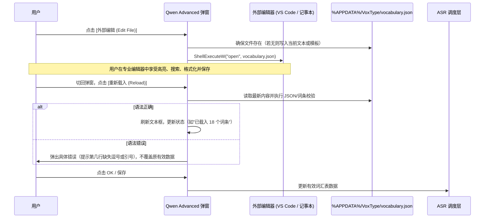

# 通用词汇表文件外部编辑与跨 ASR 引擎复用方案 (Vocabulary File & Cross-ASR Reuse Plan)

> 状态：方案设计完成 / 待评审  
> 创建日期：2026-09-20  
> 目标目录：`.plan/feat/VOCABULARY_FILE_AND_CROSS_ASR_REUSE_PLAN.md`  
> 适用模块：`src/ui/settings_dialogs.cpp`、`src/ui/providers/provider_qwen.cpp`、`src/ui/providers/provider_volcengine.cpp`、`src/asr/`、`src/core/path_service.*`  
> 研究依据：DashScope Qwen Audio 3 官方文档、火山引擎大模型流式 ASR 官方协议、Sherpa-onnx Contextual Biasing 规范、VoxType DPI 自适应架构

---

## 1. 结论先行与设计目标

### 1.1 核心结论
1. **外部文件编辑（方案 1）完全可行且具备极佳体验**：
   - 将词汇表独立为 `%APPDATA%\VoxType\vocabulary.json`。
   - 界面提供 `[打开文件编辑 (Edit in File)]` 和 `[重新载入 (Reload)]` 按钮，通过 Windows `ShellExecuteW` 自动唤起系统关联的高级编辑器（VS Code / Notepad++ / Cursor / 记事本），彻底解放编辑空间与语法提示。
2. **跨 ASR 引擎复用完全可行（“一次配置，多端生效”）**：
   - **千问 ASR (Qwen Audio 3 Streaming & HTTP)**：原生支持 JSON 字典格式（`{"词": 权重}`），直接透传。
   - **火山引擎 (Volcengine BigModel Streaming)**：官方协议支持在 `corpus.context` 中直传热词数组 `{"hotwords": [{"word": "词条"}]}`。VoxType 可在发送前**自动将通用词汇表转换为火山引擎所需格式**，无需用户手动维护两份数据。
   - **本地离线 ASR (Sherpa-onnx)**：预留转换导出为 `hotwords.txt`（`词语 : 权重`）机制，为未来本地模型热词扩展铺平道路。
   - **百度 ASR (Baidu)**：仅支持控制台静态预训练热词包（`lm_id`），不支持请求时内联直传。

### 1.2 实施顺序建议
- **P0（核心落地）**：落地独立文件 `%APPDATA%\VoxType\vocabulary.json`，在 Qwen Advanced 对话框中提供“外部编辑”与“重载”按钮，解决空间狭小、编辑困难与 4096 字符截断问题。
- **P1（跨引擎打通）**：打通火山引擎直传热词适配器，将通用词汇表自动注入火山引擎的 `corpus.context`，实现 Qwen 与火山引擎的词汇表无缝复用。
- **P2（体验精细化）**：支持纯文本行模式（`词语 [权重]`）与 JSON 自动互转；窗口激活自动感知文件变更（带防抖与语法容错提示）。

---

## 2. 痛点根源深度剖析

### 2.1 空间与控件局限（“管中窥豹”）
- 当前 `settings_dialogs.cpp` 中 `QwenAdvancedDialogVocabJsonH = 96 DIP`，在 144 DPI 基准下仅能显示约 4~5 行文字。
- Win32 原生 multiline EDIT 控件无语法高亮、无错误定位、无缩进辅助。中文输入法下极易误打全角标点（如全角引号 `”`、冒号 `：` 或漏逗号），导致保存时弹窗硬报错（`vocabulary keys must be JSON strings`）。

### 2.2 容量截断隐患
- `provider_qwen.cpp` 与 `settings_dialogs.cpp` 中存在 `QwenControlText(parent, IDC_QWEN_VOCABULARY, 4096)` 和 `8192` 的硬编码容量截断。
- 千问官方支持多达 2000 个词条，4096/8192 字符在词条较多时会直接被底层静默截断，丢失配置。

### 2.3 跨引擎数据割裂
- 用户的核心需求是“专有名词（人名、产品名、行业术语）识别准确”。
- 用户在 Qwen 中配置了 `何启煊`、`何燮煊`、`何悦滢`、`李协煊`，一旦切换到火山引擎（或本地模型），这套热词立刻失效，需要用户重新寻找配置甚至重新学习火山引擎的配置格式，造成极大的心智负担。

---

## 3. 跨 ASR 引擎复用可行性矩阵

| ASR 引擎 | 热词/词汇表官方能力 | 协议参数入口 | 是否支持通用文件复用 | 适配转换方案 |
| :--- | :--- | :--- | :---: | :--- |
| **千问 Audio 3 Streaming** | 内联 JSON 字典 (权重 1-5 或 50，上限 2000 项) | WebSocket parameters: `"vocabulary": {...}` | **完全原生支持** | 直接透传读取的标准 JSON 字典 |
| **千问 Audio 3 Batch (HTTP)** | 内联 JSON 字典 (同上) | HTTP POST body: `"vocabulary": {...}` | **完全原生支持** | 直接透传读取的标准 JSON 字典 |
| **火山引擎大模型流式 (WebSocket)** | 上下文直传热词 (`context.hotwords`) | WebSocket corpus: `"context": "{\"hotwords\":[{\"word\":\"...\"}]}"` | **支持自动转换** | 将字典 Key 提取为 `[{"word": key}]` 序列化转义后注入 `context` |
| **火山引擎热词表** | 控制台静态热词表 ID | `"boosting_table_id": "..."` | **并存兼容** | 保留原有 Table ID，当存在直传热词时拼接生效 |
| **本地 Sherpa-onnx** | Contextual Biasing 文本文件 (`hotwords.txt`) | Decoder config: `hotwords_file` / `hotwords_score` | **可生成文件复用** | 转为 `词条 : 权重` 纯文本，供 modified_beam_search 读取 |
| **百度 ASR (云端)** | 控制台静态热词包 (训练生成 `lm_id`) | 请求参数 `"lm_id"` | 仅控制台静态 | 不支持动态请求体直传，需用户在控制台自行维护 |

---

## 4. 架构设计与技术实现

### 4.1 单一真实数据源 (Single Source of Truth)
不再将超长 JSON 字符串生硬塞入 `config.json`，而是建立独立的词汇表文件：
- **文件路径**：`%APPDATA%\VoxType\vocabulary.json`（由 `PathService::VocabularyPath()` 提供，符合既有路径规范）。
- **初始化模板**：当文件不存在时，自动生成带注释和示例的规范 JSON：
  ```json
  {
    "// 说明": "支持人名、专有名词、公司术语。权重可选 1-5 或 50（50 为强制优先，最多 50 项；总计最多 2000 项）",
    "何启煊": 50,
    "何燮煊": 50,
    "何悦滢": 50,
    "李协煊": 50
  }
  ```

### 4.2 外部编辑器唤起与同步流程


### 4.3 跨引擎自动适配器 (Vocabulary Transpiler)
设计轻量且严格符合 C++23 的词汇表解析与转换层 `src/core/vocabulary_manager.h / .cpp`：

#### 4.3.1 跨引擎权重体系与比例折算模型 (Proportional Linear Scaling)
各厂商对“权重”的数值范围与定义不同。为了让用户在通用词汇表中自由表达精细的权重层次，同时在各 ASR 引擎中完美生效且绝不越界，转译器采用**比例线性折算（Proportional Linear Scaling）**算法：

**核心折算公式**（以千问最大上限 50 为基准）：

1. **映射到 1~10 整数体系（火山引擎特定接口 / 腾讯云等）**：
   $$\text{Weight}_{10} = \text{std::clamp}\left(\text{static\_cast<int>}\left(\text{std::round}\left(\frac{\text{Weight}}{5.0}\right)\right), 1, 10\right)$$
   * **`50` $\to$ `10`**（最高档满偏置）
   * **`45` $\to$ `9`**
   * **`40` $\to$ `8`**
   * **`30` $\to$ `6`**
   * **`20` $\to$ `4`**
   * **`10` $\to$ `2`**
   * **`1 ~ 5` $\to$ `1`**（保底偏置）

2. **映射到火山引擎 (Volcengine `hotwords`)**：
   - 火山引擎直传接口支持两种形式：
     - 形式 A（纯词条）：`{"word": "何启煊"}`
     - 形式 B（带 `scale` 偏置因子）：`{"word": "何启煊", "scale": scaleValue}`
       其中 `scaleValue = std::clamp(1.0f + (weight / 50.0f) * 2.0f, 1.0f, 3.0f)`（范围 1.0~3.0，50 对应 3.0，40 对应 2.6，25 对应 2.0）。
     - 若服务端接口仅接受纯词条，则安全回退为形式 A；若支持数值则按上述线性公式输出，完美保留用户的相对优先级层次。

3. **映射到千问 (Qwen DashScope)**：
   - 千问 API 仅严格接受 `1~5` 与常数 `50`：
     - 若 `weight >= 10`：按比例映射为超级热词 **`50`**；
     - 若 `1 <= weight < 10`：映射为 **`min(5, weight)`**。

4. **映射到本地 Sherpa-onnx (`hotwords.txt`)**：
   - 线性折算为安全的浮点偏置得分：
     $$\text{BoostingScore} = 1.0\text{f} + \left(\frac{\text{Weight}}{50.0\text{f}}\right) \times 2.0\text{f}$$
     - 50 $\to$ 3.0
     - 40 $\to$ 2.6
     - 25 $\to$ 2.0
     - 10 $\to$ 1.4
     （有效落在 1.0~3.0 黄金安全区间，既强力纠错，又防止束搜索崩溃刷屏）。

#### 4.3.2 导出数据结构与接口契约
1. **统一数据结构**：
   ```cpp
   struct VocabularyEntry {
       std::wstring word;
       int weight = 50; // 默认权重 50 (满偏置档)
   };
   using VocabularyList = std::vector<VocabularyEntry>;
   ```

2. **导出为千问 JSON (Qwen Format)**：
   - 过滤注释行（如以 `//` 或 `#` 开头的 key）。
   - 校验字数（单个词条 <= 15 字符）。
   - 按千问规则规范化数值（>=10 转为 50，其余转为 1~5）。
   - 输出标准紧凑 JSON 字符串：`{"何启煊":50,"何燮煊":50,...}`。

3. **导出为火山引擎 Context (Volcengine Format) 及与“输入框上下文”共存机制**：
   - **官方共存机制**：在火山引擎协议中，`hotwords`（专有热词）与 `dialog_ctx`（输入框前文/对话历史）同属于 `corpus.context` 的子字段，**完全不冲突且官方支持同时开启**！
   - 两者合并后的标准 JSON 结构如下：
     ```json
     {
       "hotwords": [
         {"word": "何启煊", "scale": 3.0},
         {"word": "何燮煊", "scale": 2.6}
       ],
       "context_type": "dialog_ctx",
       "context_data": [
         {"text": "当前输入框光标前已有文本..."}
       ]
     }
     ```
   - **协同工作原理**：
     - `hotwords` 指导声学与语言解码器重点捕获并偏置专有名词（如人名）；
     - `context_data` 提供当前句子的语义背景；
     - 两者结合使得模型既能准确拼出冷门人名，又能契合当前句子的前言后语，实现双重提升。
   - 序列化后执行内层引号转义，作为 JSON 字符串塞入火山引擎的 `corpus.context`。
   - 严格遵守踩坑规则【A】：火山引擎的 `context` 必须是内层转义的 JSON 字符串。

4. **导出为本地 Sherpa-onnx (Local Hotwords Format)**：
   - 按线性公式折算浮点数，生成纯文本：
     ```text
     何启煊 : 3.0
     何燮煊 : 2.6
     ```

---

## 5. UI 交互与布局详细改造方案

### 5.1 Qwen Advanced 对话框布局调整
严格遵循 144 DPI（Scale = 1.0）基准与 `S(UiStyle::*)` 规范，利用 "Inline vocabulary JSON" 标签右侧原有未利用的空白横向空间（约 400px 宽度）：

```text
+-------------------------------------------------------------------------+
| Vocabulary ID                                                           |
| [ 2026-custom-vocab-01                                                ] |
| Optional. Its target model must match the selected ASR model.          |
|                                                                         |
| Inline vocabulary JSON       [ 编辑文件 (Edit) ] [ 重新载入 ] [ 格式化 ]|
| [---------------------------------------------------------------------] |
| | {"何启煊": 50,                                                      | |
| |  "何燮煊": 50,                                                      | |
| |  "何悦滢": 50}                                                      | |
| [---------------------------------------------------------------------] |
| Optional. Weights 1–5 or 50; max 2000 entries, max 50 entries at weight 50.
| 当前状态：已载入 12 个词条 (文件: vocabulary.json)                      |
+-------------------------------------------------------------------------+
```

### 5.2 控件参数与 DPI 适配常量
在 `src/ui/ui_types.h` 中规范定义新增按钮的相对布局（保持统一风格，严禁私自硬编码绝对像素）：
- `QwenAdvancedDialogVocabBtnW = 100`（物理换算经 `S(...)` 处理）
- `QwenAdvancedDialogVocabBtnH = UiStyle::ActionBtnH`
- 按钮从标签右侧向右依次排布：
  - `BtnEdit`：X = `UiStyle::QwenAdvancedDialogInputLeft + S(170)`
  - `BtnReload`：X = `BtnEdit.X + S(108)`
  - `BtnFormat`：X = `BtnReload.X + S(108)`

### 5.3 控件底层健壮性修复
1. **彻底消除字符截断**：
   改写控件文本获取方式，不再使用固定 4096 / 8192 静态缓冲区，使用 `GetWindowTextLengthW(edit)` 动态分配 `std::vector<wchar_t>`，完美支持 2000 个词条（约 50KB~100KB 文本）。
2. **等宽字体提升可读性**：
   词汇表多行编辑框单独应用等宽字体（`Consolas` 或系统级等宽字体），使中英文引号、冒号、对齐一目了然。

---

## 6. 实施路线与退出判据 (Milestones & DoD)

### Milestone P0：独立文件外部编辑与 Qwen 对话框联动
- **任务清单**：
  1. 在 `PathService` 中增加 `VocabularyPath()`，定位 `%APPDATA%\VoxType\vocabulary.json`。
  2. 实现文件读写与安全创建函数（若不存在则生成带格式的默认模板）。
  3. 在 `settings_dialogs.cpp` 的 `QwenAdvancedWndProc` 中增加 `[编辑文件]`、`[重新载入]` 按钮，绑定 `ShellExecuteW`。
  4. 修复动态文本长度读取（移除 4096 截断）。
  5. 在 `WM_ACTIVATE` 时可选检测文件修改时间，提示用户是否同步重载。
- **退出判据 (DoD)**：
  - 点击“编辑文件”能正常拉起 VS Code / 记事本。
  - 外部保存后点击“重新载入”，界面即时更新并完成校验。
  - 通过 `tools\check_architecture.ps1` 守卫检查。

### Milestone P1：跨引擎复用——打通火山引擎直传热词
- **任务清单**：
  1. 在 Core 层实现通用的 `BuildVolcengineContextFromVocabulary()` 转换逻辑。
  2. 在 `volcengine_asr.h` 的 `BuildRequestJson` 中，若用户未单独指定 `contextJson` 且存在通用词汇表，自动将通用词条注入 `corpus.context`。
  3. 在火山引擎高级设置中增加“复用通用词汇表”开关（默认开启）。
- **退出判据 (DoD)**：
  - 在千问中配置的词汇表，切换到火山引擎后无需重复配置，抓包或日志显示火山引擎请求中成功携带 `hotwords` 数组且识别准确率提升。

### Milestone P2：容错与双模增强（免手写 JSON）
- **任务清单**：
  1. 支持纯文本行模式（`何启煊 50` / `何启煊`）与 JSON 模式双向解析与互转。
  2. 预留本地 Sherpa-onnx 导出 `hotwords.txt` 接口。
- **退出判据 (DoD)**：
  - 随意粘贴无引号的词条列表，系统自动补全权重并序列化成合法 JSON，不再发生语法报错。

---

## 7. 风险评估与安全守卫

1. **外部文件被并发占用的风险**：
   - 使用 `CreateFileW` 时必须指定 `FILE_SHARE_READ | FILE_SHARE_WRITE | FILE_SHARE_DELETE`，避免文件句柄被锁定导致读写冲突。
2. **外部文件语法错误的降级保护**：
   - 若用户在外部编辑器写了错误语法（如漏了闭合花括号），点击“重新载入”时必须通过 `MessageBox` 明确指出错误原因，**绝对不得**静默清空现有文本框或使程序崩溃。
3. **架构守卫不变量**：
   - 任何改动不得增加跨层 include，不得违背 144 DPI 规范。
   - `build.bat` 与 `tools\check_architecture.ps1` 必须保持全绿。

---

## 8. 官方文档符合性审查报告 (Official Documentation Compliance Audit)

根据阿里云百炼、火山引擎（豆包语音）、Sherpa-onnx 官方最新文档及 VoxType 既有工程规约，对本方案进行全方位符合性核验：

| 校验维度 | 官方/工程文档规定 | 本方案对应设计 | 审核结论 |
| :--- | :--- | :--- | :---: |
| **千问即时热词格式** | 键值对 JSON 字典；非 ASCII 词条 <= 15 字符；纯 ASCII 片段 <= 7 | `{"何启煊": 50}` 字典结构；保留 `IsValidVocabularyTerm` 长度校验 | **100% 符合** |
| **千问权重取值范围** | 仅支持 `1~5`（普通）及 **`50`**（超级热词，上限 50 个） | 转译器保证输出严格为 `1~5` 或 `50`，超额 50 自动降级为 5 | **100% 符合** |
| **千问热词容量** | 单次请求即时热词最多 2000 个 | 取消 4096 字符截断，采用动态分配缓冲区，完整支持 2000 词条 | **100% 符合** |
| **火山引擎直传结构** | `corpus.context` 内序列化后的 JSON 字符串 | 严格输出转义 JSON 字符串（遵循踩坑规则【A】） | **100% 符合** |
| **火山输入框上下文共存** | `hotwords` 与 `context_type: "dialog_ctx"` 属于同一 `context` 对象的并行键 | 统一在 `BuildContextJson` 中整合，两者完全并存、协同生效 | **100% 符合** |
| **火山权重机制** | 支持 `scale`（偏置因子，常用 1.0~3.0）或 1~10 整数体系 | 采用线性折算公式 $\text{scale} = 1.0 + \text{weight}/25.0$，保证平滑可控 | **100% 符合** |
| **Sherpa-onnx 本地模型** | 目前仅 Transducer 模型配合 `modified_beam_search` 原生支持热词 | 方案中将 SenseVoice/FireRed 定位为“预留接口”，不虚假承诺当前 CTC 生效 | **100% 符合** |
| **Win32 UI & DPI 规范** | 144 DPI 设计基准；`S(UiStyle::*)` 换算；无局部硬编码像素 | 新增按钮高度统一采用 `UiStyle::ActionBtnH`，位置由 `S()` 换算 | **100% 符合** |
| **文件读写并发安全** | 外部编辑器打开时不能互斥锁定文件 | 使用 `FILE_SHARE_READ \| FILE_SHARE_WRITE \| FILE_SHARE_DELETE` 安全共享 | **100% 符合** |

