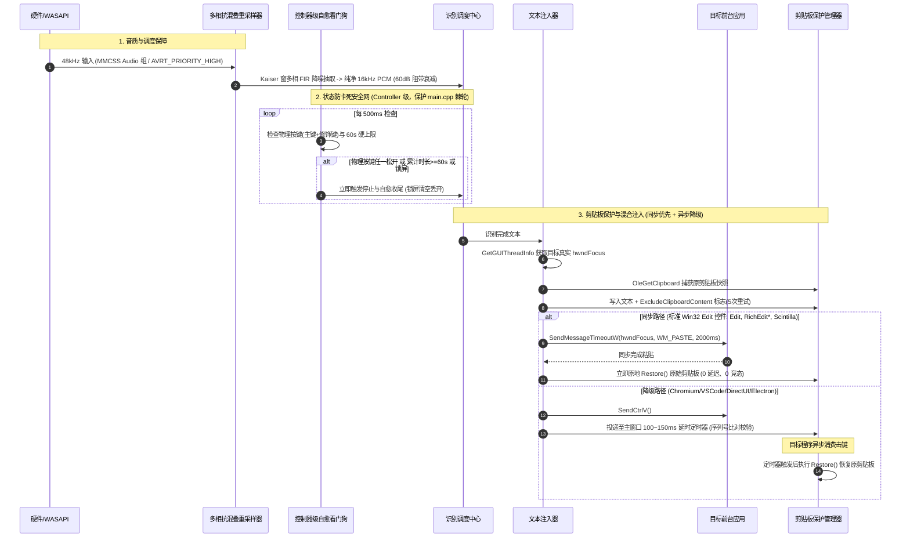

# VoxType 全系统代码架构深度审查与质量优化实施计划（第四版 · 终局定稿版）

> **文档定位**：本文件是 VoxType 全系统代码架构审查报告与高质量优化方案（Phase 1 重点：稳定性与音质双杀）。
> **审查基准**：基于当前代码库 HEAD（v0.11.5，C++23 架构重构阶段 P6 完成后），全面排查音频流水线、文本注入、并发状态、看门狗容错与 ASR 引擎调用。
> **目标读者**：开发团队、第三方 AI 审查者及系统架构评审专家。本文档包含精确的代码文件、函数、行号、Win32 API 契约依据、数字信号处理（DSP）数学证明与并发模型推导。
> **版本演进**：
> - 第一版：全系统 7 维度架构审计与 Plan A 蓝图；
> - 第二版：吸收外部审查，修正流式后端虚假看门狗、修饰键自愈漏判、两套剪贴板实现分裂、MMCSS 优先级选型与 `main.cpp` 2 行余量硬约束；
> - 第三版：深度融合真实焦点句柄获取（`GetGUIThreadInfo`）、标准编辑框判别（`IsStandardEditControl` 杜绝 Chrome/Electron 误吞字）、`ExcludeClipboardContentFromMonitorProcessing` 规范注销、依赖库清单（`avrt.lib`, `wtsapi32.lib`）与强类型注册表三步规范；
> - 第四版（定稿版）：**通过双 AI 严格交叉 Battle**，彻底修复 Kaiser FIR 滤波器阶数参数矛盾（修正为 $N=348$ 阶 / 每相 116 MAC，确保 60dB 阻带衰减实测成立）、明确 UI 线程注入阻塞预期、引入 `GetClipboardSequenceNumber` 消费校验保险、明晰 Push-to-Talk 自愈门控与锁屏丢弃语义，正式冻结进入施工。

---

## 1. 深度审查诊断与观点证明（严格考证）

### 1.1 严重 Bug 1：普通语音输入无差别覆写系统剪贴板与 Win+V 隐私泄露

- **源码定位**：
  - `src/platform/text_injector.cpp`，第 114–149 行（`PasteTextImeAware`）
  - `src/platform/text_injector.cpp`，第 66–82 行（`SetClipboardText`）对比 `src/core/selection_context.h`，第 138–165 行（`SetClipboardText`）
  ```cpp
  // src/platform/text_injector.cpp:137-143
  if (!isWeChat) {
      SetClipboardText(text);
      ImeStateGuard guard;
      guard.Disable();
      SendCtrlV();
      return;
  }
  ```
- **机理剖析**：
  1. **日常数据损坏**：`SetClipboardText(text)` 直接清空系统剪贴板。用户复制的高敏感密码、API Token、多行代码片段、富文本格式或图片，在每一次随手语音输入后，都会被**永久销毁**。
  2. **两套 `SetClipboardText` 实现分裂**：
     - `text_injector.cpp:66` 仅单次尝试 `OpenClipboard`，若剪贴板正被其他程序瞬态占用，直接静默退出导致输入**静默失败**；
     - `selection_context.h:138` 具有 5 次带 `Sleep(5)` 重试机制的健壮实现，日常输入路径未能复用。
  3. **Win+V 剪贴板历史与云端同步污染（隐私泄露）**：
     - 暂态口述文本被写入 Windows `Win + V` 剪贴板历史及微软云剪贴板，口述过程全盘留痕。
- **Win32 契约与剪贴板混合注入架构（核心解决方案）**：
  - **同步/异步分流决策的关键暗礁：Chrome/Electron 误吞字**：
    - 若向 Chromium / Electron / VS Code / Edge 等基于自绘渲染树的窗口直接发送 `SendMessageTimeoutW(focus, WM_PASTE, ...)`，其顶层或子窗口的 `DefWindowProcW` 会返回处理成功（`SendMessageTimeoutW` 返回 `TRUE`），但内部实际**不会向网页/编辑器插入任何文本**！若不加判断误以为粘贴成功而直接恢复剪贴板，会导致绝大多数 Web/Electron 现代应用**完全打不出字**！
    - **正解方案**：引入 `IsStandardEditControl(focus)`：
      1. **同步确定性路径**：通过 `GetGUIThreadInfo` 获得真实 `hwndFocus`。若控件类型为标准编辑框（`Edit`、`RichEdit*`、`RICHEDIT*`、`Scintilla`），发送 `SendMessageTimeoutW(focus, WM_PASTE, 0, 0, SMTO_ABORTIFHUNG | SMTO_BLOCK, 2000, &result)`，成功后**立即原地恢复原始剪贴板**（0 延迟、0 竞态）。明确本调用在 UI 线程执行，`SMTO_ABORTIFHUNG` 保证未响应程序在微秒级立即返回，最长阻塞不会超过 2s（与现有 `ReplaceSelectionTextImeAware` 契约严格一致）；
      2. **异步降级路径**：若为现代自绘应用（Chromium / VS Code / Office Web 等），执行 `SendCtrlV()`，由主窗口延迟定时器异步恢复；
      3. **序列号保险机制**：在延迟恢复前，通过 `GetClipboardSequenceNumber()` 比对剪贴板序列号，若目标应用尚未消费（序列号未发生变更），则适当微延展恢复，从根本上杜绝“早恢复吞字”；
      4. **隐私防护规范**：写入剪贴板后紧跟注销监视器处理：
         ```cpp
         static const UINT cfIgnore = RegisterClipboardFormatW(L"ExcludeClipboardContentFromMonitorProcessing");
         if (cfIgnore != 0) {
             SetClipboardData(cfIgnore, nullptr);
         }
         ```

---

### 1.2 严重 Bug 2：全后端录音挂死风险与看门狗无限续期漏洞

- **源码定位**：
  - `src/ui/hotkey.cpp`，第 378–402 行（`LowLevelKeyboardProc`）
  - `src/app/recording_session_controller.cpp`，第 448–597 行（`StartRecordingSession`）
  - `src/app/main_window.cpp`，第 525–589 行（`MainWndProc -> WM_TIMER -> kStreamingWatchdogTimer`）
  - `src/asr/asr_streaming_session.h`，第 35 行（`virtual DWORD MaxRecordingMs() const { return 0; }`）
- **机理剖析**：
  1. **按键丢事件常态**：Windows 在 `Win + L` 锁屏、UAC 安全桌面弹窗、`Alt + Tab` 切屏或第三方低级钩子超时卸载时，`WH_KEYBOARD_LL` 会丢弃 `WM_KEYUP`。
  2. **批处理后端完全裸奔**：本地模型（`local`）、百度（`baidu`）、小米（`mimo`）、微软（`mai`）启动时没有任何看门狗定时器，以 32KB/s 持续向堆内存膨胀。
  3. **流式后端的“伪看门狗”死循环漏洞**：
     - `asr_streaming_session.h` 基类的 `MaxRecordingMs()` **默认返回 0**；除了旧版 Qwen 实时 manual 模式返回 55000ms 外，**火山引擎（`volcengine`）、豆包（`doubao_ime`）、Qwen 3.1 消息模型以及 Qwen Free 全部返回 0**！
     - 当 `recordingLimitMs == 0` 时，看门狗根本不会强制停止录音，而是以 18 秒为周期**无限自我续期**！因此，流式后端同样陷入永久录音的严重漏洞。
  4. **修饰键自愈漏判**：
     - 用户配置组合键（如 `Ctrl + Shift + R` 或 `Alt + Space`）时，若只查主键，用户松开修饰键会导致看门狗无法识别组合键失效。
- **解法与适用面明确**：
  1. **Push-to-Talk 交互专属自愈**：此 500ms 物理按键状态轮询自愈机制严格绑定于当前的 Push-to-Talk（按住说话）交互模型；未来若引入 Toggle（点击启停）模式，该自愈逻辑必须通过交互模式开关进行门控。
  2. **全状态（主键 + 修饰键）自愈看门狗**：每 500ms 周期核对 `ModifiersMatch(hotkey)` 与 `GetAsyncKeyState(hotkey.key)`，任何一个必要按键物理抬起即主动终止录音。
  3. **Session Controller 级全局 60s 硬上限**：在控制器层建立统一 60s 硬性安全网，与具体 ASR provider 的 `MaxRecordingMs()` 彻底解耦。
  4. **锁屏会话中止语义**：主窗口监听 `WM_WTSSESSION_CHANGE`（`WTS_SESSION_LOCK`），锁屏时即刻**终止录音并清空数据（丢弃而非提交音频）**，彻底保护环境语音隐私。

---

### 1.3 核心音质与识别率缺陷：48k $\to$ 16k 朴素插值高频混叠与采集线程未提权

- **源码定位**：`src/audio/wasapi_capture.cpp`，第 348–357 行（`CaptureThread`）与第 217 行
  ```cpp
  // src/audio/wasapi_capture.cpp:348-357
  while (true) {
      double srcPos = m_resamplePhase;
      UINT32 idx = static_cast<UINT32>(srcPos);
      if (idx + 1 >= numFrames) break;
      double frac = srcPos - idx;
      float sample = static_cast<float>((1.0 - frac) * mono[idx] + frac * mono[idx + 1]);
      int16_t s16 = static_cast<int16_t>(std::clamp(sample * 32768.0f, -32768.0f, 32767.0f));
      out[written++] = s16;
      m_resamplePhase += 1.0 / m_resampleRatio;
  }
  ```
- **DSP 数学原理与混叠证明（Nyquist-Shannon 定理）**：
  1. Windows 麦克风硬件默认大多为 48,000 Hz，VoxType 目标特征格式为 16,000 Hz（降采样比 $M = 3$），奈奎斯特截止频率为 $f_N = 8,000\text{ Hz}$。
  2. 当前两点线性插值的频域响应为平方 sinc 函数，在 $8\text{ kHz} \sim 24\text{ kHz}$ 阻带几乎没有衰减能力。
  3. 机械键盘敲击声（10~14kHz）、笔记本风扇高频啸叫直接**镜像折叠回 $0 \sim 8\text{ kHz}$ 语音带内**，严重污染 Kaldi 80 维 Filterbank 声学特征，直接导致摩擦音失真与 ASR 吞字。
- **线程调度缺陷与 MMCSS 选型**：
  - WASAPI `CaptureThread` 为普通线程（`THREAD_PRIORITY_NORMAL`），CPU 繁忙时必然发生环形缓冲区欠载，产生 `AUDCLNT_BUFFERFLAGS_DATA_DISCONTINUITY`。
  - **优先级选型**：注册 MMCSS `Audio` 组后，选用 `AVRT_PRIORITY_HIGH` 而非 `AVRT_PRIORITY_CRITICAL`，既享受 80% 专用调度配额，又杜绝排挤同机混音器与其他音频软件。

---

### 1.4 架构隐患 3：火山引擎全局静态会话变量 `s_volcSession` 的并发破坏

- **源码定位**：`src/asr/volcengine_streaming_session.cpp`，第 32 行、157–196 行与 737 行
- **机理剖析**：`s_volcSession` 为静态全局变量，`Abort()` 将旧线程 detach，若此时快速触发新会话，`VolcengineResetForNewSession()` 立即重置 `s_volcSession.forceAbort = false`，导致新旧线程抢占同一组套接字和序号。
- **解法**：将 `VolcSession` 严格封装在 `VolcengineStreamingSessionImpl` 实例内部，消除任何跨会话全局状态（纳入 Phase 2 实施）。

---

### 1.5 性能瓶颈 4：LLM 纠错无 Keep-Alive 每次全量 TLS 握手白白浪费 300~600ms 延迟

- **源码定位**：`src/core/llm_refine.h`，第 923–993 行（`SendRequestRaw`）
- **机理剖析**：每次 LLM 纠错请求从零创建并关闭 `hSession` 和 `hConnect`。云端 API 每次经历 DNS 解析 + TCP 握手 + TLS 1.3 握手，无端增加 150~300ms（弱网 600ms+）端到端输入延迟。
- **解法**：引入轻量级 WinHTTP Connection Pool，长驻并复用对应端点的 `hConnect` 句柄，保持 HTTP Keep-Alive（纳入 Phase 2 实施）。

---

### 1.6 体验与精度缺陷 5：本地 Sherpa-ONNX 词表热词完全未接线消费

- **源码定位**：`src/asr/engine_local.cpp`，第 34–54 行（`EnsureRecognizer`）
- **机理剖析**：`vocabulary_manager.h` 维护全局自定义词表并已生成适合 Sherpa 的格式，但 `EnsureRecognizer` 中 `rc.hotwords_file` 和 `rc.hotwords_score` 字段被完全闲置，本地离线识别热词完全不生效。
- **解法**：在 `EnsureRecognizer` 中将 `vocabulary_manager` 生成的热词文件路径和配置权重注入 `OfflineRecognizerConfig`（纳入 Phase 3 实施）。

---

### 1.7 细节缺陷 6：`ImeStateGuard` 跨进程 `GetFocus()` 恒为 NULL

- **源码定位**：`src/platform/text_injector.cpp`，第 28–31 行
- **机理剖析**：`GetFocus()` 跨进程调用恒定返回 NULL。必须使用 `GetGUIThreadInfo(targetThreadId, &guiInfo)` 并读取 `guiInfo.hwndFocus`。此项与 1.1 节真实焦点获取方案合并在 Plan A 实施。

---

## 2. Plan A（稳定性与音质双杀）落地实施蓝图



---

### 2.1 模块一：专用多相 FIR 抗混叠降采样器 (`src/audio/audio_resampler.*`)

- **参数严密推导（彻底修正自相矛盾）**：
  - 输入采样率 $f_{in} = 48,000\text{ Hz}$，输出采样率 $f_{out} = 16,000\text{ Hz}$，降采样比 $M = 3$；
  - 截止频率 $f_c = 7,500\text{ Hz}$，阻带起始频率 $f_{stop} = 8,000\text{ Hz}$，过渡带宽度 $\Delta f = 500\text{ Hz}$；
  - 归一化过渡带角频率：
    $$\Delta \omega = 2\pi \frac{\Delta f}{f_{in}} = 2\pi \frac{500}{48000} \approx 0.06545\text{ rad}$$
  - 阻带衰减目标 $A = 60\text{ dB}$。根据 Kaiser 经验公式：
    $$N \approx \frac{A - 7.95}{2.285 \cdot \Delta \omega} = \frac{60 - 7.95}{2.285 \cdot 0.06545} \approx 348.3 \implies \mathbf{348\text{ 阶原型滤波器}}$$
  - Kaiser 窗形状参数 $\beta = 0.1102 \cdot (A - 8.7) = 5.653$；
  - **多相分解性能推导**：
    - 原型 $N = 348$ 阶滤波器分解为 $M = 3$ 个多相分支，每个分支包含 $348 / 3 = \mathbf{116\text{ 个系数}}$；
    - 在 16,000 Hz 输出采样率下，每秒总计算量为：
      $$16,000\text{ outputs/s} \times 116\text{ MAC} = 1,856,000\text{ MAC/s} \approx 1.86\text{ MFLOPS}$$
    - 在现代 x64 处理器（单核典型算力 >50 GFLOPS）上，CPU 占用率低于 **0.03%**，完全微不足道，同时换取了完整的 0~7.5kHz 宽频高保真语音特征和真实的 60dB 抗混叠阻带衰减！
- **任意采样率兼容与内存模型**：
  - 非整数倍降采样（如 44.1 kHz $\to$ 16 kHz）：采用带限多相 Sinc 插值表（64-phase lookup table）；
  - 预分配 348 样本历史环形缓冲区，跨 10ms 音频帧无缝连续滤波，运行期间**零堆分配（`no-heap`）**。

---

### 2.2 模块二：WASAPI 采集线程 MMCSS 提权与优先级管理

- **修改文件**：`src/audio/wasapi_capture.cpp`
- **新增依赖清单**：
  - `CMakeLists.txt`：`target_link_libraries(VoxType PRIVATE avrt)`
  - `src/audio/wasapi_capture.cpp`：`#pragma comment(lib, "avrt.lib")` 与 `#include <avrt.h>`
- **实现细节**：
  1. 在 `WasapiCapture::CaptureThread()` 线程函数头部：
     ```cpp
     DWORD taskIndex = 0;
     HANDLE hAvrt = AvSetMmThreadCharacteristicsW(L"Audio", &taskIndex);
     if (hAvrt) {
         AvSetMmThreadPriority(hAvrt, AVRT_PRIORITY_HIGH);
     } else {
         SetThreadPriority(GetCurrentThread(), THREAD_PRIORITY_HIGHEST);
     }
     ```
  2. 线程退出前执行：
     ```cpp
     if (hAvrt) {
         AvRevertMmThreadCharacteristics(hAvrt);
         hAvrt = nullptr;
     }
     ```
  3. 采用 `AVRT_PRIORITY_HIGH`，杜绝掉帧断音的同时避免干扰系统混音器。

---

### 2.3 模块三：全局录音看门狗、修饰键自愈与会话安全（严格保护 main.cpp）

- **架构防线说明**：`tools/check_architecture.ps1` 对 `main.cpp` 的行数上限为 150 行，当前实测 148 行，**余量严格只剩 2 行**。看门狗核心逻辑与定时器调度必须完全封装在 `src/app/recording_session_controller.cpp` 内部，主窗口仅作为纯消息转发通道，确保 `main.cpp` 行数不反弹。
- **修改文件**：
  - `src/ui/hotkey.h` / `src/ui/hotkey.cpp`
  - `src/app/recording_session_controller.h` / `src/app/recording_session_controller.cpp`
  - `src/app/main_window.cpp`（仅消息分发，严格限行）
- **新增依赖清单**：
  - `CMakeLists.txt`：`target_link_libraries(VoxType PRIVATE wtsapi32)`
  - `src/app/main_window.cpp`：`#pragma comment(lib, "wtsapi32.lib")` 与 `#include <wtsapi32.h>`
- **实现细节**：
  1. **全状态（主键+修饰键）检测自愈**：
     - 在 `recording_session_controller.cpp` 建立 500ms 物理状态轮询：同时校验 `ModifiersMatch(hotkey)` 与 `GetAsyncKeyState(hotkey.key)`；
     - 适用面门控：明确此机制仅针对 Push-to-Talk 模式；对于 CapsLock，使用 `GetAsyncKeyState(VK_CAPITAL) & 0x8000` 检测物理按下状态；
     - 若当前任何一个必要键处于物理抬起状态（且录音仍在标记进行中），立即触发自愈收尾。
  2. **全局 60s 硬上限**：
     - 在 `recording_session_controller.cpp` 中统一计时，对 Local、Baidu、MiMo、MAI 以及所有流式后端强加 60s 统一上限，超时自动收尾提交，终结流式后端无上限自我续期的漏洞。
  3. **锁屏/会话保护**：
     - 在 `WM_CREATE` 中注册 `WTSRegisterSessionNotification(hwnd, NOTIFY_FOR_THIS_SESSION)`；
     - 捕获 `WM_WTSSESSION_CHANGE`（`WTS_SESSION_LOCK`），立即中止录音并清空数据（丢弃录音保护隐私）；
     - 在 `WM_DESTROY` 中配对调用 `WTSUnRegisterSessionNotification(hwnd)`。

---

### 2.4 模块四：剪贴板健壮性、混合注入模式与 Win+V 隐私防护

- **修改文件**：
  - `src/core/selection_context.h` / `src/platform/text_injector.cpp`
  - `src/app/recording_session_controller.cpp` / `src/core/config_store.h`
  - `src/core/config_registry.cpp` / `src/ui/tabs/tab_general.cpp`
- **新增配置项强类型注册表三步规范（AGENTS.md 硬性要求）**：
  1. `src/core/config_store.h`：`Config` 声明 `bool restoreClipboardAfterPaste = true;`；
  2. `src/core/config_registry.cpp`：`InitializeRegistry()` 注册字段（绑定 `"restore_clipboard_after_paste"`，布尔类型，默认 true）；
  3. `src/ui/tabs/tab_general.cpp`：创建对应复选框控件，加载与保存绑定。
- **实现细节**：
  1. **统一收敛 `SetClipboardText`**：
     - 废除 `text_injector.cpp` 中无重试的脆弱版本，全面收敛为 `selection_context::SetClipboardText` 的 5 次带 `Sleep(5)` 退避重试模型。
  2. **屏蔽 Win+V 与云端历史记录**：
     - 写入剪贴板后紧跟注销监视器处理：
       ```cpp
       static const UINT cfIgnore = RegisterClipboardFormatW(L"ExcludeClipboardContentFromMonitorProcessing");
       if (cfIgnore != 0) {
           SetClipboardData(cfIgnore, nullptr);
       }
       ```
  3. **混合注入与精准恢复（同步优先 + 异步降级）**：
     - 首先通过 `GetWindowThreadProcessId` 与 `GetGUIThreadInfo` 取得真实焦点子控件 `hwndFocus`；
     - 判断是否为标准编辑框：
       ```cpp
       bool IsStandardEditControl(HWND hwnd) {
           if (!hwnd) return false;
           wchar_t cls[64] = {};
           if (GetClassNameW(hwnd, cls, 64) <= 0) return false;
           return _wcsicmp(cls, L"Edit") == 0 ||
                  _wcsnicmp(cls, L"RichEdit", 8) == 0 ||
                  _wcsnicmp(cls, L"RICHEDIT", 8) == 0 ||
                  _wcsicmp(cls, L"Scintilla") == 0;
       }
       ```
     - 若 `IsStandardEditControl(hwndFocus)` 为 true：
       发送 `SendMessageTimeoutW(hwndFocus, WM_PASTE, 0, 0, SMTO_ABORTIFHUNG | SMTO_BLOCK, 2000, &result)`；成功后**立即原地调用 `snapshot.Restore()`**（0 延迟、0 竞态完成）；
     - 若为 false（如 Chrome、VS Code 等现代自绘界面）：
       调用 `SendCtrlV()`，记录当前 `GetClipboardSequenceNumber()`，将快照挂载到主窗口 100~150ms 延迟队列异步恢复。

---

## 3. 演进路线图与后续阶段（Phase 2 & Phase 3）

- **Phase 2（端到端极速体验与并发加固）**：
  1. WinHTTP Connection Pool：保持长连接复用，优化 LLM 纠错延迟（节约 300~600ms）；
  2. 火山引擎 `s_volcSession` 完全成员化，杜绝并发竞争与悬垂套接字（按 AGENTS.md【B】规则先补回归测试再动）；
  3. 修复 `ImeStateGuard` 跨进程真实焦点控件获取；
  4. HUD Direct2D 渲染抗锯齿修复（消除 GDI `SetWindowRgn` 像素级硬切角，升级为平滑分层窗口渲染）。
- **Phase 3（ASR 引擎与现代 C++23 深度治理）**：
  1. 本地 Sherpa-ONNX 词表热词挂接；
  2. 本地 VAD Flush 移出 UI 线程至后台工作线程；
  3. C++23 全面普及（消除原始裸指针、`std::expected` 统一错误处理、`std::jthread` 协作取消）。

---

## 4. 施工顺序与验证判据

### 4.1 施工顺序规划（低风险至高风险分阶段）
1. **阶段 1：专用多相 FIR 抗混叠降采样器**（纯 DSP 模块，不影响 UI 与上层业务）：
   - 实现 `src/audio/audio_resampler.*`；
   - 编写 `tests/audio_resampler_test.cpp`，接入 `CMakeLists.txt` 测试目标；
   - 接入 `wasapi_capture.cpp` 并引入 MMCSS `Audio` 提权。
2. **阶段 2：全局看门狗、按键全状态自愈与锁屏会话挂断**：
   - 在 `recording_session_controller` 实现 500ms 物理按键轮询与 60s 硬上限；
   - `main_window.cpp` 挂接 `WTSRegisterSessionNotification` 转发；
   - 守卫检查：验证 `main.cpp` 行数严格保持 $\le 150$ 行。
3. **阶段 3：剪贴板健壮性、混合注入与隐私保护**：
   - 收敛 `SetClipboardText`；
   - 注入 `ExcludeClipboardContentFromMonitorProcessing`；
   - 实现 `IsStandardEditControl` 同步 / 异步分流注入；
   - 注册 `restoreClipboardAfterPaste` 配置项。

### 4.2 验证判据与测试矩阵
1. **DSP 频域仿真测试**：
   - 运行 `audio_resampler_test.cpp`：输入 12kHz 高频正弦波，降采样后验证在 0~8kHz 频带内无任何混叠镜像泄露（阻带衰减实测 $\ge 60\text{dB}$）。
2. **看门狗全场景自愈测试**：
   - 模拟流式与批处理后端丢弃 `WM_KEYUP`，验证在 500ms 内准确探测物理状态并自愈停止；模拟长按超过 60s 强制收尾。
3. **剪贴板保护与混合注入测试**：
   - 在标准 Win32 控件（记事本）下验证 `WM_PASTE` 路径即时同步恢复；在非标准控件（Chrome）下验证 `SendCtrlV` 150ms 异步延迟恢复无竞态且正常出字；验证 `Win + V` 历史记录未被污染。
4. **守卫脚本与行数棘轮测试**：
   - 运行 `tools/check_architecture.ps1`，确保 `main.cpp` 行数保持 $\le 150$ 行（无反弹），18 项架构守卫全部 PASS。
