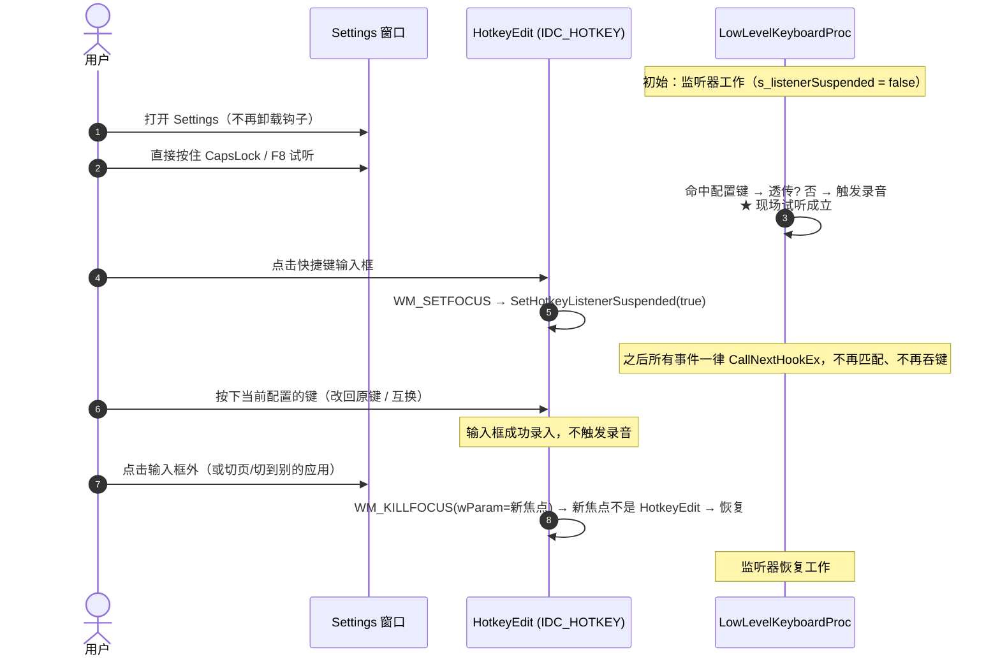

# Settings 快捷键焦点感知挂起研究与修复方案

> **文档标识**：`PLAN-FIX-HOTKEY-FOCUS-001`
> **创建日期**：2026-09-25
> **更新记录**：初版；已实施并同步 AGENTS.md / ARCHITECTURE.md（含 `doc/ARCHITECTURE_zh.md`）契约、README 双语与 CHANGELOG 双语，版本升至 `v0.11.2`。审查后追加三处加固：(1) `TCN_SELCHANGE` 显式搬移"刚被隐藏控件"上的焦点（§3.4 / §4.3）；(2) "按住期间改变焦点"两条路径收口——延迟恢复到 KEYUP、并显式终止已在飞行中的录音（§3.5 / §4.2）；(3) 延迟恢复的候选键**必须同时覆盖"输入框刚录入的那个键"**（Save 会把它变成当前热键，只判旧配置键不完备），新增 TC-11。
> **关联模块**：`src/ui/hotkey.h`, `src/ui/hotkey.cpp`, `src/ui/settings.cpp`, `AGENTS.md`, `ARCHITECTURE.md`
> **行号约定**：§1–§3 引用的行号为**修复前**状态；§4 为落地后的代码形态。
> **审查状态**：待审查（Pending Review）——实机走查（TC-01…TC-11）完成前不得签收

---

## 1. 现象复盘与问题陈述

### 1.1 触发场景与现状

1. 打开 Settings（`General` 页）准备修改"录音快捷键"；
2. 点击快捷键输入框（`VoxType.HotkeyEdit`，`IDC_HOTKEY`）。

**现状（旧实现）**：`ShowSettingsWindow()` 在开窗前就 `UninstallKeyboardHook()`（`settings.cpp:353`），整个 Settings 生命周期内监听器都不存在。因此输入框确实能录入任何键（包含当前配置的那一个）——但这只是"把钩子整段拿掉"换来的，代价见 §1.3。

**为什么必须拿掉钩子**：监听器一旦安装着，匹配到配置键就会 `return 1` 吞掉该次按键（§1.2）。也就是说，只要监听器在工作，输入框就既收不到这一下按键、又会同时触发一次录音；旧实现用"整窗卸载"规避的正是这个冲突。

> **期望目标**：把挂起粒度从"Settings 是否打开"收敛为"**快捷键输入框是否持有焦点**"——在保留"输入框可录入任意键"的同时，让 Settings 内的其余时间热键照常可用。

### 1.2 底层根因

- 全局快捷键由 **`WH_KEYBOARD_LL` 低级键盘钩子**实现（`src/ui/hotkey.cpp:274` `LowLevelKeyboardProc`），不是 `RegisterHotKey`。
- 钩子在匹配到配置键时**主动吞掉该事件**：`WM_KEYDOWN/WM_SYSKEYDOWN` 命中即 `return 1`（`hotkey.cpp:293 / 299`），`WM_KEYUP/WM_SYSKEYUP` 命中同样 `return 1`（`hotkey.cpp:304 / 308`），**不调用 `CallNextHookEx`**，因此该按键永远不会投递给当前拥有焦点的输入控件。
- 结果与 `RegisterHotKey` 的内核级吞键等价（见 §1.3 差异说明），症状相同：`HotkeyEdit` 的 `WM_KEYDOWN`/`WM_SYSKEYDOWN` 分支收不到这一下按键。
- 该吞键行为发生在**监听器已安装**的状态下；旧实现正是为此在 Settings 内整段卸载钩子（§1.3）。

### 1.3 现有缓解手段及其代价

当前不是按"是否在录入"挂起，而是**按"Settings 窗口是否打开"整段挂起**：

- `src/ui/settings.cpp:353`：`ShowSettingsWindow()` 里直接 `UninstallKeyboardHook()`；
- `src/ui/settings.cpp:336`：`WM_DESTROY` 里 `InstallKeyboardHook()` 恢复；
- `src/ui/settings.cpp:372`：窗口创建失败分支的兜底 `InstallKeyboardHook()`；
- `hotkey.cpp:326` 的 `UninstallKeyboardHook()` 内部会 `ResetCapsLockHotkeyState()`，处理"钩子中途撤走、长按判定永远不到达"的孤儿状态。

代价：

1. **Settings 打开期间完全无法试听热键**——想验证"这个键现在能不能用/好不好按"，只能关窗口再按，或干脆在外面按；
2. 挂起粒度远大于需要：真正会冲突的只有"输入框正在录入"这一个瞬间；
3. 每次开/关 Settings 都要拆装一次系统级钩子（`UnhookWindowsHookEx` + `SetWindowsHookExW`），并连带重置 CapsLock 手势状态机。

> **期望目标**：把挂起粒度从"Settings 是否打开"收敛为"**快捷键输入框是否持有焦点**"。

---

## 2. 目标方案：输入框焦点感知挂起（Focus-Aware Suspension）

### 2.1 方案核心思想

新不变量（单一权威）：

> **全局热键监听器当且仅当某个 `VoxType.HotkeyEdit` 控件持有键盘焦点时挂起。**

据此得到三种状态：

- **浏览 Settings（默认）**：监听器正常工作。用户可以在设置界面里直接按住快捷键试听/试录，无需关窗口、无需切前台后台；
- **在输入框录入（焦点在 `HotkeyEdit`）**：监听器挂起，钩子对所有事件一律 `CallNextHookEx` 透传，输入框拥有纯净按键环境，可以录入**任意**组合键——包括当前已配置的键、以及当前绑定给其它功能的键，且完全不触发录音；
- **离开输入框（失焦 / 切页 / 切到其它应用 / 关闭 Settings）**：恢复监听——但若**候选键**（刚录入的主键或当前配置键）仍被按住，则延迟到它们都不再按下才恢复（见 §3.5）。

### 2.2 与 ZenCrop 同方案的差异（为什么这里更简单）

本项目与 ZenCrop 的 `RegisterHotKey` 方案同属"录制期挂起"，但实现上更简单，值得记录：

| 维度 | ZenCrop（`RegisterHotKey`） | VoxType（`WH_KEYBOARD_LL`） |
| :--- | :--- | :--- |
| 挂起手段 | `UnregisterHotKey` / 重注册，9 个 id | 一个布尔开关让钩子整体透传 |
| 是否需重注册生命周期 | 需要（Apply / 关闭 / 挂起-恢复都要重注册） | **不需要**：钩子在进程生命周期内常驻，每次事件实时读取 `CurrentConfiguredHotkey()`（`hotkey.cpp:277`），改配置**无需**任何注册动作 |
| 通知路径 | 输入框 → 宿主 → 主窗口（跨窗口 `PostMessage`，异步） | **同线程直接置位**（钩子回调与 UI 消息同在主线程），无异步窗口 |
| 是否需要"前哨守卫"补偿 | 需要（异步注销生效前的一瞬仍可能误触发） | **不需要**：置位是同步的，下一次按键事件必然已看到新状态 |
| 多热键/AOT 类排除 | 有（9 个热键 + 置顶目标排除设置窗类名） | 无（仅 1 个录音键，无"目标窗口"语义） |

> 结论：**同样的用户价值，更小的实现面**。核心改动只是"一个状态位 + 两处焦点回调 + 拆掉整窗卸载"。

### 2.3 时序



---

## 3. 关键边界与技术保障

### 3.1 CapsLock 是本项目的默认热键（必须单独论证）

`CapsLock` 既是热键又是**日常打字会用到的键**，因此"S_settings 打开期间监听器保持工作"必须论证不会破坏打字：

- **短按仍然正常切换大小写**：钩子的既有语义是"短按（<300ms）补发一次 CapsLock 透传"（`hotkey.cpp:264-271` → `SendCapsLockTap()`），注入事件被 `LLKHF_INJECTED` 分支放行（`hotkey.cpp:278`）。所以 Settings 里快速点一下 CapsLock 依旧只是切大小写；
- **只有刻意长按（≥300ms）才会开始录音**——这正是"现场试听"的目标行为；
- **录入期间完全无副作用**：焦点在 `HotkeyEdit` 时监听器挂起，CapsLock 走系统默认路径（切换大小写），输入框照常收到 `WM_KEYDOWN(VK_CAPITAL)` 并录成 `CapsLock`；
- **中途挂起不会留下孤儿手势**：`SetHotkeyListenerSuspended(true)` 内部调用既有的 `ResetCapsLockHotkeyState()`（`hotkey.cpp:207`），把"已 KEYDOWN、300ms 判定未到"的待决状态丢弃并 `PostHotkeyRecordingCommand(kHotkeyCaptureDiscard)`。

> 结论：把"长按录音"当作 Settings 内的现场试听能力是可接受的；短按打字语义不受影响。

### 3.2 焦点判定必须用 `WM_KILLFOCUS` 的 `wParam`

`WM_KILLFOCUS` 的 `wParam` 是"即将获得焦点的窗口"（可为 NULL），属文档化契约；`GetFocus()` 在该消息内返回什么并未文档化。判定"是否仍在 HotkeyEdit 之间移动"时应使用 `wParam`：

```cpp
const HWND nextFocus = reinterpret_cast<HWND>(wParam);
if (!IsHotkeyEditWindow(nextFocus)) SetHotkeyListenerSuspended(false);
```

本项目当前只有一个 `HotkeyEdit`（`tab_general.cpp:73` 的 `IDC_HOTKEY`），防抖分支实际不会命中；保留该判据是为正确性与未来扩展（新增第二个快捷键输入框时无需再改）。

### 3.3 挂起状态必须有兜底复位

`WM_KILLFOCUS` 在窗口销毁路径上不保证一定投递到位（例如输入框连同 Settings 窗口一起被 `DestroyWindow`）。因此：

- `settings.cpp` 的 `WM_DESTROY` **无条件**执行一次 `SetHotkeyListenerSuspended(false)`（取代原先的 `InstallKeyboardHook()` 兜底）；
- 监听器本体常驻，`InstallKeyboardHook()` 仍只在 `WM_CREATE`（`main_window.cpp:214`）与进程退出（`main_window.cpp:634` 的 `UninstallKeyboardHook()`）这两端出现。

### 3.4 切页 / DPI 变更

- **切页**：`ShowSettingsPage()`（`settings.cpp:63`）只做 `Show()/InvalidateRect`，**不移动焦点**；`TabGeneral::Show(false)` 也只是对每个控件 `ShowWindow(SW_HIDE)`。因此"切页后监听器恢复"**不能**依赖"TabControl 会从点击里抢走焦点"这一非文档化前提——已在 `TCN_SELCHANGE` 里显式补齐：切页后若当前焦点落在刚被隐藏的宿主子控件上，就把焦点移到 TabControl（`settings.cpp` 的 `WM_NOTIFY` 分支）。
- **`WM_DPICHANGED`**：该分支会 `DestroyControls()` + `CreateControls()` 重建全部控件（`settings.cpp:310-312`），随后按 `focusedId` 还原焦点。输入框被销毁时触发 `WM_KILLFOCUS`（恢复），若原焦点是 `IDC_HOTKEY`，重建后 `SetFocus` 会让新输入框 `WM_SETFOCUS`（再次挂起）——**状态自洽**，无需特殊处理。

### 3.5 按住期间改变焦点（两条路径，必须显式收口）

"输入框持有焦点 ⇒ 挂起"这一不变式在此会被绕过：手势跨过了挂起切换点。两条路径都必须显式处理，否则会影响录音。

1. **录入后焦点立即离开、按键仍按住**：`HotkeyEditWndProc` 的录入分支在末尾执行 `SetFocus(GetParent(hwnd))`，挂起在这一次 KEYDOWN 上就结束了，而物理键还按着；其 **auto-repeat KEYDOWN** 会被已恢复的钩子匹配成热键，**启动一次意外录音**。这里可能被匹配的是**两个不同的键**，只判旧配置键并不完备：
   - **旧配置键**：尚未 Save 时钩子读到的就是它；
   - **刚录入的那个键**：用户在输入框录完新键（如 `F9`）后该键仍按住，此时点 Save 会立刻把 `F9` 变成当前热键（`settings.cpp:80` 的 `SaveControls` 写入 `g_config`），后续重复 KEYDOWN 同样会启动录音。
   - 处理：把"恢复"改为**延迟恢复**。挂起候选集 = {输入框刚录入的主键 `s_recordedHotkeyKey`，当前配置热键的主键}；只要有任一仍处于按下态（`GetAsyncKeyState & 0x8000`）就保持透传，直到**候选集内所有键都不再按下**才真正恢复。只判主键即可：匹配总是发生在主键的 KEYDOWN 上，单独按住修饰键不会启动录音。延迟期间**所有 KEYUP 一律原样透传、不参与匹配**（该窗口内没有任何被消费的 KEYDOWN，参与匹配会为一次从未开始的录音误发 Stop；这同时避免依赖"KEYUP 与录入键的 vkCode 完全一致"——右 Alt 会以 `VK_MENU + extended` 到达）。`s_recordedHotkeyKey` 在 `WM_SETFOCUS`（重新录入）、`Esc`、`Backspace/Delete` 清空三处复位。
   - **时序如实说明（不得写成"KEYUP 当场恢复"）**：Windows 在低级钩子回调**返回之后**才更新该键的异步状态，因此 `GetAsyncKeyState` 在释放该键的 KEYUP 事件本身通常**尚不能**确认松键。代码不依赖"在 KEYUP 那一刻恢复"：KEYUP 分支里的检查是**机会性**路径，真正的恢复落在**下一个键盘事件**（此时该键已确认抬起，判定"已无候选键按下"成功）并继续正常匹配。因此松手后的**第一次**按键就能正常触发——自愈判定发生在匹配之前。
2. **录音已开始后按住热键去点输入框**：挂起路径原先只丢弃"待决的 CapsLock 长按判定"，对**已经开始的录音**不发停止命令；而此后 KEYUP 会被透传，`FinishCapsLockHotkeyPress` / 普通 KEYUP 分支都不会再执行 → **录音停不下来**。
   - 处理：挂起时分别收口——`s_capsLockLongPressActive`（CapsLock 长按已转为录音）→ 发 `kHotkeyCapsLockRecordingStop`；否则 `s_activeHotkeyKey != 0`（普通键按住、已发 `kHotkeyRecordingStart`）→ 发 `kHotkeyRecordingStop`；待决 CapsLock（<300ms）仍走既有 `ResetCapsLockHotkeyState()` 的 `kHotkeyCaptureDiscard`。判定标志必须在 `ResetCapsLockHotkeyState()` 之前捕获（它会清零这些标志）。

### 3.6 不引入的新机制

- 不引入 `std::atomic`：`LowLevelKeyboardProc` 与 UI 消息同在安装钩子的主线程执行，既有 `s_activeHotkeyKey` / `s_capsLockHotkeyPending` 等状态同样是普通全局变量，保持一致；
- 不引入"前哨守卫"（对 ZenCrop 是必要的异步补偿，这里同步置位，无对应窗口）；
- 不引入第二个挂起标志或状态机（新增的只是"延迟恢复待释放的那个键"这一个标量状态）。

---

## 4. 代码落地设计

### 4.1 `src/ui/hotkey.h`

```cpp
// 全局热键监听器的挂起开关：仅当 VoxType.HotkeyEdit 持有焦点时为 true。
// 挂起期间 LowLevelKeyboardProc 对所有事件直接 CallNextHookEx 透传。
void SetHotkeyListenerSuspended(bool suspended);
```

### 4.2 `src/ui/hotkey.cpp`

```cpp
namespace {
bool s_listenerSuspended = false;
UINT s_recordedHotkeyKey = 0;   // 输入框刚录入的主键；Save 后即成为当前热键
bool s_resumeDeferred = false;  // 有候选键仍按下时，恢复被扣住

bool IsHotkeyEditWindow(HWND hwnd) {
    if (!hwnd) return false;
    wchar_t cls[64] = {};
    if (GetClassNameW(hwnd, cls, 64) <= 0) return false;
    return _wcsicmp(cls, kHotkeyEditClass) == 0;
}

// 恢复必须被扣住，只要还有"可能被匹配成热键"的主键按着：
// 刚录入的键（Save 可能把它变成当前热键）与当前配置热键的主键。
// 只判主键即可——匹配总是发生在主键的 KEYDOWN 上，单独按住修饰键不会启动录音。
bool AnyResumeBlockingKeyDown() {
    if (s_recordedHotkeyKey != 0 &&
        (GetAsyncKeyState(static_cast<int>(s_recordedHotkeyKey)) & 0x8000) != 0) {
        return true;
    }
    const HotkeyConfig hotkey = CurrentConfiguredHotkey();
    return !hotkey.IsEmpty() &&
           (GetAsyncKeyState(static_cast<int>(hotkey.key)) & 0x8000) != 0;
}
} // namespace

void SetHotkeyListenerSuspended(bool suspended) {
    if (suspended) {
        s_resumeDeferred = false;
        s_recordedHotkeyKey = 0;
        if (s_listenerSuspended) return;
        s_listenerSuspended = true;
        // 录音已在飞行中（按住热键时点进输入框）：必须显式停止，否则 KEYUP 被透传后停不下来。
        const bool capsLockRecording = s_capsLockLongPressActive;
        const bool plainRecording = s_activeHotkeyKey != 0 && s_activeHotkeyKey != VK_CAPITAL;
        ResetCapsLockHotkeyState();          // 待决 CapsLock（<300ms）走既有 discard
        if (capsLockRecording) {
            PostHotkeyRecordingCommand(kHotkeyCapsLockRecordingStop);
        } else if (plainRecording) {
            PostHotkeyRecordingCommand(kHotkeyRecordingStop);
        }
        return;
    }
    if (!s_listenerSuspended) return;
    // 候选键（刚录入的键 / 当前配置键）仍按着就不恢复，否则其 auto-repeat 会被匹配成热键。
    if (AnyResumeBlockingKeyDown()) {
        s_resumeDeferred = true;
        return;
    }
    s_listenerSuspended = false;
}

LRESULT CALLBACK LowLevelKeyboardProc(int code, WPARAM wParam, LPARAM lParam) {
    if (code == HC_ACTION && s_resumeDeferred) {
        const bool isKeyUp = (wParam == WM_KEYUP || wParam == WM_SYSKEYUP);
        if (isKeyUp) {
            if (!AnyResumeBlockingKeyDown()) {
                s_resumeDeferred = false;
                s_listenerSuspended = false;
            }
            // 延迟期间没有任何 KEYDOWN 被匹配过，因此这里的 KEYUP 一律不参与匹配
            // （否则会为一次从未开始的录音补发 Stop）。这样也不依赖 KEYUP 与
            // 录入键的 vkCode 完全一致（右 Alt 会以 VK_MENU + extended 形式到达）。
            return CallNextHookEx(s_keyboardHook, code, wParam, lParam);
        }
        if (!AnyResumeBlockingKeyDown()) {
            s_resumeDeferred = false;      // 释放 KEYUP 未被观察到时的自愈
            s_listenerSuspended = false;
        }
    }
    if (code == HC_ACTION && s_listenerSuspended) {
        // 正在录入、或延迟恢复仍待释放：一律透传，让按键落到输入框。
        return CallNextHookEx(s_keyboardHook, code, wParam, lParam);
    }
    if (code == HC_ACTION) { /* 既有逻辑不变 */ }
    return CallNextHookEx(s_keyboardHook, code, wParam, lParam);
}

// HotkeyEditWndProc：
case WM_SETFOCUS:
    // ... 既有 capturing 逻辑 ...
    SetHotkeyListenerSuspended(true);
    return 0;
case WM_KILLFOCUS:
    // ... 既有 capturing 逻辑 ...
    // WM_KILLFOCUS 的 wParam 是即将获得焦点的窗口（可为 NULL）；用它判定是否仍在输入框之间移动。
    if (!IsHotkeyEditWindow(reinterpret_cast<HWND>(wParam))) {
        SetHotkeyListenerSuspended(false);
    }
    return 0;
```

### 4.3 `src/ui/settings.cpp`

```cpp
// ShowSettingsWindow()：删除 UninstallKeyboardHook()（原来在 353 行），
// 并删除窗口创建失败分支的 InstallKeyboardHook() 兜底（原来在 372 行）——
// 监听器不再随 Settings 生命周期拆装。

// SettingsWndProc 的 WM_DESTROY：
// 原来：if (g_mainWindow && IsWindow(g_mainWindow)) InstallKeyboardHook();
// 改为：
SetHotkeyListenerSuspended(false);   // 兜底复位，监听器本体常驻

// SettingsWndProc 的 WM_NOTIFY / TCN_SELCHANGE：切页隐藏上一页控件后，
// 若焦点仍留在刚变为不可见的子控件上（含快捷键输入框），显式移到 TabControl，
// 使监听器恢复（不依赖 TabControl 的点击焦点行为）。
HWND focus = GetFocus();
if (focus && IsChild(hwnd, focus) && !IsWindowVisible(focus)) {
    SetFocus(GetDlgItem(hwnd, IDC_SETTINGS_TAB));
}
```

---

## 5. 契约与文档同步（本仓库 DoD）

| 文档 | 需要同步的内容 |
| :--- | :--- |
| `AGENTS.md` | "不要轻易做的事"中「不要在 Settings 打开时继续拦截录音快捷键」改为新的挂起粒度表述 |
| `ARCHITECTURE.md` | §"When Settings is opened" 的 1–3 步；§"Hotkey Listening" 增加挂起说明；§"Risk Points" 中「Global hotkeys must not intercept user input when Settings is open」 |
| `README.md` / `doc/README_zh.md` | 版本行 `v0.11.1 → v0.11.2`；Settings Guide 的 `Hold hotkey` 条目补充"Settings 内除录入期外热键保持可用" |
| `CHANGELOG.md` / `doc/CHANGELOG_zh.md` | 新增 `## v0.11.2` 段落（两份缺一不可） |
| `src/app/resource.h` | `APP_VERSION_PATCH 1 → 2`，`APP_VERSION_BUILD` 更新为当日日期 |

---

## 6. 验收用例

| 用例 | 步骤 | 期望 |
| :--- | :--- | :--- |
| **TC-01 现场试听** | 打开 Settings，焦点不在输入框，按住当前热键（默认 CapsLock ≥300ms） | 正常开始录音；松开正常上屏；无需关闭 Settings |
| **TC-02 改回原键** | 点输入框 → 按当前已配置的键（如 CapsLock） | 输入框录成该键，不触发录音，不被钩子吞掉 |
| **TC-03 两键互试** | 在输入框内依次按 `F8`、`CapsLock`、`Ctrl+Shift+A` 等 | 全部可录入；录制期间不触发录音 |
| **TC-04 短按语义保留** | Settings 内、焦点不在输入框时**快速点按** CapsLock | 仅切换大小写，不开始录音 |
| **TC-05 失焦恢复** | 输入框内录完 → 点击窗口其它控件 | 立刻可再次按住热键试听 |
| **TC-06 切页 / 切应用** | 输入框持焦时点 Tab 切页；或 Alt-Tab 到其它程序后按住热键 | 监听器已恢复，热键在其它程序内正常工作 |
| **TC-07 关闭复归** | 从输入框持焦状态直接关闭 Settings（Close / 标题栏 X） | 监听器恢复；再次按住热键正常录音 |
| **TC-08 多 DPI** | 96/144/192/288 DPI 下执行 TC-02 / TC-05（DPI 变更会重建控件） | 重建后状态自洽，无卡在挂起态 |
| **TC-09 录入后按住不放** | 点输入框 → 按住当前已配置的热键（≥2s 不松手）→ 松开 | 输入框录成该键；**按住期间不触发任何录音**（auto-repeat 不被匹配）；松手后热键恢复正常可用 |
| **TC-10 录音中改焦点** | 焦点不在输入框 → 按住热键开始录音并保持按住 → 用鼠标点进快捷键输入框 | 录音被停止并正常收尾（不继续）；输入框可继续录入；松手后不产生二次录音、不卡在挂起态 |
| **TC-11 录入新键后按住不放即 Save** | 旧热键为 `F8` → 点输入框录入 `F9` 并**保持按住** → 用鼠标点 Save → 继续按住约 2s 再松开 | 保存后 F9 生效；**按住期间不启动任何录音**；松开后按 F9 正常开始录音 |

---

## 7. 风险与残留

1. **CapsLock 长按 = 现场试听**：Settings 打开期间刻意长按热键会真的开始录音（这是目标行为）；短按不受影响（§3.1）。
2. **挂起粒度是"输入框持有焦点"**：若某条路径把焦点留在已隐藏的输入框上，监听器会保持挂起。切页路径已由 `TCN_SELCHANGE` 内的显式焦点搬移消除（不再依赖 TabControl 的点击焦点行为）；DPI 变更按 `focusedId` 还原焦点、状态自洽。实机按 TC-06/TC-08 复核。
3. **未做**：不新增针对"监听器挂起"的自动化测试（钩子与焦点为交互路径，现有测试目标不覆盖 UI 焦点）；本次按 §6 实机走查，与仓库既有做法一致。
4. **延迟恢复依赖物理按键状态，且确认通常晚一个事件**：`GetAsyncKeyState` 是物理状态查询，而 Windows 在低级钩子回调返回后才更新它，因此在释放该键的 KEYUP 事件里往往仍读到"按下"。实现因此把 KEYUP 分支的检查当作**机会性**路径，真正的恢复落在**下一个键盘事件**（自愈判定"已无候选键按下"）；松手后的第一次按键仍能正常触发，因为自愈先于匹配。实机按 TC-09 / TC-11 复核。
5. **"按住期间改变焦点"这两条路径不在自动化覆盖内**：TC-09 / TC-10 必须实机走查，见 §6。

---

## 8. 发布收尾（本仓库约定）

- 签收前置：TC-01…TC-11 实机走查通过；在此之前状态保持"实现完成、待 UI 验收"。
- 本方案并入 **v0.11.2**（`src/app/resource.h` 已是 `0.11.2`），该版本此前**尚无 tag**，故不必再 bump 第三位。
- 按用户指示，本次修复已**提交并打附注 tag**（`git tag -a v0.11.2`），落在这条带版本号与双语 CHANGELOG 的提交上；tag 仅在本地创建，**未 push**。
- **次序偏差如实记录**：该 tag 早于 TC-01…TC-11 实机验收完成，与"实机通过后再签收"的理想次序不同——这是执行用户明确指示的结果。若实机走查发现缺陷，应在修复提交后把 tag 重新指向（`git tag -f v0.11.2`）或删除重打，避免 tag 长期指向未验收的代码。
- `v0.11.1` 是否补 tag，取决于它是否实际对外发布，**不得由提交信息推断**。
