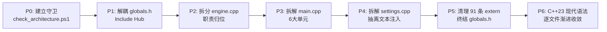

# VoxType C++23 架构重构与模块化 AI 执行标准

> **文档定位**：机器可验证的 AI 施工标准与架构契约守卫文档（取代愿景型白皮书）。  
> **基线规范**：必须通过 `tools/check_architecture.ps1` 静态断言与 `build.bat --test` 全量回归。  
> **制定日期**：2026-09-17  

---

## 0. 核心原则：机械契约优先与依赖递减

1. **机械契约高于散文建议**：
   - 每次重构改动必须执行 `tools/check_architecture.ps1`；
   - 任何导致全局包含数反弹、extern 反弹、main.cpp 行数反弹或反向依赖的代码一律视为构建失败。
2. **先断依赖，后改语法**：
   - 严禁在依赖交错未解时做跨全仓的语法翻新（如盲目全局替换 `std::span` 或 `std::expected`）；
   - 必须严格遵循「拆 Include Hub → 拆分 engine.cpp 归位 → 拆解 main.cpp → 拆解 settings.cpp → 消灭 extern → 逐文件做 C++23 现代语法收敛」的顺序。
3. **双轨错误模型（RT 零分配红线）**：
   - **RT 音频实时路径**（WASAPI 回调、waveIn 捕获）：必须使用纯标量 `enum class` 或 `trivially_copyable` 定长结构，**严禁任何 `std::string` 或动态堆内存分配**；
   - **Non-RT 业务路径**（ASR 会话、HTTP 请求、JSON 解析、配置读写）：统一采用 `std::expected<T, AppError>`，支持 Monadic 链式调用。
4. **契约文件同步是每个阶段的 DoD（Definition of Done）**：
   - 任何涉及类名、路径、配置项移动的改动，必须在当阶段同步更新 `AGENTS.md`、`ARCHITECTURE.md` 与 `check_architecture.ps1` 的基线。

---

## 1. 真实源码规模与基线指标 (Baselines)

通过 `tools/check_architecture.ps1` 实施只减不增（Ratcheting）守卫的绝对基线：

> **测量口径（强制性）**：所有源码必须用 **UTF-8** 解码后统计，禁止用 `Get-Content`。
> 原因：`build.bat` 调用的是 Windows PowerShell **5.1**，其 `Get-Content` 默认按 ANSI 代码页（本机 CP936）解码；UTF-8 源码中**紧跟非 ASCII 字节的换行会被吞掉**，实测使 `main.cpp` 少算 8 行（2751 vs 2759）、`settings.cpp` 少算 11 行（4394 vs 4405）、`globals.h` 的 extern 少算 1 条（90 vs 91）。守卫脚本统一使用 `[System.IO.File]::ReadAllLines()`。

| 监控指标 | 物理基线值 | 测量方法 | 违规判据 |
| :--- | :--- | :--- | :--- |
| **`globals.h` 包含者数量** | **22 个文件**（全部在 `src/` 下，**0 个测试**） | 正则 `#\s*include\s*[<"][^>"]*globals\.h[>"]` 扫 `src/ tests/ tools/` 的 `.h/.cpp` | `> 22` 立即判 FAIL |
| **`globals.h` 中 `extern` 声明** | **91 条** | 正则 `^\s*extern\s+` | `> 91` 立即判 FAIL |
| **`globals.h` 自身跨层 include** | **7 个**（asr 2 + audio 3 + core 2） | 解析 `globals.h` 的 include，按归属层归类 | `> 7` 立即判 FAIL |
| **`src/app/main.cpp` 行数** | **2759 行** | `ReadAllLines().Count` | `> 2759` 立即判 FAIL |
| **`src/ui/settings.cpp` 行数** | **4405 行** | `ReadAllLines().Count` | `> 4405` 立即判 FAIL |
| **跨层越权 include 总数** | **46 处**（见 §2.3） | 静态解析：把 include 解析到**真实归属层**后比对允许矩阵 | `> 46` 立即判 FAIL |
| **`src/core` 反向依赖** | **0**（硬约束，无豁免） | 同上，取 `src/core/**` 子集 | `> 0` 立即判 FAIL |
| **零源文件 target** | **0**（硬约束） | `add_library/add_executable` 声明为 STATIC/SHARED/MODULE 却无源文件 | `> 0` 立即判 FAIL |
| **缺 `/utf-8` 的 target** | **0**（硬约束） | 每个 target 须自带 `/utf-8` 或继承 `voxtype_build_flags` | `> 0` 立即判 FAIL |
| **PCH 含 `<windows.h>` 但无 `NOMINMAX`** | **0**（硬约束） | 二者同时出现即判 FAIL | `> 0` 立即判 FAIL |
| **生产 Target 签名防泄漏** | **严格隔离** | 从 `VoxType` 出发**沿 `target_link_libraries` 传递闭包**收集源文件，不得出现 `qwen_free_proto_sign.cpp` | 出现即判 FAIL |
| **测试产物位置** | **`build/artifacts/` 之下** | 解析所有 `RUNTIME_OUTPUT_DIRECTORY` 并规范化路径 | 落到 `build/cmake/**` 或非 `build/artifacts/**` 即判 FAIL |

**已修正的一处错误认知**：上一版把包含者记为"23 个文件（22 源码 + 1 测试）"。实测为 **22 个，且全部在 `src/` 下**——`tests/asr_json_protocol_test.cpp` 只是在**注释里提到** `globals.h`，并未 include 它：`// 离线测试桩：不链接真实日志实现（其依赖 globals.h → sherpa-onnx 等重头文件）`。按"字符串出现"统计会把它误算进去。

### 真实的源码定位校准
- **文本注入实现**：真实实现在 `src/ui/settings.cpp:902`（`PasteTextImeAware`，含微信 `WM_CHAR` 分支与标准剪贴板），结合 `src/core/selection_context.h` 与 `src/core/input_context.h`。`main.cpp` 仅有 2 处调用。
- **系统托盘实现**：`Shell_NotifyIcon` 真实实现在 `src/ui/hud.cpp`（3 处调用），`main.cpp` 中无托盘 API。
- **Header-Only 模块确认**：`src/asr/baidu_asr.h`、`src/core/llm_refine.h`、`src/audio/firered_vad.h` 为 Header-Only，严禁在 CMake 中脑补对应的 `.cpp`。

---

## 2. 目标分层架构契约 (Layer Architecture Contract)

单向无环拓扑结构，依赖方向严格受限：

```text
[Layer 4: App]
   │
   ├───────► [Layer 3: UI & Interaction]
   │               │ (UI -> ASR 重载接口通过 IAsrReloadListener 解耦)
   ├───────► [Layer 2: ASR & Cloud Services]
   │               │
   ├───────► [Layer 1: Audio Pipeline]
   │               │
   ▼               ▼
[Layer 0: Core & Platform Primitives]
```

### 2.1 依赖规则矩阵

| 模块层级 | 允许依赖的下层模块 | 严禁包含的层级 | 核心头文件暴露边界 |
| :--- | :--- | :--- | :--- |
| **Core (Layer 0)** | 仅 Windows SDK / STL / third_party | 全部其他模块 (`audio`, `asr`, `ui`, `app`, `platform`)，严禁 `globals.h` | `core/error.h`, `core/path_service.h`, `core/config_store.h`, `core/utf_util.h` |
| **Platform (Layer 0.5)** | `Core` | `audio`, `asr`, `ui`, `app` | `platform/text_injector.h`, `platform/input_context.h`, `platform/selection_context.h` |
| **Audio (Layer 1)** | `Core` | `asr`, `ui`, `app` | `audio/wasapi_capture.h`, `audio/vad_trim_core.h`, `audio/audio_diagnostics.h` |
| **ASR (Layer 2)** | `Core`, `Audio` | `ui`, `app` | `asr/asr_session.h`, `asr/asr_dispatcher.h`, `asr/engine_local.h` |
| **UI (Layer 3)** | `Core`（通过回调与 App/ASR 解耦） | `app`、`audio`、`asr`（含 provider 头，见 §2.3/§2.4） | `ui/hud.h`, `ui/settings.h`, `ui/hud_pagination.h`, `ui/hotkey.h` |
| **App (Layer 4)** | 全部下层模块 | — | 主程序入口与聚合工作流中枢 |

**归属补充（原文档缺失项）**：`src/core/input_context.h`（502 行，UIA/MSAA/WM_GETTEXT 分层回退）与 `src/core/selection_context.h`（370 行，含 38 处 Clipboard API、`OleSetClipboard`）当前物理位于 `src/core/`，但它们做的是**窗口/输入上下文探测**，属于 Platform 职责。二者必须随 P4 迁入 `src/platform/`，否则 Core 会被迫依赖 UIA/oleacc/oleaut32，破坏"Core 只依赖 SDK/STL 的可移植基础层"定位。迁入后 Platform 需要在 CMake 上补 `oleacc` / `uiautomationcore` / `oleaut32`（现文档把它们挂在 `voxtype_ui` 上，与实际归属不符）。

### 2.2 解决 UI → ASR 的 Save-Reload 依赖环
`AGENTS.md` 规定“Settings 保存后必须触发 ASR 引擎重载”。  
**解耦契约**：在 `Core` 中定义轻量抽象接口 `IAsrReloadListener`：
```cpp
namespace voxtype {
    class IAsrReloadListener {
    public:
        virtual ~IAsrReloadListener() = default;
        virtual void OnAsrConfigReloadRequested() = 0;
    };
}
```
Settings 窗口只持有 `IAsrReloadListener&`，由 `App` 层在启动时向 Settings 注入，杜绝 `UI → ASR` 的物理编译链接依赖。

> ⚠️ **但仅做这一件事不足以解耦 UI 与 ASR**——真实耦合形态见 §2.4，那里有一个开工前必须拍板的决策。

### 2.3 分层现状：越权引用 **46 处**（不是 22 处）

本方案早期版本只统计了 `globals.h` 的 22 个包含者，把"分层合规"等同于"不 include globals.h"。按**真实归属层**静态解析 include 后，全仓跨层越权引用共 **46 处**：

| 越权方向 | 处数 | 代表位置 | 与 §2.1 矩阵的关系 |
| :--- | :--- | :--- | :--- |
| `asr → app` | 15 | 各 streaming session / `qwen_free_proto_*` | ASR 只许依赖 Core/Audio |
| `ui → asr` | **14** | `settings.cpp`（14 个 provider 头） | 矩阵禁止 |
| `audio → asr` | **7** | `engine.cpp`(5)、`wasapi_capture.cpp`(2) | **矩阵禁止，且与 `asr → audio` 构成双向环** |
| `ui → audio` | 3 | `hotkey.cpp` / `hud.cpp` / `settings.cpp` → `engine.h` | 矩阵明文"UI 严禁直接依赖 audio"——**今天就已在违反** |
| `audio → app` | 3 | `engine.h`、`audio_diagnostics.cpp`（`resource.h` 等） | 矩阵禁止 |

**为什么这一点必须写进标准**：`46` 是 P1~P5 的真实收敛目标；只盯 `globals.h` 会让剩下 24 处（尤其 `audio → asr` 的 7 处）在新代码里被继续复制而不触发任何红灯。

**对 P2 的直接影响**：`engine.cpp` 现在 include 了 5 个 ASR 头（`asr_streaming_session.h`、`qwen_free_postprocess.h`、`qwen_audio_profile.h`、`qwen_special_word_filter.h`、`asr_runtime_log.h`），`wasapi_capture.cpp` 也引 `asr_runtime_log.h`。因此 P2 的退出判据"`src/audio/**` 不再反向依赖"要求**先把这 7 处摘干净**——这比"提取 4 类函数"多一步，必须在 P2 排期里显式列出，否则拆出来的 `voxtype_audio` 无法保持可独立链接。

### 2.4 开工前必须拍板的决策：provider 选项模型归属

`src/ui/settings.cpp` 直接 include 了 **14 个 ASR 层头文件**：

```
mai_transcribe.h   doubao_ime_asr.h   mimo_asr.h   qwen_asr.h   qwen_audio_http.h
qwen_audio_json.h  qwen_audio_streaming.h  qwen_special_word_filter.h
qwen_free_proto_asr.h  qwen_free_proto_llm.h  qwen_free_postprocess.h
qwen_free_proto_unet.h  qwen_free_proto_utdid.h  volcengine_asr.h
```

原因是 Settings 要渲染各 provider 的选项（端点、token、模型名、上下文开关……），必须认识这些 provider 的类型与常量。**§2.2 的 `IAsrReloadListener` 一个都不会减少**，于是 P4 的"`settings.cpp` 纯化为 Direct2D 布局与控件事件响应"在现结构下不可达。

**建议决策（与本项目既有的"字段注册表"结论一致）**：
把 **provider 选项的数据模型下沉到 Core**——由 Core 拥有 provider 描述符/字段注册表（member ptr + JSON key + 类型 + 默认值 + 控件 ID + 分组），Settings 只依赖 Core 的描述符渲染，ASR provider 从同一份模型读写。收益：`ui → asr` 的 14 处一次性归零，同时"加一个配置项"从 9~10 处收敛为 1 行。

若暂缓该决策，P4 必须降级为"仅迁移注入逻辑"，**不得**承诺 `settings.cpp < 3500` 行这一判据（因为移除注入约减 900 行后仍会因 provider 选项代码而反复回涨）。

---

## 3. 生产源文件真实归属与 CMake 模块库映射

主程序目前实际包含 **36 个生产源文件**，重构后按真实物理路径归入 5 个静态库与 1 个主入口：

```cmake
# =============================================================================
# Layer -1: 统一编译标志（必须最先建立，所有 target 强制继承）
# =============================================================================
# /utf-8 是硬约束，不是风格偏好：sherpa-onnx 的 cxx-api.h 含非 ASCII 字符串
# 字面量，缺 /utf-8 时在 CP936 下会产生 error C2001 / C2146 / C2061 / C2059，
# 编译直接失败（实测 MSVC 14.44.35207 + SDK 10.0.26100.0）。
# NOMINMAX 是 PCH 的前置条件，见 §4.1（否则 std::min/std::max 全量报 C2589）。
add_library(voxtype_build_flags INTERFACE)
target_compile_options(voxtype_build_flags INTERFACE /utf-8 /EHsc)
target_compile_definitions(voxtype_build_flags INTERFACE NOMINMAX UNICODE _UNICODE)
# 随配置变化的优化开关见 §4.2（在同一 target 上继续追加 target_compile_options）

# =============================================================================
# Layer 0: voxtype_core
# =============================================================================
add_library(voxtype_core STATIC
    src/core/startup_registration.cpp
    # P2 阶段提取:
    # src/core/config_store.cpp
    # src/core/path_service.cpp
    # src/core/utf_util.cpp
)
target_link_libraries(voxtype_core PUBLIC voxtype_build_flags shlwapi shell32 crypt32 advapi32)

# =============================================================================
# Layer 0.5: voxtype_platform
# =============================================================================
# P0~P3 期间本层尚无源文件。CMake 对 STATIC 库的零源声明会直接报
#   CMake Error: No SOURCES given to target: voxtype_platform
# 因此在 P4 真正产出源文件前，必须先声明为 INTERFACE。
add_library(voxtype_platform INTERFACE)
target_link_libraries(voxtype_platform INTERFACE voxtype_core)
# P4 阶段改为 STATIC 并加入源文件（同时补 oleacc / uiautomationcore / oleaut32，
# 因为 input_context.h / selection_context.h 会随迁至本层，见 §2.1）：
# add_library(voxtype_platform STATIC
#     src/platform/text_injector.cpp
#     src/platform/input_context.cpp
#     src/platform/selection_context.cpp
# )
# target_link_libraries(voxtype_platform PUBLIC
#     voxtype_build_flags voxtype_core imm32 user32 ole32 oleacc uiautomationcore oleaut32)

# =============================================================================
# Layer 1: voxtype_audio
# =============================================================================
add_library(voxtype_audio STATIC
    src/audio/audio_diagnostics.cpp
    src/audio/batch_vad_trimmer.cpp
    src/audio/streaming_vad_trimmer.cpp
    src/audio/vad_trim_core.cpp
    src/audio/wasapi_capture.cpp
)
target_link_libraries(voxtype_audio PUBLIC voxtype_build_flags voxtype_core mmdevapi ole32 winmm)

# =============================================================================
# Layer 2: voxtype_asr
# =============================================================================
add_library(voxtype_asr STATIC
    src/asr/asr_diagnostics.cpp
    src/asr/asr_dispatcher.cpp
    src/asr/asr_result.cpp
    src/asr/asr_runtime_log.cpp
    src/asr/asr_session.cpp
    src/asr/cloud_asr_common.cpp
    src/asr/cloud_http_common.cpp
    src/asr/doubao_ime_asr.cpp
    src/asr/doubao_ime_streaming_session.cpp
    src/asr/mai_transcribe.cpp
    src/asr/mimo_asr.cpp
    src/asr/qwen_asr.cpp
    src/asr/qwen_audio_http.cpp
    src/asr/qwen_audio_streaming.cpp
    src/asr/qwen_audio_streaming_session.cpp
    src/asr/qwen_free_proto_asr.cpp
    src/asr/qwen_free_proto_llm.cpp
    src/asr/qwen_free_proto_unet.cpp
    src/asr/qwen_free_proto_utdid.cpp
    src/asr/qwen_free_streaming_session.cpp
    src/asr/qwen_streaming_session.cpp
    src/asr/volcengine_net_diag.cpp
    src/asr/volcengine_streaming_session.cpp
    src/asr/winhttp_websocket_transport.cpp
    # P2 阶段从 engine.cpp 剥离出的纯本地 Sherpa 逻辑:
    # src/asr/engine_local.cpp
)
target_link_libraries(voxtype_asr PUBLIC
    voxtype_build_flags
    voxtype_core
    voxtype_audio
    winhttp ws2_32 bcrypt rpcrt4
    sherpa-onnx-cxx-api onnxruntime kaldi-native-fbank-core opus delayimp
)

# =============================================================================
# Layer 3: voxtype_ui
# =============================================================================
add_library(voxtype_ui STATIC
    src/ui/hotkey.cpp
    src/ui/hud.cpp
    src/ui/settings.cpp
)
target_link_libraries(voxtype_ui PUBLIC
    voxtype_build_flags
    voxtype_core
    d2d1 dwrite comctl32 user32 gdi32 shell32
    # P4 之后可移除（input_context.h / selection_context.h 迁往 voxtype_platform）:
    oleacc uiautomationcore
)

# =============================================================================
# Layer 4: VoxType (App)
# =============================================================================
add_executable(VoxType WIN32
    src/app/main.cpp
    src/app/resources.rc
    src/audio/engine.cpp  # P2 前暂留在此，P2 拆解后移除
)
target_link_libraries(VoxType PRIVATE
    voxtype_build_flags
    voxtype_core
    voxtype_platform
    voxtype_audio
    voxtype_asr
    voxtype_ui
)
```

### 3.1 三条与 CMake 结构绑定的硬约束

1. **每个 target 必须显式继承 `voxtype_build_flags`（或自带 `/utf-8`）。** 这是本轮新增的红线：早期版本把 `/utf-8` 只挂在 `VoxType` 上，一旦拆成 5 个静态库，`voxtype_asr` 编译 sherpa 头就会直接报错（见 §3 顶部注释与 §4.1）。守卫已把"缺 `/utf-8` 的 target"设为硬 FAIL。

2. **每个静态库都必须能独立链接成一个离线测试可执行文件。** 理由：本仓库大量使用 `#pragma comment(lib, ...)`（`src/` 内共 22 个不同库，分布于 `main.cpp`、`startup_registration.cpp`、`input_context.h`、`llm_refine.h`、各 provider 等）。这带来两个后果：一是 CMake 的链接列表**看起来**不完整但实际上能链上（`startup_registration.cpp` 自带 `advapi32` pragma，所以 `voxtype_core` 是自足的），二是**链接契约无法从构建图层面校验**——"静态库引用了 exe target 拥有的符号"这类反向依赖不会让主 exe 失败，却会让"单独给某个库写测试"直接失败。
   落地方式：为每个库加一个 `EXCLUDE_FROM_ALL` 的链接冒烟目标（一个空 `main` + 链接该库），纳入守卫。

3. **`qwen_free_proto_sign.cpp` 的隔离必须按传递闭包校验，而不是文本匹配。** 早期守卫只在 `add_executable(VoxType ...)` 的文本里找这个文件名；一旦它被收进 `voxtype_asr`（而 `VoxType` 链接 `voxtype_asr`），文本匹配就会漏判。守卫已改为从 `VoxType` 出发沿 `target_link_libraries` 收集传递闭包再判断。

---

## 4. 预编译头与构建预设规范 (PCH & Build Settings)

### 4.1 修正后的 PCH 清单

严禁包含不存在的 `<jthread>`。C++23 规范使用 `<thread>` 承载 `std::jthread`：

```cmake
target_precompile_headers(voxtype_core PUBLIC
    <windows.h>
    <string>
    <string_view>
    <vector>
    <memory>
    <expected>
    <format>
    <print>
    <span>
    <ranges>
    <chrono>
    <thread>
)
```

> ⚠️ **PCH 里放 `<windows.h>` 有一个前置条件：必须先全局定义 `NOMINMAX`。**
>
> MSVC 的预编译头通过 `/FI` 强制包含头文件。`<windows.h>` 一旦在 PCH 中被解析（此时 `NOMINMAX` 尚未定义），`min`/`max` 宏就固定下来并污染每一个 TU；项目里 45 个源文件各自写的 `#ifndef NOMINMAX / #define NOMINMAX` 此时已经失效（`windows.h` 的 include guard 已置位）。后果是全仓 **54 处 `std::min` / `std::max`（分布在 14 个文件）全部编译失败**。
>
> 实测（模拟 `/FI` 强制包含）：
> ```
> ===== 无 /FI =====                    pch_test.cpp  EXIT=0
> ===== /FIwindows.h =====
> pch_test.cpp(4): error C2589: '(': illegal token on right side of '::'
> pch_test.cpp(5): error C2589: '(': illegal token on right side of '::'
>                                        EXIT=2
> ```
>
> **两种修法（任选其一，必须显式落地）**：
> 1. 在 `voxtype_build_flags` 的 `target_compile_definitions` 中加入 `NOMINMAX`（§3 骨架已采用此方案，一行解决全局）；
> 2. 或把 `<windows.h>` 从 PCH 清单中移除（PCH 的主要收益来自 STL 与 `<format>`）。
>
> 守卫已把"PCH 含 `<windows.h>` 但 `CMakeLists.txt` 无 `NOMINMAX`"设为硬 FAIL。注意这条如果在 P6 才暴露，等于前 5 个阶段的成果全部卡在最后一步——所以必须在建立 `voxtype_build_flags` 时一次性解决。

### 4.2 构建预设与 `build.bat` 协同规范

- **编译选项参数化**：把硬编码的 `/O2` 改为区分配置的生成表达式。该写法已实测无误（CMake + Ninja 下 `$<$<CONFIG:Debug>:/Od /Zi>` 正确产出两个独立开关，未合成单个参数）：

  ```cmake
  # 注意：/utf-8 与 /EHsc 应留在 voxtype_build_flags（§3），此处只放随配置变化的开关
  target_compile_options(voxtype_build_flags INTERFACE
      $<$<CONFIG:Release>:/O2>
      $<$<CONFIG:Debug>:/Od /Zi>
  )
  ```

- **测试产物按预设隔离（三方同步，不可只改一处）**：
  现行值为 `${CMAKE_BINARY_DIR}/../../artifacts/tests`，其中 `../../` 正是让它落到 `build/artifacts/tests` 的关键。`build.bat` 里 5 个测试的路径写死指向 `%BUILD_ROOT%\artifacts\tests\*.exe`。
  **若直接改成 `${CMAKE_BINARY_DIR}/artifacts/tests`，产物会落到 `build/cmake/x64-release/artifacts/tests/`**，造成两个后果：① `build.bat --test` 报 `ERROR: ... test executable was not produced`，5 个测试全挂；② 违反 `AGENTS.md` 的布局红线"`build/cmake/x64-release/` 只放 CMake/Ninja 编译中间产物"。
  正确改法是三方同时改：
  ```cmake
  RUNTIME_OUTPUT_DIRECTORY "${CMAKE_BINARY_DIR}/../../artifacts/tests/$<CONFIG>"
  ```
  并同步 ① `build.bat` 中 5 条测试路径加上配置子目录（如 `artifacts\tests\Release\`），② 守卫的 `RUNTIME_OUTPUT_DIRECTORY` 布局规则与基线。守卫已把"解析后不落在 `build/artifacts/**`"设为硬 FAIL。

- **新增预设必须同步改造 `build.bat`，否则预设形同虚设**：
  当前 `build.bat` 把 `BUILD_TREE=%BUILD_ROOT%\cmake\x64-release`、`RUNTIME_DIR=%BUILD_ROOT%\run\x64-release`、`VERSION_FILE`、`INSTALL_MANIFEST` 以及 5 条测试路径**全部硬编码为 `x64-release`**。因此新增 `x64-debug` / `x64-asan` 预设后，`build.bat` 依然只会配置与构建 release。落地 `x64-asan` 必须让 `build.bat` 接受配置参数（如 `build.bat --preset x64-asan`），并把上述派生路径统一改为按预设拼接。

- **ASan 支持**：采用静态运行时 `/MT` + `/fsanitize=address`，**已实测编译、链接、运行全部成功**，无需附加 DLL（走静态 ASan 运行时）。
  补充两条前置条件：① 项目已有 `CMAKE_MSVC_RUNTIME_LIBRARY "MultiThreaded$<$<CONFIG:Debug>:Debug>"`，与该结论一致，不要改成 `/MD`——`/MD` 变体运行时需要 `clang_rt.asan_dynamic-x86_64.dll`，而它只存在于 MSVC 的 `bin\Hostx64\x64\`，`build.bat` 目前只把 Ninja 目录加入 PATH，会直接运行失败；② `/fsanitize=address` 与现有的 DLL 延迟加载 `/DELAYLOAD` 可共存，但 ASan 下延迟加载的 DLL 不会被插桩，定位内存问题时需知悉这一点。

---

## 5. 分阶段施工路线图与明确退出判据 (Phased Milestones)

每个阶段必须满足该阶段的明确判据（DoD）方可进入下一阶段。**所有阶段必须保持 `build.bat` 与 `build.bat --test` 全绿。**



**阶段判据的机器入口**（每个 Milestone 收尾必须跑对应命令，输出为 `PASS` 才算该阶段完成）：

| 阶段 | 判定命令 | 该命令实际断言的内容 |
| :--- | :--- | :--- |
| P1 | `tools/check_architecture.ps1 -Stage P1` | `globals.h` 不再出现 sherpa / onnx / provider 头 |
| P2 | `tools/check_architecture.ps1 -Stage P2` | `src/audio/engine.cpp` 已消失，且 `core/path_service.h`、`core/config_store.h`、`asr/engine_local.h` 均已就位 |
| P3 | `tools/check_architecture.ps1 -Stage P3` | `main.cpp < 250` 行；`ui/hud_pagination.h` 与 `tests/hud_pagination_test.cpp` 存在，且**同时**被 `CMakeLists.txt` 与 `build.bat --test` 引用 |
| P4 | `tools/check_architecture.ps1 -Stage P4` | `settings.cpp < 3500` 行；`src/platform/text_injector.cpp` 存在 |
| P5 | `tools/check_architecture.ps1 -Stage P5` | `globals.h` 已删除，且包含者与 extern 均为 0 |
| P6 | `tools/check_architecture.ps1 -Stage P6` | 裸指针音频切片签名（`const float*, size_t`）清零 |

---

### Milestone P0：立不变量守卫与安全锚点

- **操作**：
  1. 创建 `tools/check_architecture.ps1`（**v2：12 项检查 + `-Stage` 阶段闸门**）；
  2. 挂接至 `build.bat` **主流程**（紧跟 `validate_settings_layout.ps1` 之后），**每次构建都执行**，而不是仅 `--test` 时执行——否则日常快速构建会静默放过回归，与 §5 开头"所有阶段必须保持 `build.bat` 全绿"相矛盾；
  3. 守卫脚本**必须为纯 ASCII**（或带 UTF-8 BOM），见 §7.3。
- **退出判据**：
  - `build.bat --test` 与 `build.bat` 均能在守卫处正确阻断（`errorlevel` 传播）；
  - 守卫为 **17 项检查**（12 项不变量 + 5 项防绕过），且在真实仓库全绿；
  - 基线严格锁定在 **`22 / 91 / 7 / 2759 / 4405 / 46`**（含义见 §1 表格），且守卫必须能**失败**——用注入违规的合成工程验证过 **11/11 命中**，不允许出现"只会 PASS 的守卫"；
  - **防绕过 5 项全部就位**（详见 §5 表格）：抬基线、删测试、注释掉守卫调用、`file(GLOB)`、未声明的新层目录，五条路径全部被机械阻断；
  - **阶段判定入口就位**：`tools/check_architecture.ps1 -Stage P1` 等命令可运行（此刻 `P1` 预期为 FAIL，因为 P1 尚未实施）；
  - **补一次提交**，给 P0 一个可回滚的锚点。当前 `tools/check_architecture.ps1`、`.plan/refactor/`、`.agents/` 仍是 untracked 状态，"P0 已完成"没有任何提交作为凭据；且守卫的"基线防上调"检查**只有在守卫被提交后才会生效**（未提交时该检查自动跳过）。

- **已发现并修正的守卫缺陷（供后续维护者参考，勿回退）**：

| 缺陷 | 症状 | 修正 |
| :--- | :--- | :--- |
| 分层正则要求目录前缀 | 规则 `#include "(asr\|audio\|ui\|app\|platform)/"` 在全仓**永不命中**（本仓库全部使用裸文件名 include，因为 CMake 把各子目录都加进了 include path）→ 该规则是死代码，真违规一个都抓不到 | 改为"把 include 解析到**真实归属层**"再比对允许矩阵 |
| 用 `Get-Content` 统计 | Windows PowerShell 5.1 按 ANSI(CP936) 解码 UTF-8 源码，吞掉"紧跟非 ASCII 字节的换行"，导致 `main.cpp` 报 2751（真值 2759）、`settings.cpp` 报 4394（真值 4405）、extern 报 90（真值 91）。**文档基线与被强制的基线不是同一组数** | 统一改用 `[System.IO.File]::ReadAllLines()` |
| 包含者口径 | 用字符串出现次数统计，把"注释里提到 globals.h"的测试文件也算了进去（23 vs 真实 22） | 用严格 include 正则 |
| 签名隔离只查文本 | 只扫 `add_executable(VoxType)` 的文本；一旦 `qwen_free_proto_sign.cpp` 被收进 `voxtype_asr` 就漏判 | 改为沿 `target_link_libraries` 求传递闭包 |
| 只有"≤ 基线" | 无法判定任何阶段"做完了"（P1~P5 的 DoD 全部不可验证） | 新增 `-Stage P1..P6` 阶段闸门 |

---

### Milestone P1：解耦 `globals.h` 的 Include Hub
- **问题**：`globals.h` 包含了 `sherpa-onnx/c-api/cxx-api.h` 等 9 个跨层头文件，导致 23 个文件形成巨大重编译爆炸圈。
- **操作**：
  1. 将 9 个跨层 `#include` 从 `globals.h` 移除；
  2. 仅在真正需要该模块的 `.cpp` 或局部 `.h` 中按需引入；
  3. `globals.h` 内部保留最简核心标量定义。
- **退出判据**：
  - `globals.h` 不再包含任何 sherpa/onnx 头文件；
  - 全量重新编译时间产生可度量的下降；
  - `build.bat --test` 保持全部 PASS。

---

### Milestone P2：拆分 `src/audio/engine.cpp` (1497 行) 并按职责归位
- **问题**：`engine.cpp` 实际承载了 4 种不相干职责（路径、配置、音频采集、ASR 引擎）。
- **操作**：
  1. **提取路径服务**：将 `AppRootDir`, `MutableDataDir`, `ConfigPath`, `IsPortableMode` 等 14 个函数提取为 `src/core/path_service.h/.cpp`（进 `voxtype_core`）；
  2. **提取配置存储**：将 `LoadConfig`, `SaveConfig`, `ApplyPreset` 提取为 `src/core/config_store.h/.cpp`（进 `voxtype_core`）；
  3. **提取 WaveIn 采集**：将 `StartAudioCapture`, `WaveInProc` 移入 `src/audio/`；
  4. **保留本地引擎**：`engine.cpp` 剩余的本地 Sherpa 模型加载与识别逻辑重命名为 `src/asr/engine_local.h/.cpp`（进 `voxtype_asr`）。
- **退出判据**：
  - `src/audio/engine.cpp` 彻底解体；
  - `src/audio/**` 与 `src/asr/**` 不再为获取配置而反向依赖 `audio/engine.h`；
  - **`audio → asr` 的 7 处反向依赖清零**（见 §2.3）：`engine.cpp` 引用的 `asr_streaming_session.h` / `qwen_free_postprocess.h` / `qwen_audio_profile.h` / `qwen_special_word_filter.h` / `asr_runtime_log.h`，以及 `wasapi_capture.cpp` 引用的 `asr_runtime_log.h` / `asr_streaming_session.h`。这一步必须在"提取 4 类函数"之外单独排期，否则拆出的 `voxtype_audio` 无法独立链接；
  - `voxtype_audio` 能独立链接出一个 `EXCLUDE_FROM_ALL` 的空 `main` 冒烟目标（证明无反向依赖残留）；
  - 同步更新 `ARCHITECTURE.md` 与 `AGENTS.md` 中的文件索引。

---

### Milestone P3：拆解 `src/app/main.cpp` (2759 行) 为 6 大单元
- **问题**：`main.cpp` 包含状态机、会话生命周期、窗口过程、HUD 分页算法等 6 种混杂逻辑。
- **操作**（拆分为 6 个高内聚单元）：
  1. **ASR Attempt 调度器** (`src/app/asr_attempt_manager.h/.cpp`，~900 行)：管理 ASR 重试、fallback、final 处理；
  2. **录音会话控制器** (`src/app/recording_session_controller.h/.cpp`，~440 行)：管理 PTT 按住/松开与 WASAPI 开始/停止；
  3. **主窗口过程** (`src/app/main_window.h/.cpp`，~440 行)：处理 13 个 `WM_APP` 消息；
  4. **Streaming HUD 文本分页排版器** (`src/ui/hud_pagination.h/.cpp`，~147 行)：
     - **特别突破**：这 11 个函数纯度极高、无 Win32 状态依赖（实测：区间内无 `HWND` / `HDC` / `IDWrite` / `ID2D1` / `SetWindowPos`）。提取的同时新增 `tests/hud_pagination_test.cpp`，补齐长期缺失的 UI 逻辑自动化测试！
     - **必要附带动作**：这 11 个函数引用 4 个 `globals.h` 常量——`kStreamingPartialHudMaxLines`、`kStreamingPartialHudMaxScreenFraction`、`kStreamingPartialHudMaxWidthDip`、`kStreamingPartialHudTailChars`。**这 4 个常量必须随函数一起迁入 `ui/hud_pagination.h`**，否则测试 TU 仍要 include `globals.h`，而 `globals.h` 会连带拉进 sherpa 与全部 provider 头（§1 的 include hub），"纯函数单测"就变成了"重头文件编译测试"。
  5. **调试诊断输出** (`src/core/debug_logger.h/.cpp`，~130 行)；
  6. **纯净入口 `main.cpp`**：收缩至消息泵与实例互斥初始化（**< 250 行**，与守卫判据一致）。
- **退出判据**：
  - `tools/check_architecture.ps1 -Stage P3` 输出 PASS（断言 `main.cpp < 250` 行，且 `ui/hud_pagination.h`、`tests/hud_pagination_test.cpp` 存在并**同时**被 `CMakeLists.txt` 与 `build.bat --test` 引用）；
  - 新增的 `hud_pagination_test` 纳入 `build.bat --test` 且 PASS。

---

### Milestone P4：拆解 `src/ui/settings.cpp` (4405 行) 抽离文本注入引擎
- **问题**：文本注入真实实现在 `settings.cpp` 中（`PasteTextImeAware`），夹杂了窗口探测、微信兼容与剪贴板控制。
- **操作**：
  1. **建立 `voxtype_platform`**：创建 `src/platform/text_injector.h/.cpp`，并把 CMake 里的 `voxtype_platform` 从 `INTERFACE` 改回 `STATIC`（见 §3 骨架注释——零源文件的 STATIC 库会让 CMake generate 直接失败）；
  2. **迁移注入逻辑**：将 `PasteTextImeAware`、微信 `WM_CHAR` 逐字发送、普通剪贴板粘贴、IMM32 状态保护从 `settings.cpp` 移至 `text_injector.cpp`；
  3. 把 `src/core/selection_context.h` 与 `src/core/input_context.h` 迁入 `src/platform/`（归属修正见 §2.1），并补齐 `oleacc` / `uiautomationcore` / `oleaut32` 链接；
  4. `settings.cpp` 纯化为 Direct2D 布局与控件事件响应。
- **前置依赖**：第 4 项的可达性取决于 **§2.4 的 provider 选项模型归属决策**。若该决策未拍板，`settings.cpp` 仍会 include 14 个 ASR provider 头，行数会在移除注入逻辑后迅速回涨。
- **退出判据**：
  - `tools/check_architecture.ps1 -Stage P4` 输出 PASS（`settings.cpp < 3500` 且 `src/platform/text_injector.cpp` 存在）；
  - `ui → asr` 的越权引用从 14 处降到 0（若采纳 §2.4 决策）；
  - 微信 `WM_CHAR` 注入逻辑与剪贴板逻辑通过平台模块暴露清晰 API，且行为回归基线通过（见 §7.2）；
  - `build.bat --test` 保持全绿。

---

### Milestone P5：消灭 91 条 `extern` 与终结 `globals.h`
- **问题**：全局变量导致各模块随意读写全局状态，模块无法独立。
- **操作**：
  1. 将 91 条 extern 涉及的状态归类到其所属的控制器对象中（如 `RecordingSessionController`、`AsrAttemptManager`、`ConfigStore`）；
  2. 采用显式的上下文传递或依赖注入，消灭全局跨文件读写；
  3. 物理删除 `src/app/globals.h`。
- **退出判据**：
  - `src/app/globals.h` 文件被安全删除；
  - `tools/check_architecture.ps1 -Stage P5` 输出 PASS（断言 `globals.h` 已删除，且 **包含者 0 / extern 0**——文件删除后两者必然归零，守卫据此判定）；
  - 同步更新 `AGENTS.md`，将旧规则"新增配置项同步三处"改为规范的新模式（注意：该规则实际涉及 9~10 处、4 个文件，不只是三处）；
  - 同步更新 `ARCHITECTURE.md` L89 关于"全局变量定义在 main.cpp、经 globals.h 以 extern 访问"的整段描述。

---

### Milestone P6：现代 C++23 语法逐文件渐进收敛
- **原则**：在依赖完全解耦的前提下，**逐文件做现代语法替换，做一个提交一个，杜绝跨全仓大爆炸**。
- **标准**：
  - **音频切片**：`std::span<const float>` 替换裸指针切片；
  - **错误处理**：Non-RT 业务层返回 `std::expected<T, AppError>`，链式调用；
  - **多线程**：`std::jthread` + `std::stop_token` 协作终止；
  - **字符串**：`std::format` 彻底消灭剩余 `snprintf`。
- **退出判据**：
  - 核心模块全面符合 `.agents/skills/modern-cpp23-guidance/SKILL.md` 规范；
  - 所有单元测试通过；
  - 整个架构具备极高的代码可读性与自动化测试保护。

---

## 6. 核心避坑红线 (不可违反)

1. **微信客户端打字**：必须使用 `WM_CHAR` 逐字投递，严禁使用剪贴板+`Ctrl+V`。
2. **WASAPI 音频实时线程**：采集回调内部严禁执行任何堆内存分配（`new`/`malloc`），严禁构建带 `std::string` 的错误对象。
3. **WASAPI 生命周期**：严格维持 `Init -> Start -> Stop -> Release`，不可跳过 `Release`。
4. **DPI 坐标换算**：DirectWrite/Direct2D 内部使用 DIP，向 Win32 `SetWindowPos` 传递时必须显式乘以 DPI 缩放换算为物理像素。
5. **DLL 延迟加载安全性**：`sherpa-onnx` 等库必须保持 `/DELAYLOAD` 并受 SEH 保护。
6. **UTF-8 字面量**：在 MSVC `/utf-8` 选项下，初始化 `std::string` 统一使用常规 `"..."`，避免使用 `u8"..."` 引入 `char8_t` 类型冲突。
7. **编译标志继承（新增）**：每个 `add_library` / `add_executable` 都必须继承 `voxtype_build_flags`（或自带 `/utf-8`）。`/utf-8` 是硬约束而非风格偏好——sherpa-onnx 的 `cxx-api.h` 含非 ASCII 字符串字面量，缺 `/utf-8` 时直接编译失败（`C2001 newline in constant` 等，实测）。守卫对此硬 FAIL。
8. **`.ps1` 脚本编码（新增）**：本仓库所有由 `build.bat` 调用的 PowerShell 脚本必须**纯 ASCII**，或带 UTF-8 BOM。原因：`build.bat` 使用 Windows PowerShell **5.1**，它按 ANSI(CP936) 解码**无 BOM** 的 UTF-8 脚本，会吞掉"紧跟非 ASCII 字节的换行"，把下一行代码并进注释，症状是 `Missing '=' operator after key in hash literal` 一类**看不出与编码有关**的解析错误。此坑本轮已实际踩中一次。
9. **零源文件 target（新增）**：`add_library(X STATIC/SHARED/MODULE)` 必须至少声明一个源文件，否则 CMake 在 generate 阶段直接失败（`No SOURCES given to target`）。需要"先占位后填内容"时请用 `INTERFACE`。

---

## 7. 施工协议（AI 执行时必须遵守）

> 本节是为了让"标准"在**多轮、跨会话**的 AI 施工中不被走样。每一条都对应一次实际踩过的坑。

### 7.1 提交与回滚

- **每个 Milestone 一个原子提交**，提交信息格式：`refactor(P2): dissolve src/audio/engine.cpp into layer-owned files`。
- **禁止在重构流程中插入 `git stash`**。本机存在已知的文件系统 atomic-write 问题（历史上出现过 `.git/refs/` 目录丢失、`.pack` 删除后遗留孤立 `.idx`），中间销毁性操作会放大风险。
- **每个阶段开始前记录回滚点**（当前 `HEAD` 的 SHA 写到 `.plan/refactor/rollback-anchors.md`），阶段失败时用 `git switch -c` / `git restore` 回到锚点，而不是"就地挽救"。
- **不要用 `file(GLOB ...)` 收集源文件**：会让"新增文件忘记进 CMake"与"删除文件忘记出 CMake"都变成静默行为，同时让 §3 的 target 结构检查失真。

### 7.2 行为回归基线（P2/P4 之前必须建立）

架构断言只能证明"结构没错"，证明不了"功能没坏"。现有 5 个测试全部是**离线协议级**（`qwen_free_protocol_test` / `qwen_audio_json_test` / `llm_refine_test` / `audio_diagnostics_test` / `asr_json_protocol_test`），对 **UI 布局、文本注入、WASAPI 硬件、托盘、热键钩子零覆盖**。而 P2 要动采集、P4 要动注入——恰好是零覆盖的两块。

仓库已具备建立基线的条件，不要另起炉灶：

- `tools/asr_audio_replay.cpp`（752 行，多后端回放）+ `models/**/*.wav` → 建"黄金样本 → 输出哈希"回归，覆盖 `engine.cpp` 解体与 VAD/采集改动；
- 文本注入 → 建立人工核对清单（微信 / 记事本 / VS Code / 浏览器四类目标窗口各一遍），并在 P4 前后各跑一次，记录结果。

**没有建立基线的阶段不得宣称"测试全覆盖"。**

### 7.3 契约文件同步

每个 Milestone 收尾**必须同时**更新，缺一项即该阶段未完成：

| 文件 | 需要同步的内容 |
| :--- | :--- |
| `ARCHITECTURE.md` | `Source Code Structure` 文件职责表（L40-88）、`Text Injection` 章节、`Main Modules` 对应小节 |
| `AGENTS.md` | "新增配置项同步三处"规则、"Settings 布局常量在 `globals.h` 的 `UiStyle`"规则、新增本文档 §6.7/6.8/6.9 三条红线 |
| `CHANGELOG.md` + `README.md` + `src/app/resource.h` | 若涉及版本号（版本号只改 `resource.h` 的四个宏，其余为派生） |
| `tools/check_architecture.ps1` | 阶段收尾后把新的基线数值写回 ratchet |

### 7.4 沟通口径

- 任何"改完了"的结论必须附带**命令与输出**（`build.bat` / `build.bat --test` / `check_architecture.ps1 -Stage PX`），不接受口头完成；
- 任何推翻先前结论的判断必须给出**新证据**，并同时清理文档中已被推翻的旧结论（不留注释性残留）。
