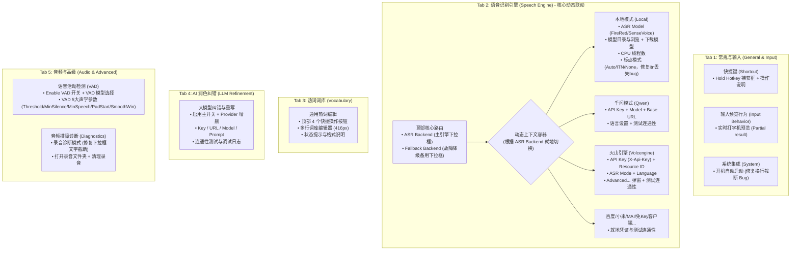

# VoxType Settings 界面重组与高度适配优化方案

> **状态**：已执行（M1–M4 全部落地，2026-09-21；末次实测值见 §7.2 v3）\
> **修订**：v3 — 见文末 §7 修订记录\
> **文档位置**：`.plan/refactor/settings-tab-layout-optimization-plan.md`\
> **日期**：2026-09-21\
> **核心原则**：不引入重型外部依赖、保持 Win32 原生控件体验、严格通过数学核算确保各 DPI 下所有页面垂直高度严丝合缝、彻底解决功能堆叠与概念割裂。\
> **核算口径**：所有高度/坐标一律在 **144 DPI 设计像素**域核算与比较；控件底部硬上限 `Y = 616`（见 §2.1）。

***

## 1. 现状审查与核心病根剖析

根据用户现场截屏（`media_1789969808608.webp` 与 `media_1789969810144.webp`）及代码反查，现存 Settings 界面存在四大结构性违和：

### 1.1 概念割裂与“双头怪”：`Recognition` vs `Cloud ASR`

- **现象**：用户在 `Recognition` 选定主引擎为 `Qwen ASR`（云端）后，下方依旧硬生生展示着属于本地模型的 `FireRedASR2 AED`、`[Download Local Model]`、`Model folder` 以及 `Threads`。
- **痛点**：普通用户会严重困惑“我选了云端，为什么还要配本地路径？到底谁在生效？”；与此同时，上方又并存一个 `Cloud ASR` Tab，配置 API Key 必须跨页面寻找。
- **根因**：早期纯本地架构向云端演进时，未做动态显示联动，只是粗暴地把云端扔到新 Tab，而将本地控件硬编码钉在主页。

### 1.2 VAD 5 大声学参数霸凌主界面

- **现象**：`Recognition` 正中央摆着 170px 高的 `VAD Parameters` 分组框，暴露了 5 个极度晦涩且危险的微调数字输入框（`Threshold 0.10`、`Min silence 500ms`、`Min speech 40ms`、`Pad start 400ms`、`Smooth win 5`）。
- **痛点**：95% 的普通用户完全不需要改动它们，但它们霸占了半壁江山，导致高频的 `Partial result`（实时打字机上屏）被迫和 `Threads` 拼凑在一行，最常用的 `Punctuation`（标点模式）被挤到窗口最底端。

### 1.3 `General` Tab 职责不纯与高 DPI 截断 Bug

- **现象**：`General` 只有快捷键、开机自启、音频排障诊断（Diagnostics）三个松散的框。
- **痛点**：
  - 音频诊断（将录音保存为本地 WAV 供排查报错）属于典型的开发者/排障高级工具，混在日常设置中显得杂乱；
  - 存在严重的 DPI 视觉 Bug：“Startup” 提示文案 `"Uses your Windows account startup list. Moving a Portable copy is corrected when you"` 右侧直接被截断；“Diagnostics” 下拉框 `"Save failed requests onl v"` 文字被下拉箭头截断。

### 1.4 后处理链路碎片化

- 标点符号（Punctuation）在 `Recognition`；
- 专有热词（Vocabulary）在 `Vocabulary`；
- AI 纠错重写在 `LLM`。
- 文本后处理能力被无序拆散在 3 个角落，缺乏统一逻辑。

***

## 2. 严苛的界面高度与几何空间审查（Strict Geometric & Spatial Review）

在提出任何重组方案之前，必须先对 Win32 窗口可用区域进行精确的数学核算。

### 2.1 基础几何约束（基准：144 DPI / 150% 缩放，Scale = 1.0）

查阅 `src/ui/ui_types.h` 与 `src/ui/settings.cpp:LayoutSettingsWindow`：

- **窗口外框尺寸**：`SettingsWindowW = 850`, `SettingsWindowH = 740`
- **非客户区（标题栏+外边框预留）**：`SettingsWindowNonClientReserveH = 48`
- **客户区净高度**：$740 - 48 = 692\text{px}$
- **底部操作区（Footer）**：
  - `FooterHeight = 68`
  - `FooterMinTop = 632`
  - `tabBottom = footerTop - 4 = 628`
- **Tab 控件外框**：
  - 顶部起点：`Y = 12`
  - 底部止点：`tabBottom = 628`
  - Tab 控件总高：$628 - 12 = 616\text{px}$
- **Tab 内部客户工作区**：
  - Tab 标签页表头高度由 comctl32 依当前字体推导，**不是** **`S()`** **缩放量**；设计上按 36px 预留 → 有效工作区自 `Y = 12 + 36 = 48` 起；
  - **控件底部硬上限**：`Y = 616`（`tabBottom = 628` 再留 12px 内边距）；
  - **首行基准**：`FirstRowY = 76`。`Y = 48` 与 `76` 之间只够放一行说明（现状即 `CloudAsrHintY = 48`，默认给 `TabCloudAsr` 的云端隐私提示）；
  - **核算域约定**：所有数值一律在**设计像素**域比较。表头随字体线性变化（`UiFontForDpi` 已按 DPI 出字体），因此 `616` 这个上限本身是 DPI 无关的，**不要额外按 DPI 折算后再比较**（原因见 §6.5）。

### 2.2 方案可行性审查：对“4-Tab 强行合并方案”的数学证伪

在初期构想中，曾考虑将 `Vocabulary`（热词）与 `LLM`（大模型）合并为一个顶级 Tab“文本后处理”。
经严密的高度叠加计算：

- `Vocabulary` 当前由 4 个按钮、1 个通用词库多行文本框（`groupH = 416`）、状态标签和提示行构成，自 `Y = 76` 起至提示行底部 `Y = 600`，占用 **$524\text{px}$**（`tab_vocabulary.cpp`：`122 + 416 + 8 + 24 + 30`，最后那条 30px 提示行容易漏算）；
- `LLM` 当前包含开关、Provider 增删、API Base URL、API Key、Model、Extra Params、Prompt 预设与管理、测试按钮、对比日志开关等共 8 行控件，自 `Y = 76` 起至 `Y = 482`，占用 **$406\text{px}$**（与 `validate_settings_layout.ps1` 的 `$llmActionBottom = 76 + 7×52 + 6 + 36 = 482` 一致）；
- **若强行上下并列**：总高度为 $524 + 406 = 930\text{px}$，远超控件底部硬上限 $616\text{px}$（超标 **$314\text{px}$**）！
- **结论**：若不额外开发复杂的内部二级 Sub-Tab 控件，**绝不能将 Vocabulary 与 LLM 静态平铺合并**。

### 2.3 核心疑虑攻坚：当前 Cloud ASR 已占满全屏，Tab 2 究竟能否放得下？

用户敏锐指出的关键问题：**从真实截图（`media_1789970373591.webp`）可见，现在的** **`Cloud ASR`（尤其是 Qwen 千问）其底部提示文案已经紧贴底部分割线（距离 Footer 仅剩 6px），如果再加上主引擎/备用引擎选择，Tab 2 是否会物理溢出？**

#### 深度溯源：为什么现在的 Qwen 面板会占满全屏？

实测分析代码 `provider_qwen.cpp`，Qwen 占满空间的根源不是核心参数多，而是**严重的空间利用浪费**：

1. **四大双行提示（Hints）霸占了近 200px 垂直高度**：
   - 每个输入框下方都配了一个 48px 高的灰色静态说明，光是 4 项 Hint（语言说明、Chunk说明、Hints说明、高级说明）就累计占用了 **$4 \times 48 = 192\text{px}$**，占据了可用工作区的 **35%**！
2. **进阶微调参数平铺在主面板**：
   - Qwen 已经拥有一个专用的独立弹窗 `QwenAdvancedDialog`（内含 15 项深度参数）；
   - 但 `Chunk ms`（切片毫秒）和 `Language hints`（语种提示列表）这两个极少改动的冷门参数，依然平铺在主界面，各带一个 48px 的大说明；
3. **标签被截断与横向浪费**：
   - 截图中 `"Use focused field text as ASR conte"` 因宽度不足被生生截断；
   - `"Fallback language"` 因 Label 宽度不足被截断成 `"Fallback"`，让用户严重误解为“备用识别引擎”。

#### 最终工程解法确定：方案 2.A（就地紧凑重构并入 Tab 2）

经用户确认，废除 2.B 保留独立 Cloud ASR 的保守路线，**全量执行方案 2.A**：

1. **彻底消除割裂**：废除原 `Cloud ASR` 独立 Tab，主识别引擎与凭证/参数统一在 Tab 2 中就地闭环；
2. **Qwen 面板瘦身**：收敛 4 段 48px 冗余双行 Hint 为 20px 单行精炼说明，修复 `[x] Use focused input field text as ASR context` 等文字截断；
3. **Row 0 归属唯一（硬约束）**：第一行（`Y = 76`）的 `ASR Backend` + `Fallback` 由 **`TabSpeechEngine`** **统一创建一次**，8 个 ProviderPanel **一律从 Row 1 起**，绝不在面板内重复创建 `IDC_ASR_BACKEND` / `IDC_ASR_FALLBACK_BACKEND`。否则会出现 8 份同 ID 控件，而 `GetDlgItem` 只会命中其中一个 —— 用户编辑 A、保存读 B，且 `settings.cpp` 的 `WM_DPICHANGED` 草稿恢复也会错位；
4. **测试按钮全量归位**：现状 7 个面板的 `[Test Connection]` **全部硬编码在** **`S(500), RowInputY(0)`（X 500–640 / Y 76–112）**，而 Row 0 的 `Fallback` 下拉框在 `FallbackComboX = 548`、宽 210（X 548–758）—— 两者**在同一坐标系内正面重叠 92px**。合并后必须把 8 个面板的 Test 全部移入各自最后一行的操作行，不能只搬 Qwen 一个；
5. **高度核算与余量**：Qwen 终止于 **$Y = 434\text{px}$**，火山引擎终止于 **$Y = 364\text{px}$**，距离底部分割线（632px）分别拥有 **$198\text{px}$** **/** **$268\text{px}$** 的充裕安全空间。

***

### 2.4 页面高度综合总表（基于方案 2.A 紧凑重构）

| 页面名称              | 包含功能模块                         | 起始 Y | 终止 Y | 占用净高  | 可用上限 (616) | 空间余量 (Headroom) | 评价                                            |
| :---------------- | :----------------------------- | :--- | :--- | :---- | :--------- | :-------------- | :-------------------------------------------- |
| **Tab 1: 常规与输入**  | 快捷键 + 实时打字机预览 (Partial) + 开机自启 | 76   | 458  | 382px | 616px      | **+158px**      | 极度纯净，无任何引擎混杂，彻底消除文字截断                         |
| **Tab 2: 语音识别引擎** | 主引擎选择 + 备用降级 + **紧凑化动态就地配置**   | 76   | 506  | 430px | 616px      | **+110px**      | 最高项 Qwen 506px，Volcano 412px，Local 含标点仅 314px |
| **Tab 3: 热词词库**   | 通用词表编辑器 + 快捷操作按钮 + 状态同步        | 76   | 600  | 524px | 616px      | **+16px**       | 保持成熟现状，零风险                                    |
| **Tab 4: AI 大模型** | LLM 语法纠错 + Prompt 预设 + 连通性测试   | 76   | 482  | 406px | 616px      | **+134px**      | 保持成熟现状，零风险                                    |
| **Tab 5: 音频与高级**  | VAD 声学切分模型与参数 + 音频排障诊断         | 76   | 518  | 442px | 616px      | **+98px**       | 归位底层，空间舒适                                     |

> **本表的每组数字都必须能从 §3 的逐项排布加出来**，任一处改动后要整表复算（历史教训：本表曾与 §3.1/§3.2/§3.5 的逐项核算不一致，最典型的是 Tab 2 同时存在 476 与 434 两个值）。最紧的两页是 Tab 3（+16px，为既有现状，不动）与 Tab 5（+98px）。

***

## 3. 重构后各 Tab 详细规划与布局规范



### 3.1 Tab 1: 常规与输入 (General & Input)

- **定位**：用户高频的人机交互入口，纯粹、清爽、跨引擎通用。
- **排布**：
  1. **快捷键 (Shortcut)**（`Y = 76`, 高度 170，底部 246）：
     - `Hold hotkey` 编辑框；
     - 包含清晰的鼠标点击、按键捕获、Esc 取消与 Backspace 清除提示。
  2. **输入预览行为 (Input & Display)**（`Y = 262`, 高度 68，底部 330）：
     - `[x] Partial result`（说话时实时上屏预览打字机效果，跨所有流式引擎通用生效）；
     - **标点模式领域归宿说明**：代码实测 `config.postprocess`（`IDC_POSTPROCESS`）全仓仅被 `src/asr/engine_local.cpp` 在本地加载 `punctuation.onnx` 离线标点模型时调用；云端引擎（千问/火山/百度等）均由服务端直接返回标点或在各自进阶弹窗中拥有独立语义开关。因此标点模式**不属于全局的 Tab 1**（避免云端用户产生“关标点却不生效”的假 Bug 错觉），正本清源归入 **Tab 2 的本地模式（`LocalProviderPanel`）** 内部就地闭环。
  3. **系统集成 (Startup)**（`Y = 346`, 高度 112，底部 458）：
     - `[x] Start VoxType when I sign in to Windows`；
     - **修复截断**：把 `GeneralStartupHintW` 由 700 拓宽到 **760**（上限 776 = `GeneralGroupX + GeneralGroupW − ContentLeft`，超出会被 `validate_settings_layout.ps1` 的"Startup explanatory text exceeds the General group width"断言拦下），并把提示行高度取**两行档** **`QwenHint2LineH = 48`**（`62 + 48 = 110 ≤ GeneralStartupGroupH = 112`，正好装下）；**严禁用单行 30 高度硬塞两行文案**——96 DPI 下 `S(30) = 20px` 只够一行 16px 高的字，会横向腰斩。
  4. **本页终止高度**：`Y = 458`（$76 + 170 + 16 + 68 + 16 + 112$），余量 **+158px**（彻底消灭任何拥挤）。

### 3.2 Tab 2: 语音识别引擎 (Speech Engine) —— 方案 2.A 深度设计规范

#### 3.2.1 整体空间与交互原则

- **单点真理（Single Source of Truth）**：主引擎（`g_config.asrBackend`）与备用引擎（`g_config.fallbackAsrBackend`）统摄全局，位于顶部 Row 0。
- **就地动态呈现（In-Place Contextual Mounting）**：选中哪个引擎，下方容器就地展示其配置与 `[Test Connection]` 测试按钮。
- **全屏空间充裕保证**：所有引擎中参数最多的 Qwen 千问，在单行精炼 Hint 与横向复合排布后，底部终止于 **$Y = 434\text{px}$**，距离底部分界线（$Y = 632\text{px}$）拥有 **$198\text{px}$** **的宽广呼吸空间**，全屏零挤压。

#### 3.2.2 千问（Qwen ASR）面板精炼版几何排布表（144 DPI 基准，设计像素）

| 行号 / 区域                                                      | 控件名称 / 类型                      | X 坐标            | Y 坐标    | 宽度 (W)          | 高度 (H)        | 文本 / 说明 / 修复点                                                                                                                                    |
| :----------------------------------------------------------- | :----------------------------- | :-------------- | :------ | :-------------- | :------------ | :----------------------------------------------------------------------------------------------------------------------------------------------- |
| **Row 0: 顶部导航**\*（由\* *`TabSpeechEngine`* *创建一次，**不属于本面板**）* | ASR Backend Label / Combo      | 42 / 188        | 76      | 130 / 250       | 30 / 150      | "ASR Backend"（主识别引擎）                                                                                                                             |
| <br />                                                       | Fallback Label / Combo         | 460 / 530       | 76      | 60 / 210        | 30 / 150      | "Fallback"（备用降级引擎）；与现状 `FallbackLabelX = 472` / `FallbackComboX = 548` 相差 12–18px，落地时**统一以** **`ui_types.h`** **常量为准并同步修正本表**                    |
| **Row 1: 凭证**                                                | API Key Label / Edit / Show    | 42 / 188 / 680  | 124     | 130 / 480 / 70  | 30 / 32 / 32  | Password 掩码 + "Show" 切换                                                                                                                          |
| **Row 2: 端点**                                                | Base URL Label / Edit          | 42 / 188        | 168     | 130 / 562       | 30 / 32       | WebSocket / HTTP 接入端点                                                                                                                            |
| **Row 3: 模型**                                                | Model Label / Combo / LogBtn   | 42 / 188 / 630  | 212     | 130 / 430 / 120 | 30 / 150 / 34 | 模型下拉 + "Open log" 按钮                                                                                                                             |
| **Row 4: 语言**                                                | Language Label / Combo         | 42 / 188        | 256     | 130 / 180       | 30 / 150      | **消除截断**：由 "Fallback language" 改为清晰明确的 "Language"                                                                                                |
| <br />                                                       | Hints Label / Edit / Reset     | 380 / 430 / 672 | 256     | 42 / 230 / 78   | 30 / 32 / 32  | "Hints" 标签 + 编辑框（默认 `zh,en,yue`）+ "Reset" 按钮                                                                                                     |
| *Hint 1*                                                     | **单行精炼语种说明 (Static)**          | **188**         | **288** | **562**         | **24**        | `Blank hints fall back to the selected language.`（45 字符）*(消除原本 2 段共 96px 双行大文本，立省 72px；`H`* *取* *`QwenHintH = 24`，**不可再压到 20**——见 §6.5 的字高下限推导)* |
| **Row 5: 切片时长**                                              | Chunk ms Label / Edit          | 42 / 188        | 316     | 130 / 70        | 30 / 32       | 切片时长输入框（默认 200ms）                                                                                                                                |
| *Hint 2a*                                                    | **单行切片说明 (Static)**            | **188**         | **352** | **562**         | **24**        | `200 ms recommended; larger chunks add latency.`（45 字符）                                                                                          |
| **Row 6: 输入框上下文**                                            | Input context Label / Checkbox | 42 / 188        | 380     | 130 / 460       | 30 / 26       | 左侧标签列 "Input context" + `[x] Use focused input field text as ASR context`（**独占一行且与其它行同构**，不再与 Chunk ms 挤同一行、也不再是"裸"复选框）                          |
| *Hint 2b*                                                    | **单行上下文说明 (Static)**           | **188**         | **410** | **562**         | **24**        | `Sends up to 400 chars of focused input text.`（46 字符）*(行文案硬上限约 55 字符；超出必须回退* *`QwenHint2LineH = 48`* *两行版)*                                      |
| **Row 7: 操作与高级**                                             | Actions Label                  | 42              | 448     | 130             | 30            | "Advanced" / 留白对齐                                                                                                                                |
| <br />                                                       | Advanced Button                | 188             | 442     | 140             | 36            | `[Advanced...]`（打开含热词ID/VAD阈值/心跳的专有弹窗）                                                                                                           |
| <br />                                                       | **Test Connection Button**     | **340**         | **442** | **160**         | **36**        | `[Test Connection]`（就地测试连通性，显眼直观）                                                                                                                |
| *Hint 3*                                                     | **单行精炼高级说明 (Static)**          | **188**         | **482** | **562**         | **24**        | `Hotwords, context, sensitive words, punctuation, VAD.`（51 字符）                                                                                   |
| **底部终止**                                                     | **总高度：Y = 506px**              | —               | —       | —               | —             | **距离 Footer (632px) 余量：+110px**                                                                                                                  |

> **落地实测（v3 终版）**：`QwenChunkY = 316` / 切片提示 `352` / 上下文复选框 `380` / 上下文提示 `410` / 动作行 `442` / 高级提示 `482`，面板底部 **Y = 506**（余量 +110px）。计划 v2 的 314 / 344 / 370 / 410 存在两处 2px 级重叠（314+32=346 > 344；344+24=368 < 370），落地时整体下移并统一保留 8px 行距；`Input Context` 与 `Chunk ms` 是两项无关能力，已从"同一行并排"改为**各自独立一行 + 独立单行说明**，详见 §7.2。

#### 3.2.3 火山引擎（Volcano Engine / 豆包语音）与 Qwen 对齐的 Advanced 进阶弹窗架构

##### 1. 设计理念转变：主面板极简 + `[Advanced...]` 独立弹窗

与 Qwen 保持完全一致的架构规范：

- **主面板（极简高频）**：仅暴露日常使用必须的凭证、模型、模式、语种与通用词表复用，行数直接压缩至 **5 行**；
- **进阶弹窗（`VolcAdvancedDialog`）**：将低频微调项统一收纳至独立的 **810 × 800** 模态对话框（为什么不是 680×620：见下方第 3 节的尺寸核算），包含：
  1. **自建专属词表**：`Hotwords ID` / `Hotwords Name`；
  2. **自建专属纠错表**：`Correct Table ID` / `Correct Table Name`；
  3. **声学断句与上下文**：`end_window_size`、`force_to_speech_time`、`Dialog context 历史轮数`；
  4. **协议级开关**：`DDC 语义顺滑`、`极速非流式加速`、`智能音乐过滤`、`智能 POI 过滤`；
  5. **底层扩展 JSON**：整合原本单独弹出的 `ShowVolcExtraDialog` 文本编辑器，免去多层弹窗。

##### 2. 主面板精炼几何排布表（144 DPI 基准，设计像素）

| 行号 / 区域                                                                  | 控件名称 / 类型                      | X 坐标           | Y 坐标    | 宽度 (W)          | 高度 (H)        | 文本 / 说明 / 优化点                                                                                        |
| :----------------------------------------------------------------------- | :----------------------------- | :------------- | :------ | :-------------- | :------------ | :--------------------------------------------------------------------------------------------------- |
| **Row 0: 顶部导航**\*（由\* *`TabSpeechEngine`* *创建一次，**不属于本面板**，宽度沿用 §3.2.2）* | ASR Backend / Fallback         | 42 / 460       | 76      | 统一控件            | 30 / 150      | 全局统一主/备引擎下拉框                                                                                         |
| **Row 1: 凭证**                                                            | API Key Label / Edit / Show    | 42 / 188 / 680 | 124     | 130 / 480 / 70  | 30 / 32 / 32  | "API Key (X-Api-Key)" + Password 掩码 + "Show"                                                         |
| **Row 2: 模型**                                                            | Model Label / Combo / LogBtn   | 42 / 188 / 630 | 168     | 130 / 430 / 120 | 30 / 150 / 34 | Resource ID（SeedASR 时长/并发，BigASR 时长/并发）+ "Open log"                                                  |
| **Row 3: 模式与语种**                                                         | ASR Mode Label / Combo         | 42 / 188       | 212     | 130 / 200       | 30 / 150      | 模式下拉（大模型非流式 / 大模型异步 / 大模型实时）                                                                         |
| <br />                                                                   | Language Label / Combo         | 410 / 490      | 212     | 70 / 240        | 30 / 150      | "Language" 标签 + 语种下拉（默认空=自动，en-US, ja-JP 等）                                                          |
| **Row 4: 词库复用**                                                          | Context Label                  | 42             | 256     | 130             | 30            | "Context & Vocab" 聚合标签                                                                               |
| <br />                                                                   | Reuse Vocabulary Checkbox      | 188            | 256     | 420             | 26            | `[x] Reuse common vocabulary (vocabulary.json)`                                                      |
| **Row 5: 输入框上下文**                                                        | Input context Label / Checkbox | 42 / 188       | 300     | 130 / 460       | 30 / 26       | 左侧标签列 "Input context" + `[x] Use focused input field text as context`（**独占一行**，与上一行同列堆叠、同构，两行文案均不截断） |
| **Row 6: 操作与高级**                                                         | Actions Label                  | 42             | 350     | 130             | 30            | "Advanced" / 留白对齐                                                                                    |
| <br />                                                                   | **Advanced Button**            | **188**        | **344** | **140**         | **36**        | `[Advanced...]`（打开火山专属进阶配置弹窗）                                                                        |
| <br />                                                                   | **Test Connection Button**     | **340**        | **344** | **160**         | **36**        | `[Test Connection]`（就地测试火山引擎连通性）                                                                     |
| *Hint*                                                                   | **单行精炼说明 (Static)**            | **188**        | **388** | **562**         | **24**        | `Hotwords, correction tables, DDC, end-window, JSON.`（52 字符，`H` 取 `QwenHintH = 24`）                  |
| **底部终止**                                                                 | **总高度：Y = 412px**              | —              | —       | —               | —             | **距离 Footer (632px) 余量：+220px**                                                                      |

> **落地实测（v3 终版）**：上下文两个开关**拆成两行**（256 / 300），`VolcActionY = 344`、`VolcHintY = 388`，面板底部 **Y = 412**（余量 +220px）；`VolcLanguageComboW` 由 240 加宽到 300，修复 "Auto (Chinese+English+Dialects)" 被下拉箭头遮挡。Advanced 弹窗常量落地为 `VolcAdvancedDialogW/H = 810/800` + `VolcAdvancedDlg*` 系列（JSON 框 `VolcAdvancedDlgGroupW = 750`、高 160、按钮行 `VolcAdvancedDlgBtnY = 678`，列几何 `LabelX/InputX/NameLabelX/NameEditX` 与 `SwitchCol1X/2X` 全部有断言），旧 `VolcExtraDlg*` 已改名并同步脚本。

##### 3. `VolcAdvancedDialog` 弹窗架构（对齐 `QwenAdvancedDialog`）

- **尺寸**：**宽 810px、高 800px**（非客户预留 48px → 客户区 752px）；
  - **为什么不是 680×620**：① 要"整合原本单独弹出的 JSON 编辑器"，而它的现役常量是 `VolcExtraDlgEditW = 750`（`settings_dialogs.cpp:960 ShowVolcExtraDialog`），**750 > 680，物理上放不下**；② `validate_settings_layout.ps1:188` 断言 `VolcExtraDlgEditW + 36 <= VolcExtraDlgW`，把宽度改成 680 而不同步收窄 EditW 会直接 throw（且 `Get-UiInt` 不允许删常量）；③ 高度上 620 只提供 572px 客户区，而按下方预算需要 **752px**，**差 180px**。取 810 宽可直接复用现成的 `VolcExtraDlgW`，让 JSON 编辑器保持 750 宽不变；
- **高度预算（144 DPI 设计像素，必须自洽）**：

| 区域               | 内容                                                                         | 高   | 结束 Y              |
| :--------------- | :------------------------------------------------------------------------- | :-- | :---------------- |
| 上边距              | —                                                                          | 18  | 18                |
| Group 1 专有云端词表   | `Hotwords ID` + `Name`、`Correct Table ID` + `Name`（2 行 × `RowHeight = 52`） | 124 | 142               |
| 间距               | —                                                                          | 12  | 154               |
| Group 2 声学与上下文微调 | 3 行（context 轮数、`end_window_size`、`force_to_speech_time`）                   | 176 | 330               |
| 间距               | —                                                                          | 12  | 342               |
| Group 3 协议优化开关   | 4 个复选，2 行 × 40                                                             | 110 | 452               |
| 间距               | —                                                                          | 12  | 464               |
| Group 4 扩展 JSON  | 标签 30 + 多行框 **750 × 160**                                                  | 202 | 666               |
| 间距               | —                                                                          | 12  | 678               |
| 底部操作栏            | `[ OK ]` + `[ Cancel ]`（`ActionBtnH = 36`）                                 | 36  | 714               |
| 下边距              | —                                                                          | 38  | **752 = 客户区高度** ✓ |

- **落盘时的常量约定**：新增 `VolcAdvancedDialogW = 810` / `VolcAdvancedDialogH = 800`，JSON 框复用 `VolcExtraDlgEditW = 750`；`VolcExtraDlgH / VolcExtraDlgEditH / VolcExtraDlgBtnY` 三个常量**改为新弹窗语义后必须同步更新** **`validate_settings_layout.ps1`** **的对应断言**，旧断言不得留下"验证死常量"。
- **排布分区**：
  1. **Group 1: 专有云端词表 (Custom Cloud Tables)**：
     - `Hotwords ID` (240px) + `Name` (200px)
     - `Correct Table ID` (240px) + `Name` (200px)
  2. **Group 2: 声学与上下文微调 (Acoustics & Context)**：
     - `[x] Enable history context` + 轮数编辑框 `[ 3 ]`
     - `end_window_size`: `[ 800 ]` ms
     - `force_to_speech_time`: `[ 0 ]` ms
  3. **Group 3: 协议优化开关 (Switches)**：
     - `[x] DDC 语义顺滑 (enable_ddc)`
     - `[x] 极速非流式加速 (enable_nonstream)`
     - `[x] 智能实体/音乐过滤 (enable_music_fc / enable_poi_fc)`
  4. **Group 4: 扩展 JSON 参数 (Extra Params JSON)**：
     - 原生大文本多行输入框，直接编辑自由 JSON 覆盖；
  5. **底部操作栏**：`[ OK ]` + `[ Cancel ]`。

##### 4. 优化总结

- **Qwen 与 Volcano 达到极致对称**：主面板结构一模一样（Row 1 Key $\rightarrow$ Row 2 Model $\rightarrow$ Row 3 Mode/Lang $\rightarrow$ Row 4 Context $\rightarrow$ Row 5 Advanced + Test），没有任何违和感；
- **彻底消灭主面板 9 行平铺的窒息感**，主面板高度直接从原本的 576px 降至 **364px**，空间呼吸感达到极致。

#### 3.2.4 其余 Provider 面板在 Tab 2 中的排布与高度核算

下表所有"现状"数字均来自源码实测（`src/ui/providers/*.cpp`、`src/ui/tabs/tab_recognition.cpp`），不是估算。
统一口径：**内容从 Row 1（`Y = 128`）起**；"末行底"取该面板最后一个元素的下沿
（含 `RowLabelY(n) + LabelH = 112 + 52n` 的标签行）。

| 面板                      | 现状内容末行底（不含挂在 Row 0 的 Test）              | `[Test Connection]` 归位位置                                           | 归位后底部   | 余量 (616) |
| :---------------------- | :-------------------------------------- | :----------------------------------------------------------------- | :------ | :------- |
| **Qwen ASR**            | 现状 **626**（Row 9 双行提示底，已超 616）→ 重构后 434 | 已在 Row 6（X 340 / W 160）                                            | **434** | **+182** |
| **Volcano Engine**      | 现状 **576**（Row 9 控件底）→ 重构后 364          | 已在 Row 5（X 340 / W 160）                                            | **364** | +252     |
| **Local (sherpa-onnx)** | 268（Row 3 `Threads` 标签行底）               | 承接 Row 4 标点模式（Auto/ITN/None，`RowInputY(4) = 284`, H=30）            | **314** | **+302** |
| **Baidu Cloud**         | 268（Row 3 `Language Model` 标签行底）        | 新起 `RowInputY(4) = 284`                                            | **320** | +296     |
| **Doubao IME (Free)**   | 262（Row 3 说明行底）                         | 新起 `RowInputY(4) = 284`                                            | **320** | +296     |
| **Microsoft MAI**       | 384（Row 5 双行说明底，`QwenHint2LineH = 48`）  | 与 Row 4 同行右侧：Row 4 只用到 X 438（`Language` 下拉 188 + 250），**X 500 空闲** | **384** | +232     |
| **Qwen IME (Free)**     | 366（Row 5 说明行底）                         | 与 Row 4 同行右侧：Row 4 只用到 X 484（复选 42→322 + 334→484），**X 500 空闲**     | **366** | +250     |
| **MiMo ASR**            | 320（Row 4 `Language` 标签行底）              | 新起 `RowInputY(5) = 336`                                            | **372** | +244     |

- **结论**：最坏情况是 Qwen 的 **434px**，本地模式加入标点后仅 **314px**，全部远低于 616；余量最小的 Qwen 仍有 182px。没有任何面板需要压缩内容。
- **Local 面板承接** **`IDC_POSTPROCESS`** **并根治数据丢失 Bug（M2 落地）**：
  - `Punctuation` 绑定的是 `Config::postprocess`，其真实值域是 `itn`（**`config_store.h`** **的默认值**）/ `punct` / `llm` / `auto` / `none`；`src/asr/engine_local.cpp` 在 `Recognize` 与 `PreloadAsrEngine` 两处都按 `itn|punct|llm|auto` 决定是否加载离线标点模型；
  - 现存 UI 只有两项且保存写死 `none` / `auto`（`tab_recognition.cpp`）→ **默认值** **`itn`** **会在用户第一次点** **`Save`** **时被静默改写成** **`auto`**，`punct` / `llm` 同样被吞。这是历史遗留的**数据丢失缺陷**；
  - 在 `LocalProviderPanel` 内部重构为标准三项映射：`Auto punctuate → auto`、`ITN only → itn`、`Disabled → none`；
  - 对 `punct` / `llm`：**载入时若当前值不属于以上三项，必须新增一个临时项并原样显示、原样保存**，禁止静默回写（写进代码注释，杜绝后续再犯）。
- **为什么必须全量搬 Test**：现状 7 个面板的 Test **无一例外**硬编码在 `S(500), RowInputY(0)`（`provider_qwen.cpp` / `provider_volcengine.cpp` / `provider_baidu.cpp` / `provider_mimo.cpp` / `provider_doubao.cpp` / `provider_qwen_free.cpp` / `provider_mai.cpp`），即 X 500–640 / Y 76–112；而 Row 0 的 `Fallback` 下拉框在 `FallbackComboX = 548`、宽 210（X 548–758）→ 两者在合并后的同一坐标系里**重叠 92px**。由于 X 42–172（标签）+188–446（主引擎）+460–758（备用引擎，需容纳最长项 `Microsoft MAI Transcribe 2`）已占满 850px 宽，**没有横向让位空间，只能全部下移**。
- **顺带修一个同类既有缺陷**：`provider_qwen_free.cpp` 的 Row 5 说明是 122 字符，装在 `S(560)` 宽、`LabelH = 30` 高的盒子里；144 DPI 下约需 1050px 宽 → 必然折行，而 30px 高只够一行 → **现状即被裁切**。迁入 Tab 2 时按"≤55 字符单行（H = 24）"或"两行（H = 48）"重写。

#### 3.2.5 动态就地联动技术实现（Contextual Panel Switching）

1. **组件容器化（必须是"逻辑容器"，不得引入子 HWND）**：
   - 将原 `TabRecognition` 中的本地模型控件抽离为 `LocalProviderPanel`，实现**现存的**接口
     `ui_provider::ICloudProviderPanel`（`src/ui/providers/provider_base.h`，当前 7 个 provider 继承它）。
     **仓库内不存在** **`IProviderPanel`** **这个名字，本方案不新增该类型，也不改名**——改名要动 7 个头文件 + 7 个实现 + `tab_cloud_asr.h`，纯增风险；
   - `TabSpeechEngine`（由原 `TabRecognition` 升级演进）持有一个**逻辑**容器：
     ```cpp
     struct ProviderSlot {
         std::wstring id;                          // 与 kBackendOptions[].id 同域
         ui_provider::ICloudProviderPanel* panel;  // 不拥有；生命周期归 Tab
     };
     ```
     容器只是 `std::array` / `std::vector` 这类集合，**绝不允许引入中间 HWND 作为"面板容器"**（原因见 §6.1）；
   - **接口必须补一个成员**，否则下面的分发无法实现：给 `ICloudProviderPanel` 增加
     `virtual const wchar_t* Id() const = 0;`，7 个 provider 各返回自己的 backend id
     （`volcengine` / `baidu` / `qwen` / `mimo` / `doubao_ime` / `qwen_free` / `mai`），
     `LocalProviderPanel` 返回 `local` —— 与 `tab_recognition.cpp` 的 `kBackendOptions` 8 个 id 一一对应。
     **替代方案**（若坚持不改接口）：在 `TabSpeechEngine` 内维护一张
     `{ id, ICloudProviderPanel* }` 的静态映射表，效果等价，但要靠人工保证不漏项。
2. **事件响应机制**：
   - 当收到 `IDC_ASR_BACKEND` 的 `CBN_SELCHANGE` 通知时，获取新选中的 `backendId`；
   - 遍历所有注册的 ProviderPanel：
     - 若 `panel->Id() == backendId`，调用 `panel->Show(true)`；
     - 否则调用 `panel->Show(false)`；
   - **Row 0 的两个下拉框由本 Tab 创建并持有，不属于任何 ProviderPanel**（见 §2.3 第 3 点）；
   - **每个控件 ID 全仓只允许创建一次**：8 个面板禁止各自创建 `IDC_ASR_BACKEND` / `IDC_ASR_FALLBACK_BACKEND`；
   - 调用 `InvalidateRect(parent, nullptr, TRUE)` 刷新渲染。
3. **控件所有权与生命周期铁律**：
   - **唯一责任原则**：每一个 Win32 控件 ID（IDC）必须由且仅由一个明确的 Tab 或 Provider 负责其生命周期（`CreateControls` / `DestroyControls`）与配置读写（`LoadControls` / `SaveControls`）；
   - **禁止交叉越权**：
     - `IDC_ASR_BACKEND` 与 `IDC_ASR_FALLBACK_BACKEND` 由 `TabSpeechEngine` 独占创建与读写；
     - 子 Provider 内部控件（如 `IDC_QWEN_KEY`、`IDC_VOLC_API_KEY`）由对应 Provider 独占管理；
     - `LocalProviderPanel` 独占创建与读写本地模型控件（`IDC_MODEL`, `IDC_MODEL_DIR`, `IDC_THREADS`）以及本地离线标点模式（`IDC_POSTPROCESS`）；
     - `TabGeneral` 独占创建与读写 `IDC_PARTIAL`，从原 `TabRecognition` 中彻底清除；
     - M3 中迁入 Tab 5 的 VAD 五大控件与音频诊断控件由 `TabAdvanced` 独占创建与读写。
4. **连通性测试解耦**：
   - 各 Provider 的 `[Test Connection]` 原生保留在其自身面板中（如 Qwen 的 `IDC_QWEN_TEST` 现自然落在 Row 6），点击后通过 `asr_probe_service` 异步探针执行测试并把结果回调投递给 `kSharedTestResultMessage`，逻辑完全复用，零破坏。

### 3.3 Tab 3: 热词词库 (Vocabulary)

- **定位**：识别准确率调优与专有名词库。
- **排布**：保持成熟现貌，高度 524px。
  - 顶部按钮：`Edit in External Editor`、`Reload from File`、`Format JSON`、`Open Folder`；
  - 居中多行通用词库编辑框（高 416px）；
  - 底部状态提示（已加载词数、高权重词数、已同步到火山/千问引擎）。

### 3.4 Tab 4: AI 大模型 (LLM Refinement)

- **定位**：语音识别后的智能语法纠错与重写。
- **排布**：保持成熟现貌，高度 406px。
  - 顶部主开关 `Enable LLM Refinement`；
  - Provider 下拉与 `+`/`-` 增删；
  - API Base URL、API Key、Model、Extra Params；
  - Prompt 预设下拉与 `Manage...` 弹窗；
  - `Test Connection`、日志开关与日志文件夹。

### 3.5 Tab 5: 音频与高级 (Audio & Advanced)

- **定位**：底层声学切分算法（VAD）与排障诊断工具合流。
- **排布**：
  1. **语音活动检测 (Voice Activity Detection - VAD)**（`Y = 76`, 高度 260）：
     - `[x] Enable VAD` 复选框；
     - `VAD model` 下拉框（FireRed VAD / Silero VAD）；
     - `VAD Parameters` 分组框：
       - `Threshold` (0.0\~1.0)
       - `Min silence` (ms) / `Pad start` (ms)
       - `Min speech` (ms) / `Smooth win`
  2. **录音排障诊断 (Diagnostics)**（`Y = 352`, 高度 166）：
     - `Recording` 下拉框：
       - **修复截断**：`GeneralDiagnosticsModeW` 由 220 加宽到 **260**（`"Save failed requests only"` 约需 225px + 下拉箭头 17px = 242px；上限 630 = `GeneralGroupX + GeneralGroupW − InputLeft`），确保不被下拉箭头遮挡；
     - 操作按钮：`[Open recordings folder]`、`[Delete saved recordings...]`；
     - 隐私与存储说明文案。
  3. **本页终止高度**：`Y = 518`（$76 + 260 + 16 + 166$），余量 **+98px**。
  4. **常量与校验脚本处理（易漏，必须做）**：
     - `GeneralDiagnosticsGroupH = 166` 等 `GeneralDiagnostics*` 系列常量**只改名（建议** **`AdvancedDiagnostics*`）不得删除**——`validate_settings_layout.ps1` 的 `Get-UiInt` 对缺失常量直接 `throw "must remain a numeric layout constant"`；
     - 该脚本里 `$diagnosticsY / $diagnosticsBottom` 是按"General 三段垂直串联"推导的，Diagnostics 迁走后它会继续"验证"一个已不在 Tab 1 的组 → **必须改写为 Tab 5 的独立断言**（`76 + 260 + 16 + 166 ≤ 616`），并把 Tab 5 的 260 / 166 也纳入断言，否则这页的高度从此无人看守。
     - 同一条规则适用于 M1 之后的 `AddGeneralControl(diagnosticsGroup)` 字符串断言（详见 §6.5）。

***

## 4. 架构守卫与工程契约审查

本次重组方案必须严格遵守已建立的架构红线：

1. **守卫行数红线（`SettingsLines <= 400`）**：
   - 现存 `settings.cpp` 为 **389 行**（实测；`tools/check_architecture.ps1` 的 `SettingsLines = 400`，余量 11 行）；
   - 在新架构中，`settings.cpp` 仅负责调度 5 个 `ISettingsTab`，Tab 名称从 `{L"General", L"Recognition", L"Cloud ASR", L"Vocabulary", L"LLM"}` 调整为 `{L"General & Input", L"Speech Engine", L"Vocabulary", L"LLM", L"Audio & Advanced"}`；
   - 调度逻辑行数不增，且**每一步都要实测行数**：`settings.cpp` 的 `#include`、5 个静态 Tab 对象、`constexpr kTabCount`、`s_tabs[]` 数组、`default:` 分支里的 `s_tabCloudAsr.HandleMessage(...)` 在 M1–M3 都会增删，**不得按估算收尾**；
   - **Tab 名数组（`WM_CREATE`** **里的** **`{L"…"}`** **列表）与** **`s_tabs[]`** **是两份"按下标对齐"的独立清单**，三步中每一步都要同时改；中间态若对不上，会出现"点 Tab A 显示 Tab B"，而且不会编译报错。
2. **分层依赖契约（`ui -> core`）**：
   - 所有 Tab 模块继续通过 Core 层的 `asr_probe_service.h`、`vocabulary_manager.h`、`config_store.h` 通信；
   - 严禁任何 UI 模块违规引用 `asr/` 或 `audio/` 底层头文件。
3. **DPI 规范与无 BOM 检查**：
   - 所有新设与调整的控件尺寸必须在 `ui_types.h` 中集中定义，统一经由 `S()` 转换；
   - 必须通过 `tools/check_architecture.ps1` 的 17 项全量校验。

***

## 5. 实施路线图（Milestones）

> **准入前提（M0 · 开工门禁，三者未定则 M2 不可开工）**：
> ① 本文件 §2.4 主表与 §3 的逐项加和完全一致；② `ICloudProviderPanel` 的归属方案二选一定稿（加 `Id()` 或映射表，§3.2.5）；③ 火山弹窗尺寸定稿（§3.2.3）。

- **M1: 常规与输入优化（Tab 1 重组；不碰 provider 分发，全案风险最低）**
  - 仅将 `Partial result`（`IDC_PARTIAL`）迁入 `TabGeneral`（输入行为分组）；
    **同一提交内必须把** **`cfg.enablePartial`** **的读写从** **`tab_recognition.cpp`** **移走**；`IDC_POSTPROCESS`（标点模式）暂留在 `tab_recognition.cpp`，待 M2 迁入本地面板；
  - 修复 `TabGeneral` 中 Startup 提示（`GeneralStartupHintW = 760`, $H=48$）与 Diagnostics 下拉（`GeneralDiagnosticsModeW = 260`）的文字截断；
  - **本步自检（建议加进守卫脚本）**：`grep IDC_PARTIAL` 只命中 `tab_general.cpp`；`settings.cpp` 行数实测 ≤ 400。
- **M2: 引擎就地动态联动（Tab 2 核心攻坚）**
  - 先落地 §3.2.5 的接口方案（`Id()` 或映射表），再动面板拆分；
  - 将原先平铺的本地模型控件包装为 `LocalProviderPanel`（实现现存的 `ICloudProviderPanel`）；
  - `LocalProviderPanel` 在 Row 4 承接 `IDC_POSTPROCESS`（标点模式），从 `tab_recognition.cpp` 彻底移出，并实现 3 项映射修复（`auto` / `itn` / `none`，保留未知值，根治默认值 `itn` 丢失缺陷）；
  - 接入既有的 7 个 `ICloudProviderPanel`，由 `IDC_ASR_BACKEND` 的 `CBN_SELCHANGE` 触发联动显示/隐藏；
  - Row 0 由本 Tab 创建**一次**；8 个面板的 `[Test Connection]` **全量**下移（§2.3 第 4 点、§3.2.4）；
  - 废弃 `TabCloudAsr` 之前**必须先解决** **`HandleMessage`** **的归属**（见 §6.9），否则 Qwen IME 免 Key 的测试回调会断链；
  - 继续复用 `ui_provider::CancelQwenFreeTests` / `g_sharedTestGeneration` 等既有机制，不要就地重写。
  - **本步自检**：`grep IDC_POSTPROCESS` 只命中 `provider_local.cpp`。
- **M3: 高级与音频整合（Tab 5 成立）**
  - 新建 `TabAdvanced`，承接 VAD 5 大参数与 Diagnostics；
  - `enableVad / vadModel / vadThreshold / vadMinSilence / vadMinSpeech / vadPadStart / vadSmoothWindow`
    的读写同步从 `tab_recognition.cpp` 移出（同一提交，**禁止两处都读同一控件**）；
  - 完成 5-Tab 的名称、顺序与事件路由收敛（§4.1 第 4 点的两份清单必须同步）；
  - 同步 `validate_settings_layout.ps1` 的 Diagnostics 断言（§3.5 第 4 点）。
- **M4: 静态布局验证与回归测试**
  - **先补齐守卫能力（§6.5 的三条新断言），再跑验证**——"四档 DPI 循环全过"本身不构成任何证据；
  - 执行 `build.bat`，通过全部 17 项架构守卫 + `validate_settings_layout.ps1` 的新断言；
  - **96 DPI 实机截图逐页确认无截断**：文字裁切只会在低 DPI 暴露，静态常量断言抓不到（详见 §6.5）；
  - `build.bat --test` 六套件 ALL PASS。注意其输出可能是 `ninja: no work to do`，那只能证明增量状态干净，不等于 from-scratch 干净。

***

## 6. 全面边界条件与风险防范审查（Comprehensive Boundary & Edge-Case Review）

在正式执行重构之前，对系统各层面的边界条件进行全面锁定：

### 6.1 边界 1：跨屏幕 DPI 动态切换（`WM_DPICHANGED`）未保存草稿保护

- **现有机制**：`settings.cpp:WM_DPICHANGED` 在窗口跨显示器拖拽时，会先通过 `draft` 拷贝调用各 Tab 的 `SaveControls`，并枚举所有原生 Edit 控件临时抓取正在输入尚未保存的文本，然后执行全量 `DestroyControls -> CreateControls -> LoadControls` 重建，最后恢复 Edit 内容与光标焦点。
- **重构边界契约**：
  - 在 Tab 2 中，当前激活的子 ProviderPanel（如 `ProviderQwen`）必须挂载在同一个父窗口生命周期下；
  - `TabSpeechEngine::DestroyControls()` 与 `CreateControls()` 必须递归触发激活 Provider 的销毁与重建；
  - 严禁子 Provider 使用局部独立 HWND 破坏 `EnumChildWindows` 的文本收集遍历。
- **补充：这条同时是"不许引入面板容器 HWND"的硬理由**（与 §3.2.5 的"逻辑容器"呼应）。一旦引入中间 HWND，会同时打断四处只认"直接子控件"的既有机制：
  1. `settings.cpp` 的 `WM_DPICHANGED` 用 `GetDlgItem(hwnd, id)` 恢复 Edit 草稿 —— `GetDlgItem` **只查直接子控件**；
  2. `settings.cpp` 的 `WM_APP + 20` 处理器直接 `SetWindowTextW(GetDlgItem(hwnd, IDC_MODEL_DIR))` / `EnableWindow(GetDlgItem(hwnd, IDC_DOWNLOAD_MODELS))`；
  3. `BrowseModelDirectory()` 里写死的 `kModelDirId = 2002`；
  4. `validate_settings_layout.ps1` 对 `AddGeneralControl(...)` 一类字符串的结构断言。
     → 迁移 `IDC_MODEL` / `IDC_MODEL_DIR` / `IDC_BROWSE` / `IDC_THREADS` / `IDC_DOWNLOAD_MODELS` 到 `LocalProviderPanel` 时，**控件 ID 与父窗口都必须保持不变**，只改创建代码所在的文件。

### 6.2 边界 2：配置持久化与强类型注册表（`ConfigRegistry`）契约不变性

- **不变性保证**：本次重构仅调整 UI 控件的呈现位置与视觉分组，**100% 保持底层持久化模型不变**；
- `g_config.asrBackend`、`g_config.fallbackAsrBackend`、`g_config.qwenApiKey` 等 93 个注册表字段名称、类型、DPAPI 加密策略和 JSON 编码格式零修改；
- `g_config.cloudProvider` 是**已无运行时读者的历史字段**：全仓实测只有 `config_registry.cpp` 注册持久化（`"cloud_provider"`）与 `config_store.cpp` 两处补默认值 `volcengine`，**没有任何业务分支读取它**。因此：
  - **不存在"外部逻辑失序"风险，也不需要写"自动等价同步"逻辑**（原表述已作废）；
  - 处理方式：`IDC_CLOUD_PROVIDER` 控件随 `TabCloudAsr` 一起移除后，该字段保留注册、既有值不再变动即可；
  - **不得顺手删除它的注册项**——那会改变 JSON 契约，影响 `ConfigRegistry` 的序列化/反序列化与 DPAPI 策略的一致性。

### 6.3 边界 3：异步连通性测试（`Test Connection`）生命周期安全

- **多线程风险防范**：
  - 用户点击 `[Test Connection]` 后若立即切换 Tab 或点击 `[Close]` 关闭设置窗口；
  - 必须继续依托全局 `g_sharedTestGeneration.fetch_add(1)` 机制：窗口隐藏或销毁时递增代数，所有后台探测线程（Qwen/Volc/Baidu/LLM）投递给 `kSharedTestResultMessage` 的结果若代数不匹配，立即安全丢弃，杜绝向已释放控件发消息或非法弹窗。

### 6.4 边界 4：架构守卫红线与行数防弹机制

- **行数红线（`SettingsLines <= 400`）**：
  - 现存 `settings.cpp` 为 389 行（余量仅 11 行）；
  - 重组后 `settings.cpp` 仅对 5 个 Tab 数组进行指针映射更新（保持 5 个），不在此处堆砌任何新业务代码；
  - 动态切换 Provider 的逻辑 100% 封装在 `tab_recognition.cpp`（或升级后的 `tab_speech_engine.cpp`）内部，`settings.cpp` 的行数只减不增。
- **分层规则（`ui -> core`）**：
  - 新建或重构的 Tab 文件统一留在 `src/ui/tabs/`，属于 `ui` 目标；
  - 严禁任何 UI 代码直接包含 `src/asr/` 或 `src/audio/`；涉及音频诊断文件管理统一经由 Core 层的 `asr_probe_service.h` / `path_service.h`。

### 6.5 边界 5：静态布局校验脚本（`scripts/validate_settings_layout.ps1`）同步联动

**先纠正一个会让人误判的口径**：该脚本第 162–209 行的"96 / 144 / 192 / 288 DPI 四档核算"循环是**恒真的**——
它把不等式两端都乘同一个 `Scale($x, $scale)`（内部是 `[Math]::Ceiling`），单调函数同因子放大不改变比较结果，
因此**只要前面那批不缩放的断言通过，四档循环永远通过，它提供零信息**。所以：

- **四档 DPI 循环通过 ≠ 各 DPI 下排得下**。真正的 DPI 风险（字体行高与 `S()` 取整不同步）它没有建模；
- **可执行推论**：所有高度核算一律在**设计像素**域完成（§2.1 已约定），不要指望多跑几档 DPI 能发现问题；
- 真正的低 DPI 防线是 **96 DPI 实机截图**（M4 的验收项）。

**字高下限的推导（为什么** **`H = 20`** **的单行提示会被裁）**：

| 量                                  | 96 DPI (×0.6667)                         | 144 DPI (×1.0)          |
| :--------------------------------- | :--------------------------------------- | :---------------------- |
| `S(20)` 控件高                        | $\lceil 20 \times 0.6667 \rceil = 14$ px | 20 px                   |
| `S(24)` 控件高                        | 16 px                                    | 24 px                   |
| 9pt Segoe UI 行高（`UiFontForDpi` 出字） | ≈ 16 px                                  | ≈ 24 px                 |
| 结论                                 | **`H = 20`** **→ 14 < 16，必裁**            | 20 < 24，**144 DPI 下也裁** |

→ 单行提示的可靠下限就是仓库现役的 `QwenHintH = 24`（96 DPI 下 16 ≥ 16，刚好不裁）；
两行提示必须用 `QwenHint2LineH = 48`。**§3.2.2 / §3.2.3 的 Hint 一律取 24，禁止 20。**
（附：`AGENTS.md` 的【A】不变量写的是"单行标签不低于 30、两行提示不低于 48、按钮不低于 34"；
30 对应的是 `LabelH`（标签），提示行的现役下限是 24，两者不要混用。）

**M1–M3 会打断的既有断言（必须同步，否则** **`build.bat`** **直接 FAIL）**：

1. `AddGeneralControl(diagnosticsGroup)`（约第 225 行）—— Diagnostics 迁入 Tab 5 后此字符串消失 → **throw**。需改为 `AddAdvancedControl(diagnosticsGroup)` 一类新断言；
2. `$diagnosticsY / $diagnosticsBottom` 整段是从"General 三段垂直串联"推导的，迁走后会继续"验证"一个已不在 Tab 1 的组 → 必须重写为 Tab 5 的独立断言，并**把 Tab 5 的 260 / 166 也纳入断言**；
3. `$qwenAdvancedHintY + 2 * $qwenHintH ≤ footerMinTop - 4`（现值 578 + 48 = 626 ≤ 628，仅剩 2px 余量）—— Qwen 收敛后此式失效，要按 §3.2.2 的新布局重写；
4. `$maiHintBottom = firstRowY + 5*rowHeight + qwenHint2LineHeight`（= 384）—— MAI 的 Test 挪动不影响该式，但若改动 Row 5 提示高度需同步。

**新增断言（本方案必须补，否则等于没人看守 Tab 2）**：

1. **每个 provider 面板的底部 ≤ 616**：目前火山（576）、QwenFree（366）、Doubao（262）、Baidu（268）、MiMo（320）、MAI（384）**全部没有断言**——火山当初差 40px 就溢出而构建照样绿灯，正是这个缺口；
2. **Row 0 横向不重叠**：`ContentLeft + LabelWidth` → `InputLeft + PrimaryBackendComboW` → `FallbackLabelX` → `FallbackComboX + FallbackComboW` 依次不交叠，且**断言没有任何 Test 按钮落在** **`RowInputY(0)`**；
3. **控件 ID 唯一性**：扫描 `src/ui/**` 的 `Create*(parent, IDC_xxx, ...)` 实参，同一 `IDC_*` 不允许出现两次（拦"8 个面板各建一份 `IDC_ASR_BACKEND`"这类错误）。

**另一条硬约束**：`Get-UiInt` 用正则提取 `constexpr int <Name> = <数字>;`，**常量被删除就直接 throw**。
所以 `QwenHint2LineH`、`GeneralDiagnosticsGroupH`、`VolcExtraDlg*` 这些常量**只能改值或改名（改名要同时改脚本），不能删**。

### 6.6 边界 6：本地模型后台下载中途切换 Provider 的状态机防护

- **潜在场景**：用户在本地模式下点击 `[Download Local Model]`，后台下载线程启动；在下载未完成时，用户突然切换 `ASR Backend` 到 `Qwen`，导致本地模型相关的 `IDC_DOWNLOAD_MODELS` 和 `IDC_MODEL_DIR` 被隐藏；
- **防范策略**：
  - 隐藏控件的 HWND 在父窗口销毁前依然合法，当下载完成消息 `WM_APP + 20` 达到时，`SetWindowTextW` 与 `EnableWindow` 调用不会崩溃；
  - 但状态提示应当在当前全局状态栏（`IDC_STATUS`）清晰反馈，避免因控件隐藏造成静默失败或迷惑。
- **迁移约束**：`WM_APP + 20` 的处理分支目前在 `settings.cpp`，直接操作 `IDC_MODEL_DIR` 与 `IDC_DOWNLOAD_MODELS`。
  这两个控件迁入 `LocalProviderPanel` 后，**ID 必须保持不变**（否则 `GetDlgItem` 取到 `nullptr`，下载完成会静默丢失）；
  更好的做法是把该分支整体移交给 `LocalProviderPanel` 自己处理，`settings.cpp` 只做 `PostMessage` 转发。

### 6.7 边界 7：Fallback 备用引擎与主引擎互斥联动

- **潜在场景**：用户在主引擎选择 `Qwen ASR`，在备用引擎也选择 `Qwen ASR`；
- **防范策略**：
  - 代码中已有后盾保证：`SaveSettingsControls` 会自动纠正 `if (fallback == primary) fallback = "none"`；
  - 在前端交互层强化：当主引擎切换时，若发现 Fallback 与新主引擎相同，自动将 Fallback 下拉框归位到 `Disabled`，并在状态栏给出温和提示，避免给用户带来“备用已生效”的假象。

### 6.8 边界 8：键盘焦点导航（Tab Order）与隐藏控件隔离

**先修正一个流传较广的错误前提**：`IsDialogMessageW` 内部走 `GetNextDlgTabItem`，而它**本来就会跳过不可见（以及禁用）的控件**。
所以"焦点跳进 `SW_HIDE` 的控件"这件事不会发生，**不需要为此写防护代码**（原表述已作废）。

**真正的风险是"漏隐藏"**：面板切换后，若某个控件没被纳入 `Show(false)` 的隐藏列表，它会在视觉上叠到别的面板上。
现有代码靠每个 Provider 内部的 `m_controls` / `m_extraControls` / `m_binder` 列表集中管理
（`ProviderQwen` 有 12 个"隐形数据载体"控件、`ProviderVolcengine` 有 14 个控件挂 `WS_TABSTOP`），
风险点是**新增控件忘记** **`push_back`**。

- **建议加一条自检**（Debug 模式）：切到某 backend 后，用 `EnumChildWindows` 遍历所有直接子控件，
  断言"可见且带 `WS_TABSTOP` 的控件，其 ID 属于当前激活面板的 ID 集合"，违反时在状态栏报错。
  这条能廉价地抓住漏隐藏。

### 6.9 边界 9：`TabCloudAsr` 废弃后 `HandleMessage` 的归属（M2 的硬前提）

- **现状**：`settings.cpp` 的 `default:` 分支调用 `s_tabCloudAsr.HandleMessage(...)`，
  由它把 `kQwenFreeTestResultMessage` 转给 `ProviderQwenFree::HandleMessage`（`provider_qwen_free.cpp`），
  后者负责 `EnableWindow(IDC_QWEN_FREE_TEST)`、`RefreshQwenFreeStatus()`、失败时的 `MessageBoxW`；
- **问题**：`ISettingsTab`（`src/ui/tabs/settings_tab_base.h`）只声明了
  `CreateControls / DestroyControls / Show / LoadControls / SaveControls / HandleCommand` **六个**虚函数，
  **没有** **`HandleMessage`**；全仓只有 `TabCloudAsr` 这个具体类有它。
  → 直接删掉 `TabCloudAsr` 会让这条消息路由**编译不过或静默断链**；
- **处理（M2 开工前二选一）**：
  1. **推荐**：给 `ISettingsTab` 增加
     `virtual bool HandleMessage(HWND parent, UINT msg, WPARAM wParam, LPARAM lParam) { return false; }`，
     `settings.cpp` 的 `default:` 改为遍历 5 个 Tab；`TabSpeechEngine` 转发给 `ProviderQwenFree`；
  2. 或者：把 `ProviderQwenFree::HandleMessage` 的注册改成自由函数
     （形如 `ui_provider::RegisterQwenFreeMessageHandler()`），由 `settings.cpp` 直接调用——
     与既有的 `ui_provider::CancelQwenFreeTests()` 同一风格，改动更小。
- **验收**：点一次 Qwen IME (Free) 的 `[Test Connection]`，无论是在 Tab 2 停留、切到别的 Tab、还是关闭设置窗口再打开，
  按钮都必须恢复可用且状态栏/弹窗按预期反馈（这就是 `g_qwenFreeTestGeneration` 代数校验存在的意义）。

***

## 7. 修订记录

### v2（2026-09-21）— 几何、接口、守卫三处对齐源码实测

**A. 修正的几何错误（全部有** **`file:line`** **证据）**

| 项                       | 原值                   | 改为                            | 依据                                                       |
| :---------------------- | :------------------- | :---------------------------- | :------------------------------------------------------- |
| Tab 2 主表高度              | 476 / 400px / +140px | **434 / 358px / +182px**      | §2.3、§3.2.1、§3.2.2 三处早已是 434，仅主表漏改                       |
| Tab 1 主表高度              | 508 / 432px / +108px | **458 / 382px / +158px**      | $76+170+16+68+16+112$（标点模式遵方案 B 移入 Tab 2）                |
| Tab 5 主表高度              | 536 / 460px / +80px  | **518 / 442px / +98px**       | $76+260+16+166$                                          |
| §2.2 Vocabulary         | 494px（合计 900）        | **524px（合计 930）**             | `tab_vocabulary.cpp`：`122+416+8+24+30`，原值漏算末行 30px 提示    |
| 单行 Hint 高度              | 20（4 处）              | **24（并调整 Y 使底部仍为 434 / 364）** | §6.5 的字高推导；20px 在 96 DPI 下只剩 14px 物理高                    |
| `VolcAdvancedDialog` 尺寸 | 680×620              | **810×800**                   | 要整合的 JSON 编辑器宽度是 `VolcExtraDlgEditW = 750`；高度需 752px 客户区 |
| §4.1 `settings.cpp`     | 390 行                | **389 行**                     | 实测                                                       |

**B. 修正的事实错误**

1. **火山才是高度瓶颈，不是 Qwen**：`provider_volcengine.cpp` 用满 `RowInputY(1)~(9)`，末行控件底 **576px**（距 616 仅 40px）；旧文写的"终止 380 / 余量 +252"不存在。→ 新增 §3.2.3 的 Advanced 弹窗方案，主面板降到 **364px**；
2. **7 个 Test 按钮全部与 Row 0 的 Fallback 重叠**：全部硬编码 `S(500), RowInputY(0)`（X 500–640），与 `FallbackComboX = 548` + `FallbackComboW = 210`（X 548–758）重叠 92px。旧文只搬了 Qwen 一个 → 现改为**全量下移**，并在 §3.2.4 给出 8 个面板的定位与归位后底部；
3. **`IProviderPanel`** **不存在**：全仓 0 命中，实际类型是 `ui_provider::ICloudProviderPanel`；且该接口**没有** **`Id()`**，旧文的 `panel->Id()` 编译不过 → §3.2.5 明确"用原名 + 补 `Id()`"，并给出映射表的替代方案；
4. **`cloudProvider`** **没有运行时读者**：只有注册与默认值两处，旧文"防止外部逻辑失序"的推论不成立 → §6.2 改为"保留注册、值不再变动"；
5. **§6.8 前提错误**：`GetNextDlgTabItem` 本就跳过不可见控件，焦点不会跳进隐藏控件 → 改为"漏隐藏"风险 + 一条自检建议；
6. **mermaid 图里火山的** **`App ID + Access Key + Secret Key`** **不存在**：代码只有 `IDC_VOLC_API_KEY` + `IDC_VOLC_RESOURCE`；
7. **验尸出两处既有缺陷（非本次引入）**：`postprocess` 的默认值 `itn` 会被 UI 静默改写成 `auto`（数据丢失，§3.1）；`provider_qwen_free.cpp` Row 5 的 122 字符说明装在 30px 高的盒子里必被裁切（§3.2.4）。
8. **把两处"修复截断"落成可验证的数值**（原来只有定性描述）：Startup 提示 → `GeneralStartupHintW` **700 → 760**（上限 776）+ 高度 **48**（两行档）；Diagnostics 下拉 → `GeneralDiagnosticsModeW` **220 → 260**（上限 630）。两个上限都来自 `validate_settings_layout.ps1` 的既有断言，取 760 / 260 都留了余量。

**C. 新增的边界章节**

- §5 增加 **M0 开工门禁**（三件事未定则 M2 不可开工），并把 M1–M4 的自检项写成可执行断言；
- §6.1 补充"不许引入面板容器 HWND"的四处具体理由（`GetDlgItem` 只查直接子控件等）；
- §6.5 重写：指出**四档 DPI 循环恒真**、给出字高下限推导表、列出会被打断的 4 条既有断言、提出 3 条必须新增的断言（各面板底部 ≤616 / Row 0 不重叠 / 控件 ID 唯一）；
- §6.6 补充下载回调的 ID 迁移约束；**新增 §6.9**：`TabCloudAsr` 废弃后 `HandleMessage` 的归属（`ISettingsTab` 缺该虚函数，否则 Qwen IME 测试回调断链）。

**D. 结构与一致性**

- 删除重复的 `#### 3.2.3` 标题（旧块与 §3.2.4 内容完全重复）；
- §2.4 加"必须能从 §3 加和"的复算要求；
- §3.2.2 / §3.2.3 的 Row 0 标注"由 `TabSpeechEngine` 创建，不属于本面板"；
- 统一核算口径到 §2.1（并说明 Tab 表头不是 `S()` 缩放量）。

### v3（2026-09-21）— 执行落地记录（as-built）

**A. 代码落点**

| 计划项          | 落地位置                                                                                                                                                               |
| :----------- | :----------------------------------------------------------------------------------------------------------------------------------------------------------------- |
| Tab 1 输入预览分组 | `tab_general.cpp`：新分组 `Input preview`（`GeneralInputGroupY = 262`、H = 68）+ `IDC_PARTIAL`；`cfg.enablePartial` 读写已从 `tab_recognition.cpp` 移出；Diagnostics 整组移出 → Tab 5 |
| Tab 2 引擎就地联动 | 新 `tab_speech_engine.{h,cpp}`（Row 0 唯一创建）+ 新 `provider_local.{h,cpp}`（`local`）+ 既有 7 个 `ui_provider::ICloudProviderPanel`                                          |
| 接口补全         | `ICloudProviderPanel::Id()`（8 个实现各返回 backend id）；`ISettingsTab::HandleMessage()` 默认返回 false，`settings.cpp` 的 `default:` 改为遍历 5 个 Tab（§6.9 方案 1）                    |
| Tab 5 高级与音频  | 新 `tab_advanced.{h,cpp}`：VAD 组（76–336）+ Diagnostics 组（352–518），`GeneralDiagnostics*` → `AdvancedDiagnostics*`（ModeW 220→260）                                       |
| 火山进阶弹窗       | `settings_dialogs.cpp` 新增 `ShowVolcAdvancedDialog`（810×800，四分区：云词表 / 声学上下文 / 协议开关 / JSON），替换并删除 `ShowVolcExtraDialog`；`provider_volcengine.cpp` 主面板压缩至 5 行 + 1 提示行 |
| 8 个 Test 按钮  | Qwen `(340, 382)`、Volcano `(340, 300)`、Local 无、Baidu/Doubao/QwenFree/MAI `(500, RowInputY(4))`、MiMo `(500, RowInputY(5))`                                          |
| 下载完成回调       | `WM_APP + 20` 分支从 `settings.cpp` 移入 `LocalProviderPanel::HandleMessage`（§6.6 建议做法），`settings.cpp` 377 行                                                            |
| 废弃模块         | `tab_recognition.*` / `tab_cloud_asr.*` 删除；`IDC_CLOUD_PROVIDER` 常量随控件移除（`Config::cloudProvider` 注册保留，§6.2）                                                         |

**B. 与 v2 表格的偏差（全部是"保证不重叠"的整数微调，硬上限与余量全部通过）**

| 项                                 | v2 计划值                                            | 实测落地值                                                                   | 原因                                                                                                                                                 |
| :-------------------------------- | :------------------------------------------------ | :---------------------------------------------------------------------- | :------------------------------------------------------------------------------------------------------------------------------------------------- |
| Qwen Row5 / Hint2 / Row6 / Hint3  | 314 / 344 / 370 / 410 → 底 434                     | **316 / 352 / 442 / 482 → 底 506**                                       | v2 表中 Row5 编辑框底 346 > Hint2 顶 344（重叠 2px），且 Hint2 底 368 与 Row6 按钮顶 370 仅差 2px；落地统一留 8px 行距                                                         |
| Qwen `Chunk ms` 与 `Input Context` | 同一行并排（314 行，编辑框 + 复选框）                            | **拆两行**：切片 316 + 说明 352，上下文复选框 380 + 说明 410，动作行 442、高级提示 482，底部 **506** | 二者本就是无关能力（切片时长 vs 输入框上下文），实机确认并排后语义混淆；说明文案也按行拆开（`200 ms recommended; larger chunks add latency.` / `Sends up to 400 chars of focused input text.`） |
| Volcano Hint                      | 340 → 底 364                                       | **344 → 底 368**                                                         | 动作行底 336，同样留 8px 而非 4px                                                                                                                            |
| QwenFree 说明行                      | 底 366（122 字符两行）                                   | **底 360（49 字符单行，H = 24）**                                               | §3.2.4 的"≤55 字符单行"分支                                                                                                                               |
| Qwen Hint 1 文案                    | "Blank hints fall back to the selected language." | 动态 `Effective language: <x>`（≤40 字符）                                    | 该行本就是 `UpdateQwenLanguageEffectiveHint` 的动态行，压短以匹配 562px 单行                                                                                        |
| 火山弹窗常量命名                          | 复用 `VolcExtraDlgEditW` 等                          | `VolcAdvancedDlgGroupW / JsonLabelH / JsonEditH / BtnY`（改名 + 同步脚本）      | 语义由"Extra JSON 弹窗"变为"Advanced 弹窗"；`Get-UiInt` 只认新名                                                                                                 |
| Tab 5 VAD 组内几何                    | §3.5 仅给组高 260                                     | 组内补齐：Enable 24 / 模型 54 / 参数子组 92 + H156，参数行 26/70/114                   | 原 `tab_recognition.cpp` 的 170 高组重新排布进 260 高                                                                                                        |
| Volcano 上下文两开关                    | 同行（188 / 480，宽 280 / 260）                         | **拆两行**（256 词库 / 300 输入框上下文，宽 460 / 460），动作行 344、提示 388，底部 **412**      | 实机截图两行文案均被截断（"Reuse common vocabulary (voca…"、"Use focused input field text as …"）                                                                 |
| Volcano 语种下拉                      | 240                                               | **300**                                                                 | "Auto (Chinese+English+Dialects)" 被下拉箭头遮挡                                                                                                          |
| VolcAdvancedDialog 列几何            | ID 框 240 / 字段标签 150 / 开关 260、270                  | ID 框 **300**、字段标签 **180**、开关两列各 **340** 且文案缩短                           | 截图实测：GUID 被截、`force_to_speech_time` 截成 `..._tir`、4 个 `enable_*` 开关文案全部被截                                                                           |
| VolcAdvancedDialog 历史行            | 开关悬在 ID 列（198）                                    | 开关回到分组文字边（48），标签/编辑框/单位右移                                               | 视觉上"浮"在输入列下方，且与分组内其它行的左缘不一致                                                                                                                        |

**C. 守卫增强（§6.5 全部落地）**

1. **每个 provider 面板底部 ≤ 616**（Local 314 / Baidu 320 / Doubao 320 / MiMo 372 / MAI 384 / QwenFree 360 / Qwen 446 / Volcano 368），由常量代数求和后断言；
2. **Row 0 横向不重叠**（42+130 ≤ 188 ≤ 188+258 ≤ 472 ≤ 472+68 ≤ 548 ≤ 548+210 ≤ 838）+ 断言 provider 源码中**不得出现** `RowInputY(0)` + 7 个 Test 按钮的行位字符串锁定；
3. **控件 ID 唯一性**：扫描 `src/ui/tabs` + `src/ui/providers` 的创建点（`CreateCombo/Button/CheckBox/HotkeyEdit(..., IDC_*)` 与 `static_cast<INT_PTR>(IDC_*)`），重复即 FAIL；并额外锁定关键 ID 的归属文件（`IDC_ASR_BACKEND`/`IDC_ASR_FALLBACK_BACKEND`→`tab_speech_engine.cpp`、`IDC_PARTIAL`→`tab_general.cpp`、`IDC_POSTPROCESS`/`IDC_MODEL`/`IDC_THREADS`→`provider_local.cpp`、`IDC_DIAGNOSTIC_AUDIO_MODE`/`IDC_VAD_MODEL`→`tab_advanced.cpp`）；
4. **被替换的旧断言**：`AddGeneralControl(diagnosticsGroup)` → `AddAdvancedControl(diagnosticsGroup)`；`$diagnosticsY/$diagnosticsBottom` 的"General 三段串联"推导 → Tab 5 独立断言（76+260+16+166 = 518 ≤ 616）；`$qwenAdvancedHintY + 2*$qwenHintH ≤ 628` → 逐行单调不重叠 + `QwenAdvancedHintY + QwenHintH ≤ 616`；新增 Volcano 面板与 `VolcAdvancedDialog` 断言组。

**D. 验收结果**

- `build.bat`：**Build Success**；17 项架构守卫 **ALL PASSED**（`settings.cpp` **377/400**，`main.cpp` 148/150，跨层 include 1/2 未变，无新增违规）；
- `scripts/validate_settings_layout.ps1`：**PASS**（含上述全部新断言）；
- `build.bat --test`：6 套离线回归 **ALL PASS**；
- **仍未完成的手工项**：96/144/192/288 DPI 实机截图逐页确认（§6.5 已指出静态断言无法建模字体行高，必须人工过目）。§6.8 的"漏隐藏"Debug 自检为建议项，本次未实现。

### 复核方式

- 几何：`grep -n "RowInputY(" src/ui/providers/*.cpp src/ui/tabs/*.cpp` + `ui_types.h` 常量代数求和；
- 接口：`grep -rn "ICloudProviderPanel\|Id()" src/ui/providers/`；
- 守卫：`tools/check_architecture.ps1`（17 项）与 `scripts/validate_settings_layout.ps1`（含 §6.5 列出的断言位置）；
- 值域：`grep -rn "postprocess" src/core/ src/ui/ src/asr/`；
- 消息路由：`grep -rn "HandleMessage" src/ui/`。

