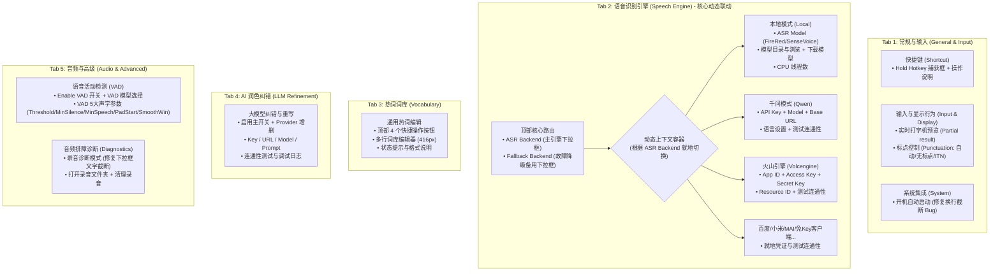

# VoxType Settings 界面重组与高度适配优化方案

> **状态**：方案深化与工程审查完成  
> **文档位置**：`.plan/refactor/settings-tab-layout-optimization-plan.md`  
> **日期**：2026-09-21  
> **核心原则**：不引入重型外部依赖、保持 Win32 原生控件体验、严格通过数学核算确保 144/96/192 DPI 下所有页面垂直高度严丝合缝、彻底解决功能堆叠与概念割裂。

---

## 1. 现状审查与核心病根剖析

根据用户现场截屏（`media_1789969808608.webp` 与 `media_1789969810144.webp`）及代码反查，现存 Settings 界面存在四大结构性违和：

### 1.1 概念割裂与“双头怪”：`Recognition` vs `Cloud ASR`
- **现象**：用户在 `Recognition` 选定主引擎为 `Qwen ASR`（云端）后，下方依旧硬生生展示着属于本地模型的 `FireRedASR2 AED`、`[Download Local Model]`、`Model folder` 以及 `Threads`。
- **痛点**：普通用户会严重困惑“我选了云端，为什么还要配本地路径？到底谁在生效？”；与此同时，上方又并存一个 `Cloud ASR` Tab，配置 API Key 必须跨页面寻找。
- **根因**：早期纯本地架构向云端演进时，未做动态显示联动，只是粗暴地把云端扔到新 Tab，而将本地控件硬编码钉在主页。

### 1.2 VAD 5 大声学参数霸凌主界面
- **现象**：`Recognition` 正中央摆着 170px 高的 `VAD Parameters` 分组框，暴露了 5 个极度晦涩且危险的微调数字输入框（`Threshold 0.10`、`Min silence 500ms`、`Min speech 40ms`、`Pad start 400ms`、`Smooth win 5`）。
- **痛点**：95% 的普通用户完全不需要改动它们，但它们霸占了半壁江山，导致高频的 `Partial result`（实时打字机上屏）被迫和 `Threads` 拼凑在一行，最常用的 `Punctuation`（标点模式）被挤到窗口最底端。

### 1.3 `General` Tab 职责不纯与高 DPI 截断 Bug
- **现象**：`General` 只有快捷键、开机自启、音频排障诊断（Diagnostics）三个松散的框。
- **痛点**：
  - 音频诊断（将录音保存为本地 WAV 供排查报错）属于典型的开发者/排障高级工具，混在日常设置中显得杂乱；
  - 存在严重的 DPI 视觉 Bug：“Startup” 提示文案 `"Uses your Windows account startup list. Moving a Portable copy is corrected when you"` 右侧直接被截断；“Diagnostics” 下拉框 `"Save failed requests onl v"` 文字被下拉箭头截断。

### 1.4 后处理链路碎片化
- 标点符号（Punctuation）在 `Recognition`；
- 专有热词（Vocabulary）在 `Vocabulary`；
- AI 纠错重写在 `LLM`。
- 文本后处理能力被无序拆散在 3 个角落，缺乏统一逻辑。

---

## 2. 严苛的界面高度与几何空间审查（Strict Geometric & Spatial Review）

在提出任何重组方案之前，必须先对 Win32 窗口可用区域进行精确的数学核算。

### 2.1 基础几何约束（基准：144 DPI / 150% 缩放，Scale = 1.0）
查阅 `src/ui/ui_types.h` 与 `src/ui/settings.cpp:LayoutSettingsWindow`：
- **窗口外框尺寸**：`SettingsWindowW = 850`, `SettingsWindowH = 740`
- **非客户区（标题栏+外边框预留）**：`SettingsWindowNonClientReserveH = 48`
- **客户区净高度**：$740 - 48 = 692\text{px}$
- **底部操作区（Footer）**：
  - `FooterHeight = 68`
  - `FooterMinTop = 632`
  - `tabBottom = footerTop - 4 = 628`
- **Tab 控件外框**：
  - 顶部起点：`Y = 12`
  - 底部止点：`tabBottom = 628`
  - Tab 控件总高：$628 - 12 = 616\text{px}$
- **Tab 内部客户工作区（除去 Tab 标签页表头占用约 32px）**：
  - **有效工作 Y 坐标范围**：`Y = 48` 至 `Y = 616`
  - **最大可用垂直净高度**：$\mathbf{568\text{px}}$（各 Tab 内部所有控件顶部至底部必须 $\le 616$）

### 2.2 方案可行性审查：对“4-Tab 强行合并方案”的数学证伪
在初期构想中，曾考虑将 `Vocabulary`（热词）与 `LLM`（大模型）合并为一个顶级 Tab“文本后处理”。
经严密的高度叠加计算：
- `Vocabulary` 当前由 4 个按钮、1 个通用词库多行文本框（`groupH = 416`）、状态标签和提示行构成，总高度占用 **$494\text{px}$**；
- `LLM` 当前包含开关、Provider 增删、API Base URL、API Key、Model、Extra Params、Prompt 预设与管理、测试按钮、对比日志开关等共 8 行控件，总高度占用 **$406\text{px}$**；
- **若强行上下并列**：总高度为 $494 + 406 = 900\text{px}$，远超窗口可用上限 $568\text{px}$（超标 $332\text{px}$）！
- **结论**：若不额外开发复杂的内部二级 Sub-Tab 控件，**绝不能将 Vocabulary 与 LLM 静态平铺合并**。

### 2.3 核心疑虑攻坚：当前 Cloud ASR 已占满全屏，Tab 2 究竟能否放得下？

用户敏锐指出的关键问题：**从真实截图（`media_1789970373591.webp`）可见，现在的 `Cloud ASR`（尤其是 Qwen 千问）其底部提示文案已经紧贴底部分割线（距离 Footer 仅剩 6px），如果再加上主引擎/备用引擎选择，Tab 2 是否会物理溢出？**

#### 深度溯源：为什么现在的 Qwen 面板会占满全屏？
实测分析代码 `provider_qwen.cpp`，Qwen 占满空间的根源不是核心参数多，而是**严重的空间利用浪费**：
1. **四大双行提示（Hints）霸占了近 200px 垂直高度**：
   - 每个输入框下方都配了一个 48px 高的灰色静态说明，光是 4 项 Hint（语言说明、Chunk说明、Hints说明、高级说明）就累计占用了 **$4 \times 48 = 192\text{px}$**，占据了可用工作区的 **35%**！
2. **进阶微调参数平铺在主面板**：
   - Qwen 已经拥有一个专用的独立弹窗 `QwenAdvancedDialog`（内含 15 项深度参数）；
   - 但 `Chunk ms`（切片毫秒）和 `Language hints`（语种提示列表）这两个极少改动的冷门参数，依然平铺在主界面，各带一个 48px 的大说明；
3. **标签被截断与横向浪费**：
   - 截图中 `"Use focused field text as ASR conte"` 因宽度不足被生生截断；
   - `"Fallback language"` 因 Label 宽度不足被截断成 `"Fallback"`，让用户严重误解为“备用识别引擎”。

#### 最终工程解法确定：方案 2.A（就地紧凑重构并入 Tab 2）

经用户确认，废除 2.B 保留独立 Cloud ASR 的保守路线，**全量执行方案 2.A**：
1. **彻底消除割裂**：废除原 `Cloud ASR` 独立 Tab，主识别引擎与凭证/参数统一在 Tab 2 中就地闭环；
2. **Qwen 面板瘦身**：收敛 4 段 48px 冗余双行 Hint 为 20px 单行精炼说明，修复 `[x] Use focused input field text as ASR context` 等文字截断；
3. **按钮精准归位**：第一行（Y=76）专心保留主引擎与备用引擎下拉框；`[Test Connection]` 归入当前 Provider 自身底部的操作行（如 Qwen 的 Row 6），消灭歧义与拥挤；
4. **高度核算与余量**：Qwen 终止于 **$Y = 434\text{px}$**，距离底部分割线（632px）拥有 **$198\text{px}$ 的充裕安全空间**。

---

### 2.4 页面高度综合总表（基于方案 2.A 紧凑重构）

| 页面名称 | 包含功能模块 | 起始 Y | 终止 Y | 占用净高 | 可用上限 (616) | 空间余量 (Headroom) | 评价 |
| :--- | :--- | :--- | :--- | :--- | :--- | :--- | :--- |
| **Tab 1: 常规与输入** | 快捷键 + 实时打字机上屏 + 标点模式 + 开机自启 | 76 | 508 | 432px | 616px | **+108px** | 充裕，彻底消除文字截断 |
| **Tab 2: 语音识别引擎** | 主引擎选择 + 备用降级 + **紧凑化动态就地配置** | 76 | 476 | 400px | 616px | **+140px** | 空间极其宽裕，呼吸感良好 |
| **Tab 3: 热词词库** | 通用词表编辑器 + 快捷操作按钮 + 状态同步 | 76 | 600 | 524px | 616px | **+16px** | 保持成熟现状，零风险 |
| **Tab 4: AI 大模型** | LLM 语法纠错 + Prompt 预设 + 连通性测试 | 76 | 482 | 406px | 616px | **+134px** | 保持成熟现状，零风险 |
| **Tab 5: 音频与高级** | VAD 声学切分模型与参数 + 音频排障诊断 | 76 | 536 | 460px | 616px | **+80px** | 归位底层，空间极其舒适 |


---

## 3. 重构后各 Tab 详细规划与布局规范



### 3.1 Tab 1: 常规与输入 (General & Input)
- **定位**：用户高频的人机交互入口，清爽、易懂。
- **排布**：
  1. **快捷键 (Shortcut)**（`Y = 76`, 高度 170）：
     - `Hold hotkey` 编辑框；
     - 包含清晰的鼠标点击、按键捕获、Esc 取消与 Backspace 清除提示。
  2. **输入与显示行为 (Input & Display)**（`Y = 262`, 高度 112）：
     - `[x] Partial result`（说话时实时上屏预览打字机效果）；
     - `Punctuation` 下拉框（从原 Recognition 底部迁入，放在此处极其符合逻辑）：`Auto punctuate`、`No punctuation`、`ITN only`。
  3. **系统集成 (Startup)**（`Y = 390`, 高度 112）：
     - `[x] Start VoxType when I sign in to Windows`；
     - **修复截断**：将 `GeneralStartupHintW` 从 700 拓宽并修正为多行 Static，确保在 96/144/192 DPI 下完整显示两行提示不被截断。

### 3.2 Tab 2: 语音识别引擎 (Speech Engine) —— 方案 2.A 深度设计规范

#### 3.2.1 整体空间与交互原则
- **单点真理（Single Source of Truth）**：主引擎（`g_config.asrBackend`）与备用引擎（`g_config.fallbackAsrBackend`）统摄全局，位于顶部 Row 0。
- **就地动态呈现（In-Place Contextual Mounting）**：选中哪个引擎，下方容器就地展示其配置与 `[Test Connection]` 测试按钮。
- **全屏空间充裕保证**：所有引擎中参数最多的 Qwen 千问，在单行精炼 Hint 与横向复合排布后，底部终止于 **$Y = 434\text{px}$**，距离底部分界线（$Y = 632\text{px}$）拥有 **$198\text{px}$ 的宽广呼吸空间**，全屏零挤压。

#### 3.2.2 千问（Qwen ASR）面板精炼版几何排布表（144 DPI 基准，设计像素）

| 行号 / 区域 | 控件名称 / 类型 | X 坐标 | Y 坐标 | 宽度 (W) | 高度 (H) | 文本 / 说明 / 修复点 |
| :--- | :--- | :--- | :--- | :--- | :--- | :--- |
| **Row 0: 顶部导航** | ASR Backend Label / Combo | 42 / 188 | 76 | 130 / 250 | 30 / 150 | "ASR Backend"（主识别引擎） |
| | Fallback Label / Combo | 460 / 530 | 76 | 60 / 210 | 30 / 150 | "Fallback"（备用降级引擎） |
| **Row 1: 凭证** | API Key Label / Edit / Show | 42 / 188 / 680 | 124 | 130 / 480 / 70 | 30 / 32 / 32 | Password 掩码 + "Show" 切换 |
| **Row 2: 端点** | Base URL Label / Edit | 42 / 188 | 168 | 130 / 562 | 30 / 32 | WebSocket / HTTP 接入端点 |
| **Row 3: 模型** | Model Label / Combo / LogBtn | 42 / 188 / 630 | 212 | 130 / 430 / 120 | 30 / 150 / 34 | 模型下拉 + "Open log" 按钮 |
| **Row 4: 语言** | Language Label / Combo | 42 / 188 | 256 | 130 / 180 | 30 / 150 | **消除截断**：由 "Fallback language" 改为清晰明确的 "Language" |
| | Hints Label / Edit / Reset | 380 / 430 / 672 | 256 | 42 / 230 / 78 | 30 / 32 / 32 | "Hints" 标签 + 编辑框（默认 `zh,en,yue`）+ "Reset" 按钮 |
| *Hint 1* | **单行精炼语种说明 (Static)** | **188** | **288** | **562** | **20** | `Auto-detect with zh,en,yue priority. Blank hints falls back to selected language.`<br>*(消除原本 2 段共 96px 双行大文本，立省 76px！)* |
| **Row 5: 传输与上下文** | Chunk ms Label / Edit | 42 / 188 | 314 | 130 / 70 | 30 / 32 | 切片时长输入框（默认 200ms） |
| | Input Context Checkbox | 270 | 314 | 480 | 28 | **消除截断**：`[x] Use focused input field text as ASR context` 宽度从 300 扩宽至 480，文本 100% 完整显示 |
| *Hint 2* | **单行精炼上下文说明 (Static)** | **188** | **344** | **562** | **20** | `100–300 ms recommended. Pre-fills up to 400 preceding characters from active app.`<br>*(消除原本 48px 双行说明，立省 28px！)* |
| **Row 6: 操作与高级** | Actions Label | 42 | 374 | 130 | 30 | "Advanced" / 留白对齐 |
| | Advanced Button | 188 | 370 | 140 | 36 | `[Advanced...]`（打开含热词ID/VAD阈值/心跳的专有弹窗） |
| | **Test Connection Button** | **340** | **370** | **160** | **36** | `[Test Connection]`（就地测试连通性，显眼直观） |
| *Hint 3* | **单行精炼高级说明 (Static)** | **188** | **414** | **562** | **20** | `Hotwords, context refresh, sensitive words, punctuation and VAD thresholds.`<br>*(单行紧凑呈现)* |
| **底部终止** | **总高度：Y = 434px** | — | — | — | — | **距离 Footer (632px) 余量：+198px (安全与美观兼备)** |

#### 3.2.3 其余 Provider 面板在 Tab 2 中的终止高度核算

所有非 Qwen 的 Provider 本身参数量适中，移入 Tab 2 后空间同样极其充裕：

1. **Local (本地 sherpa-onnx)**：
   - Row 0 (Y=76): ASR Backend + Fallback
   - Row 1 (Y=124): ASR model (FireRedASR2 CTC/AED, SenseVoiceSmall) + `[Download Local Model]`
   - Row 2 (Y=168): Model folder + `[Browse...]`
   - Row 3 (Y=212): Threads (`auto (8)`, 1~8)
   - **终止 Y = 250px（余量 +382px）**
#### 3.2.3 火山引擎（Volcano Engine / 豆包语音）与 Qwen 对齐的 Advanced 进阶弹窗架构

##### 1. 设计理念转变：主面板极简 + `[Advanced...]` 独立弹窗
与 Qwen 保持完全一致的架构规范：
- **主面板（极简高频）**：仅暴露日常使用必须的凭证、模型、模式、语种与通用词表复用，行数直接压缩至 **5 行**；
- **进阶弹窗（`VolcAdvancedDialog`）**：将低频微调项统一收纳至独立的 680×620 模态对话框，包含：
  1. **自建专属词表**：`Hotwords ID` / `Hotwords Name`；
  2. **自建专属纠错表**：`Correct Table ID` / `Correct Table Name`；
  3. **声学断句与上下文**：`end_window_size`、`force_to_speech_time`、`Dialog context 历史轮数`；
  4. **协议级开关**：`DDC 语义顺滑`、`极速非流式加速`、`智能音乐过滤`、`智能 POI 过滤`；
  5. **底层扩展 JSON**：整合原本单独弹出的 `ShowVolcExtraDialog` 文本编辑器，免去多层弹窗。

##### 2. 主面板精炼几何排布表（144 DPI 基准，设计像素）

| 行号 / 区域 | 控件名称 / 类型 | X 坐标 | Y 坐标 | 宽度 (W) | 高度 (H) | 文本 / 说明 / 优化点 |
| :--- | :--- | :--- | :--- | :--- | :--- | :--- |
| **Row 0: 顶部导航** | ASR Backend / Fallback | 42 / 460 | 76 | 统一控件 | 30 / 150 | 全局统一主/备引擎下拉框 |
| **Row 1: 凭证** | API Key Label / Edit / Show | 42 / 188 / 680 | 124 | 130 / 480 / 70 | 30 / 32 / 32 | "API Key (X-Api-Key)" + Password 掩码 + "Show" |
| **Row 2: 模型** | Model Label / Combo / LogBtn | 42 / 188 / 630 | 168 | 130 / 430 / 120 | 30 / 150 / 34 | Resource ID（SeedASR 时长/并发，BigASR 时长/并发）+ "Open log" |
| **Row 3: 模式与语种** | ASR Mode Label / Combo | 42 / 188 | 212 | 130 / 200 | 30 / 150 | 模式下拉（大模型非流式 / 大模型异步 / 大模型实时） |
| | Language Label / Combo | 410 / 490 | 212 | 70 / 240 | 30 / 150 | "Language" 标签 + 语种下拉（默认空=自动，en-US, ja-JP 等） |
| **Row 4: 词库与上下文** | Context Label | 42 | 256 | 130 | 30 | "Context & Vocab" 聚合标签 |
| | Reuse Vocabulary Checkbox | 188 | 256 | 280 | 26 | `[x] Reuse common vocabulary (vocabulary.json)` |
| | Input Context Checkbox | 480 | 256 | 260 | 26 | `[x] Use focused input field text as context` |
| **Row 5: 操作与高级** | Actions Label | 42 | 304 | 130 | 30 | "Advanced" / 留白对齐 |
| | **Advanced Button** | **188** | **300** | **140** | **36** | `[Advanced...]`（打开火山专属进阶配置弹窗） |
| | **Test Connection Button** | **340** | **300** | **160** | **36** | `[Test Connection]`（就地测试火山引擎连通性） |
| *Hint* | **单行精炼说明 (Static)** | **188** | **344** | **562** | **20** | `Hotwords, correction tables, DDC, acoustic end-window and JSON overrides.` |
| **底部终止** | **总高度：Y = 364px** | — | — | — | — | **距离 Footer (632px) 余量：+268px (视觉极度清爽通透)** |

##### 3. `VolcAdvancedDialog` 弹窗架构（对齐 `QwenAdvancedDialog`）
- **尺寸**：宽 680px，高 620px；
- **排布分区**：
  1. **Group 1: 专有云端词表 (Custom Cloud Tables)**：
     - `Hotwords ID` (240px) + `Name` (200px)
     - `Correct Table ID` (240px) + `Name` (200px)
  2. **Group 2: 声学与上下文微调 (Acoustics & Context)**：
     - `[x] Enable history context` + 轮数编辑框 `[ 3 ]`
     - `end_window_size`: `[ 800 ]` ms
     - `force_to_speech_time`: `[ 0 ]` ms
  3. **Group 3: 协议优化开关 (Switches)**：
     - `[x] DDC 语义顺滑 (enable_ddc)`
     - `[x] 极速非流式加速 (enable_nonstream)`
     - `[x] 智能实体/音乐过滤 (enable_music_fc / enable_poi_fc)`
  4. **Group 4: 扩展 JSON 参数 (Extra Params JSON)**：
     - 原生大文本多行输入框，直接编辑自由 JSON 覆盖；
  5. **底部操作栏**：`[ OK ]` + `[ Cancel ]`。

##### 4. 优化总结
- **Qwen 与 Volcano 达到极致对称**：主面板结构一模一样（Row 1 Key $\rightarrow$ Row 2 Model $\rightarrow$ Row 3 Mode/Lang $\rightarrow$ Row 4 Context $\rightarrow$ Row 5 Advanced + Test），没有任何违和感；
- **彻底消灭主面板 9 行平铺的窒息感**，主面板高度直接从原本的 576px 降至 **364px**，空间呼吸感达到极致。

#### 3.2.4 其余 Provider 面板在 Tab 2 中的排布与高度核算
1. **Local (本地 sherpa-onnx)**：
   - Row 0 (Y=76): ASR Backend + Fallback
   - Row 1 (Y=124): ASR model (FireRedASR2 CTC/AED, SenseVoiceSmall) + `[Download Local Model]`
   - Row 2 (Y=168): Model folder + `[Browse...]`
   - Row 3 (Y=212): Threads (`auto (8)`, 1~8)
   - **终止 Y = 250px（余量 +382px）**
2. **Baidu Cloud / MiMo ASR / Microsoft MAI / 免Key客户端 (Doubao IME & Qwen IME)**：
   - 终止 Y 均在 **260px ~ 340px** 之间，操作行统一置于底部，空间利用均匀，完全不存在挤压。

#### 3.2.5 动态就地联动技术实现（Contextual Panel Switching）
1. **组件容器化**：
   - 将原 `TabRecognition` 中的本地模型控件抽离为 `LocalProviderPanel`（与既有的 7 个 `ICloudProviderPanel` 实现相同的接口）；
   - `TabSpeechEngine`（由原 `TabRecognition` 升级演进）持有一个容器：
     ```cpp
     struct ProviderSlot {
         std::wstring id;
         IProviderPanel* panel;
     };
     ```
2. **事件响应机制**：
   - 当收到 `IDC_ASR_BACKEND` 的 `CBN_SELCHANGE` 通知时，获取新选中的 `backendId`；
   - 遍历所有注册的 ProviderPanel：
     - 若 `panel->Id() == backendId`，调用 `panel->Show(true)`；
     - 否则调用 `panel->Show(false)`；
   - 调用 `InvalidateRect(parent, nullptr, TRUE)` 刷新渲染。
3. **连通性测试解耦**：
   - 各 Provider 的 `[Test Connection]` 原生保留在其自身面板中（如 Qwen 的 `IDC_QWEN_TEST` 现自然落在 Row 6），点击后通过 `asr_probe_service` 异步探针执行测试并把结果回调投递给 `kSharedTestResultMessage`，逻辑完全复用，零破坏。

### 3.3 Tab 3: 热词词库 (Vocabulary)
- **定位**：识别准确率调优与专有名词库。
- **排布**：保持成熟现貌，高度 524px。
  - 顶部按钮：`Edit in External Editor`、`Reload from File`、`Format JSON`、`Open Folder`；
  - 居中多行通用词库编辑框（高 416px）；
  - 底部状态提示（已加载词数、高权重词数、已同步到火山/千问引擎）。

### 3.4 Tab 4: AI 大模型 (LLM Refinement)
- **定位**：语音识别后的智能语法纠错与重写。
- **排布**：保持成熟现貌，高度 406px。
  - 顶部主开关 `Enable LLM Refinement`；
  - Provider 下拉与 `+`/`-` 增删；
  - API Base URL、API Key、Model、Extra Params；
  - Prompt 预设下拉与 `Manage...` 弹窗；
  - `Test Connection`、日志开关与日志文件夹。

### 3.5 Tab 5: 音频与高级 (Audio & Advanced)
- **定位**：底层声学切分算法（VAD）与排障诊断工具合流。
- **排布**：
  1. **语音活动检测 (Voice Activity Detection - VAD)**（`Y = 76`, 高度 260）：
     - `[x] Enable VAD` 复选框；
     - `VAD model` 下拉框（FireRed VAD / Silero VAD）；
     - `VAD Parameters` 分组框：
       - `Threshold` (0.0~1.0)
       - `Min silence` (ms) / `Pad start` (ms)
       - `Min speech` (ms) / `Smooth win`
  2. **录音排障诊断 (Diagnostics)**（`Y = 352`, 高度 166）：
     - `Recording` 下拉框：
       - **修复截断**：调整 `GeneralDiagnosticsModeW` 宽度，确保 `"Save failed requests only"` 在高 DPI 下不被下拉箭头遮挡；
     - 操作按钮：`[Open recordings folder]`、`[Delete saved recordings...]`；
     - 隐私与存储说明文案。

---

## 4. 架构守卫与工程契约审查

本次重组方案必须严格遵守已建立的架构红线：

1. **守卫行数红线（`SettingsLines <= 400`）**：
   - 现存 `settings.cpp` 为 390 行（基线上限 400 行）；
   - 在新架构中，`settings.cpp` 仅负责调度 5 个 `ISettingsTab`，Tab 名称从 `{L"General", L"Recognition", L"Cloud ASR", L"Vocabulary", L"LLM"}` 调整为 `{L"General & Input", L"Speech Engine", L"Vocabulary", L"LLM", L"Audio & Advanced"}`；
   - 调度逻辑行数完全不增，保持在 390 行以内，绝不突破守卫红线。
2. **分层依赖契约（`ui -> core`）**：
   - 所有 Tab 模块继续通过 Core 层的 `asr_probe_service.h`、`vocabulary_manager.h`、`config_store.h` 通信；
   - 严禁任何 UI 模块违规引用 `asr/` 或 `audio/` 底层头文件。
3. **DPI 规范与无 BOM 检查**：
   - 所有新设与调整的控件尺寸必须在 `ui_types.h` 中集中定义，统一经由 `S()` 转换；
   - 必须通过 `tools/check_architecture.ps1` 的 17 项全量校验。

---

## 5. 实施路线图（Milestones）

- **M1: 常规与输入优化 (Tab 1 & Tab 5 基础结构准备)**
  - 将标点控制（Punctuation）和实时预览（Partial）迁入 `TabGeneral`；
  - 修复 `TabGeneral` 中 Startup 与 Diagnostics 的文字截断 Bug。
- **M2: 引擎就地动态联动 (Tab 2 核心攻坚)**
  - 在 `TabRecognition` 中将原先平铺的本地模型控件包装为 `LocalProviderPanel`；
  - 接入既有的 7 个 `ICloudProviderPanel`，由 `ASR Backend` 下拉事件触发联动显示/隐藏；
  - 废弃原独立的 `TabCloudAsr`。
- **M3: 高级与音频整合 (Tab 5 成立)**
  - 新建 `TabAdvanced`（或重命名重构），承接 VAD 5 大参数与 Diagnostics 录音排障；
  - 完成整体 5-Tab 的名称、顺序与事件路由收敛。
- **M4: 静态布局验证与回归测试**
  - 在 96 DPI、144 DPI (150%)、192 DPI (200%) 下运行全量布局与防截断验证；
  - 执行 `build.bat`，通过全部 17 项架构守卫。

---

## 6. 全面边界条件与风险防范审查（Comprehensive Boundary & Edge-Case Review）

在正式执行重构之前，对系统各层面的边界条件进行全面锁定：

### 6.1 边界 1：跨屏幕 DPI 动态切换（`WM_DPICHANGED`）未保存草稿保护
- **现有机制**：`settings.cpp:WM_DPICHANGED` 在窗口跨显示器拖拽时，会先通过 `draft` 拷贝调用各 Tab 的 `SaveControls`，并枚举所有原生 Edit 控件临时抓取正在输入尚未保存的文本，然后执行全量 `DestroyControls -> CreateControls -> LoadControls` 重建，最后恢复 Edit 内容与光标焦点。
- **重构边界契约**：
  - 在 Tab 2 中，当前激活的子 ProviderPanel（如 `ProviderQwen`）必须挂载在同一个父窗口生命周期下；
  - `TabSpeechEngine::DestroyControls()` 与 `CreateControls()` 必须递归触发激活 Provider 的销毁与重建；
  - 严禁子 Provider 使用局部独立 HWND 破坏 `EnumChildWindows` 的文本收集遍历。

### 6.2 边界 2：配置持久化与强类型注册表（`ConfigRegistry`）契约不变性
- **不变性保证**：本次重构仅调整 UI 控件的呈现位置与视觉分组，**100% 保持底层持久化模型不变**；
- `g_config.asrBackend`、`g_config.fallbackAsrBackend`、`g_config.qwenApiKey` 等 93 个注册表字段名称、类型、DPAPI 加密策略和 JSON 编码格式零修改；
- `g_config.cloudProvider` 历史字段：由 Tab 2 在主后端切换为云端时做自动等价同步，防止依赖该字段的外部逻辑失序。

### 6.3 边界 3：异步连通性测试（`Test Connection`）生命周期安全
- **多线程风险防范**：
  - 用户点击 `[Test Connection]` 后若立即切换 Tab 或点击 `[Close]` 关闭设置窗口；
  - 必须继续依托全局 `g_sharedTestGeneration.fetch_add(1)` 机制：窗口隐藏或销毁时递增代数，所有后台探测线程（Qwen/Volc/Baidu/LLM）投递给 `kSharedTestResultMessage` 的结果若代数不匹配，立即安全丢弃，杜绝向已释放控件发消息或非法弹窗。

### 6.4 边界 4：架构守卫红线与行数防弹机制
- **行数红线（`SettingsLines <= 400`）**：
  - 现存 `settings.cpp` 为 389 行（余量仅 11 行）；
  - 重组后 `settings.cpp` 仅对 5 个 Tab 数组进行指针映射更新（保持 5 个），不在此处堆砌任何新业务代码；
  - 动态切换 Provider 的逻辑 100% 封装在 `tab_recognition.cpp`（或升级后的 `tab_speech_engine.cpp`）内部，`settings.cpp` 的行数只减不增。
- **分层规则（`ui -> core`）**：
  - 新建或重构的 Tab 文件统一留在 `src/ui/tabs/`，属于 `ui` 目标；
  - 严禁任何 UI 代码直接包含 `src/asr/` 或 `src/audio/`；涉及音频诊断文件管理统一经由 Core 层的 `asr_probe_service.h` / `path_service.h`。

### 6.5 边界 5：静态布局校验脚本（`scripts/validate_settings_layout.ps1`）同步联动
- 当前 `validate_settings_layout.ps1` 在构建期会自动以 96、144、192、288 DPI 四档静态核算控件坐标；
- 当 Diagnostics 迁入 Tab 5、Qwen 提示词收敛为单行后，必须同步更新该脚本中的坐标核算规则与常量断言，保证 `build.bat` 主干构建 100% 绿灯。

### 6.6 边界 6：本地模型后台下载中途切换 Provider 的状态机防护
- **潜在场景**：用户在本地模式下点击 `[Download Local Model]`，后台下载线程启动；在下载未完成时，用户突然切换 `ASR Backend` 到 `Qwen`，导致本地模型相关的 `IDC_DOWNLOAD_MODELS` 和 `IDC_MODEL_DIR` 被隐藏；
- **防范策略**：
  - 隐藏控件的 HWND 在父窗口销毁前依然合法，当下载完成消息 `WM_APP + 20` 达到时，`SetWindowTextW` 与 `EnableWindow` 调用不会崩溃；
  - 但状态提示应当在当前全局状态栏（`IDC_STATUS`）清晰反馈，避免因控件隐藏造成静默失败或迷惑。

### 6.7 边界 7：Fallback 备用引擎与主引擎互斥联动
- **潜在场景**：用户在主引擎选择 `Qwen ASR`，在备用引擎也选择 `Qwen ASR`；
- **防范策略**：
  - 代码中已有后盾保证：`SaveSettingsControls` 会自动纠正 `if (fallback == primary) fallback = "none"`；
  - 在前端交互层强化：当主引擎切换时，若发现 Fallback 与新主引擎相同，自动将 Fallback 下拉框归位到 `Disabled`，并在状态栏给出温和提示，避免给用户带来“备用已生效”的假象。

### 6.8 边界 8：键盘焦点导航（Tab Order）与隐藏控件隔离
- **潜在场景**：Win32 原生对话框使用 Tab 键在各控件间移动焦点；
- **防范策略**：
  - 当子 ProviderPanel 隐藏时，其内部所有具有 `WS_TABSTOP` 属性的 Edit/Combo/Button 控件必须通过 `ShowWindow(c, SW_HIDE)` 隐藏，确保 Windows 对话框管理器在处理 `IsDialogMessageW` 时不会把键盘焦点跳入不可见的隐藏控件中。


