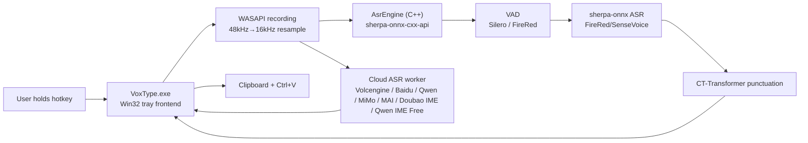
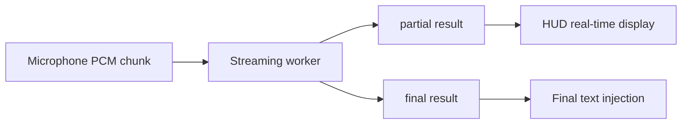

# Architecture

> 🇨🇳 [中文版](doc/ARCHITECTURE_zh.md)

This document describes the current implementation, not the final ideal design. For longer-term research plans, see `PLAN.md`.

## Overview



## Process

### `VoxType.exe`

Single process. Responsibilities:

- Single instance enforcement.
- Register tray icon.
- Display Settings.
- Listen for global hotkeys.
- Capture microphone audio.
- Call sherpa-onnx C++ API directly via `AsrEngine` for local VAD, ASR, and punctuation.
- Optionally route audio to cloud ASR backends: Baidu, Volcengine, Qwen ASR, MiMo ASR, Microsoft MAI Transcribe 2, experimental Doubao IME ASR, or the reverse-engineered Qwen IME Free backend.
- Inject final text into the current application.

- Inject final text into the current application.

`AsrEngine` internally caches `OfflineRecognizer`, `VoiceActivityDetector`, and `OfflinePunctuation`. The same model is not loaded repeatedly.

## Source Code Structure

Since v0.6.0, the source code is organized into multiple modules. Current source files are grouped by area under `src/`:

| Directory | Responsibility |
|-----------|----------------|
| `src/app/` | Application entry point, main window, recording orchestrator, Win32 resources |
| `src/asr/` | Local ASR engine, ASR provider clients, batch/streaming sessions, metrics, dispatch helpers |
| `src/audio/` | Audio capture (WASAPI / waveIn), FireRed VAD, streaming VAD trimmer |
| `src/ui/` | HUD, HUD pagination, hotkey handling, Settings window, UI theme/controls |
| `src/platform/` | Platform integration (text injector, clipboard, Windows message emulation) |
| `src/core/` | Core app messages/state, path service, config store, LLM refine, input context reading |

| File | Responsibility |
|------|---------------|
| `src/core/app_messages.h` | Application window messages, hotkey command IDs, timer IDs, tray notification constants |
| `src/core/app_state.h` / `src/core/app_state.cpp` | Global application instance, window handle, icon, atomic audio telemetry flags |
| `src/core/config_store.h` / `src/core/config_store.cpp` | Configuration data model (`Config`), schema migration, DPAPI credential encryption, JSON persistence |
| `src/core/config_registry.h` / `src/core/config_registry.cpp` | Strongly-typed configuration field registry, metadata, DPAPI encryption, JSON serialization strategies |
| `src/core/asr_probe_service.h` / `src/core/asr_probe_service.cpp` | Decoupled ASR connection probe service interface and registration |
| `src/app/asr_probe_service_impl.h` / `src/app/asr_probe_service_impl.cpp` | ASR probe service implementation connecting probe requests to backend providers |
| `src/core/path_service.h` / `src/core/path_service.cpp` | Application and models directory path resolution, log/config file path queries |
| `src/core/vocabulary_manager.h` / `src/core/vocabulary_manager.cpp` | Universal custom vocabulary manager: parsing (JSON/lines), linear weight scaling, and transpilation to the Volcano Engine hotword/correct table, the Qwen vocabulary, sherpa hotwords, and the LLM `【用户词表】` system section |
| `src/platform/text_injector.h` / `src/platform/text_injector.cpp` | Direct text injection into active windows via clipboard paste or WM_CHAR character streaming (WeChat) |
| `src/asr/engine_local.h` / `src/asr/engine_local.cpp` | Local sherpa-onnx recognizer, VAD detector, punctuation model lifecycle, preload, DLL availability checks |
| `src/asr/asr_metrics.h` / `src/asr/asr_metrics.cpp` | Thread-safe performance latency metrics (VAD, ASR, Punctuation, Cloud API, LLM) |
| `src/audio/audio_capture.h` / `src/audio/audio_capture.cpp` | Microphone capture lifecycle (WASAPI/waveIn), active buffer management, RMS level calculation |
| `src/audio/audio_diagnostics.h` / `src/audio/audio_diagnostics.cpp` | Provider-neutral capture/stage diagnostics, PCM metrics, WAV/SHA-256/JSON persistence, retention, and managed-folder operations |
| `src/audio/streaming_vad_trimmer.h` / `src/audio/streaming_vad_trimmer.cpp` | Provider-independent streaming PCM VAD trim for cloud ASR sessions |
| `src/asr/asr_session.h` / `src/asr/asr_session.cpp` | Batch ASR session abstraction for Local, Baidu, MiMo, MAI, Qwen, and recorded Doubao IME paths |
| `src/asr/asr_result.h` / `src/asr/asr_result.cpp` | ASR text normalization, result/failure classification, stable backend/result log names, and `MakeAsrWatchdogTimeoutText()` — the single constructor for watchdog timeout text, whose prefix is guaranteed to be on the operational-error allow-list |
| `src/asr/asr_dispatcher.h` / `src/asr/asr_dispatcher.cpp` | Final ASR result dispatch, LLM gate, raw ASR tracking |
| `src/asr/asr_runtime_log.h` / `src/asr/asr_runtime_log.cpp` | Debug-only, privacy-safe ASR lifecycle logging with timestamp/PID and bounded rotation |
| `src/asr/cloud_asr_common.h` / `src/asr/cloud_asr_common.cpp` | Cloud replay buffer, adaptive finalize timeout, empty-final retry helpers, `ComputeCloudAsrPostStopWatchdogMs()` (shared post-stop watchdog budget: primary final wait + retry reserve, capped) and the replay-fit arithmetic `EstimateCloudAsrReplaySendMs()` / `CloudAsrReplayFitsInBudget()` |
| `src/asr/asr_diagnostics.h` / `src/asr/asr_diagnostics.cpp` | Maps shared `Config` stage routing and provider outcomes into `audio_diagnostics` without provider-specific file I/O |
| `src/ui/hud.h` / `src/ui/hud.cpp` | HUD window, Direct2D/DirectWrite rendering, tray icon, UI resource creation/deletion |
| `src/ui/hud_pagination.h` / `src/ui/hud_pagination.cpp` | HUD text line wrapping, paging calculations, and display clipping |
| `src/ui/ui_types.h` | UI layout dimensions, colors, control constants, DPI metrics |
| `src/ui/ui_theme.h` / `src/ui/ui_theme.cpp` | UI GDI/DirectWrite font and brush theme resource lifecycle management |
| `src/ui/hotkey.h` / `src/ui/hotkey.cpp` | Hotkey config, CapsLock long-press logic, `WH_KEYBOARD_LL` hook, `HotkeyEdit` custom control |
| `src/ui/form_builder.h` / `src/ui/form_builder.cpp` | Native Win32 form control builder and auto-incrementing layout cursors |
| `src/ui/settings.h` / `src/ui/settings.cpp` | Settings window shell, tab switcher, top-level window layout, and event dispatcher |
| `src/ui/tabs/` | Modular Settings tab panels: `General`, `Recognition`, `Cloud ASR`, `Vocabulary`, `LLM`, and `Prompt` |
| `src/ui/providers/` | Modular Cloud ASR provider sub-panels: `Baidu`, `Volcengine`, `Qwen`, `MiMo`, `Doubao IME`, `Qwen Free`, and `MAI` |
| `src/ui/settings_controls.h` / `src/ui/settings_controls.cpp` | Encapsulated Settings dialog control handles and layout visibility toggles |
| `src/app/main.cpp` | Slim Win32 application entry point (`wWinMain`) and message pump |
| `src/app/main_window.h` / `src/app/main_window.cpp` | Main hidden message window, tray dispatch, hotkey handling, timer triggers |
| `src/app/recording_session_controller.h` / `src/app/recording_session_controller.cpp` | State machine orchestrating recording lifecycle, VAD trimming, and ASR dispatch |
| `src/app/asr_attempt_manager.h` / `src/app/asr_attempt_manager.cpp` | Dispatches ASR attempts across primary and fallback backends |
| `src/app/debug_logger.h` / `src/app/debug_logger.cpp` | Application debugging output and console attachment |
| `src/core/llm_refine.h` | LLM correction module: provider presets/migration, versioned prompt presets whose literals must declare the transcript as data rather than an instruction and keep `【禁改】` subordinate to `【可改】`, the `【用户词表】` system section, a partial assistant-reply output guard preceded by an echoed data-frame prefix strip, request JSON, endpoint normalization, bounded WinHTTP calls, and OpenAI-compatible response parsing (header-only, `llm::` namespace) |
| `src/asr/baidu_asr.h` | Baidu Cloud ASR module (header-only) |
| `src/asr/volcengine_asr.h` | Volcengine (豆包) ASR module (header-only, WebSocket) |
| `src/asr/qwen_asr.h` / `src/asr/qwen_asr.cpp` | Qwen ASR realtime WebSocket client |
| `src/asr/qwen_audio_http.*` | Qwen Audio 3 HTTP/WAV batch client |
| `src/asr/qwen_audio_streaming.*` / `src/asr/qwen_audio_streaming_session.*` | Qwen Audio 3 streaming task/PCM client and session lifecycle |
| `src/asr/qwen_free_streaming_session.h` / `src/asr/qwen_free_streaming_session.cpp` | Qwen IME Free streaming session: local PCM capture, replay-safe finalization, bundled LLM post-processing, and selection-rewrite safety |
| `src/asr/qwen_free_proto_asr.h` / `src/asr/qwen_free_proto_asr.cpp` | Qwen IME Free ASR WebSocket protocol: UTDID/WSG query, length-prefixed PCM/JSON frames, partial/final parsing, and connection diagnostics |
| `src/asr/qwen_free_proto_llm.h` / `src/asr/qwen_free_proto_llm.cpp` | Qwen IME Free `VoiceInputWrite` / `VoiceInputRewrite` HTTP protocol and response validation |
| `src/asr/qwen_free_proto_sign.*`, `qwen_free_proto_unet.*`, `qwen_free_proto_utdid.*` | Generic HMAC test primitive, fingerprint-gated native `unet.dll` WSG signing, and local UTDID acquisition |
| `src/asr/mimo_asr.h` / `src/asr/mimo_asr.cpp` | Xiaomi MiMo ASR batch client (`mimo-v2.5-asr`, WAV upload over `/chat/completions`) |
| `src/asr/mai_transcribe.h` / `src/asr/mai_transcribe.cpp` | Microsoft MAI Transcribe 2 batch client for OpenRouter JSON/Base64 WAV and Azure Fast Transcription multipart WAV |
| `src/asr/doubao_ime_asr.h` / `src/asr/doubao_ime_asr.cpp` | Experimental Doubao IME client: device registration, token bootstrap, Opus encoding, and handwritten protobuf over WebSocket |
| `src/asr/doubao_ime_streaming_session.h` / `src/asr/doubao_ime_streaming_session.cpp` | Doubao IME `IStreamingAsrSession` wrapper with pending PCM buffer, replay retry, partial HUD, and credential writeback |
| `tools/doubao_ime_probe.bat` / `tools/doubao_ime_probe.cpp` | Standalone Doubao IME diagnostic probe: reuses saved credentials when available, runs a live protocol check, optionally runs a 16kHz mono WAV recognition check, and supports a real-time-ish streaming send/drain probe |
| `tools/asr_audio_replay.bat` / `tools/asr_audio_replay.cpp` | Developer-only canonical-WAV validator and multi-backend replay runner using the production batch/streaming sessions |
| `src/audio/firered_vad.h` | FireRed VAD module (header-only) |
| `src/core/input_context.h` | Input field context reading module (header-only, UIA/MSAA/WM_GETTEXT layered fallback) |
| `src/core/startup_registration.h` / `src/core/startup_registration.cpp` | Current-user Windows Run registration, including stale Portable-path detection and repair |
| `src/core/utils.h` | Shared utility functions (WideToUtf8, Utf8ToWide, EscapeJson, Trim) |

Global variables are encapsulated in layer-owned modules (`app_state.*`, `config_store.*`, `audio_capture.*`, `engine_local.*`, `asr_metrics.*`, `ui_theme.*`) with clear access boundaries.

### Delay-Loaded DLLs

`onnxruntime.dll`, `sherpa-onnx-cxx-api.dll`, and `kaldi-native-fbank-core.dll` are delay-loaded via MSVC `/DELAYLOAD` linker flag. They are only loaded into memory when local ASR functions are actually called. In cloud-only mode, these DLLs are never loaded, keeping idle memory at ~12 MB.

`engine_local.cpp` includes `TryLoadAsrDlls()` which safely checks DLL availability before calling sherpa-onnx functions, returning `false` gracefully if DLLs are missing.

### Build, packaging, and mutable data

`CMakeLists.txt` and the `x64-release` CMake preset are the build authority.
`build.bat` prepares MSVC, invokes CMake/Ninja, then installs the only
supported runnable development payload at `build/run/x64-release`.

The generated `build/` root is deliberately small and validated:

```text
build/
├─ cmake/x64-release/   CMake/Ninja cache, objects, install manifest, package staging
├─ run/x64-release/     sole runnable development payload
├─ packages/            verified MSI and Portable assets, preserved by --clean
├─ artifacts/           generated package verification, test, and diagnostic reports
├─ logs/                explicit build/test logs
└─ README.txt           generated layout guide
```

Unexpected top-level items are reported by the layout validator rather than
silently being deleted or included in a package.

The Portable `.7z` and MSI both derive from that canonical runtime payload and
are independently extracted and compared with its hash manifest before being
placed in `build/packages`. The MSI is x64/per-machine, defaults to `Program
Files\VoxType`, and uses an Advanced folder picker. A stable HKLM
`Software\VoxType\InstallFolder` value is AppSearched before Major Upgrade so
the user-selected directory persists across releases.

Runtime assets remain alongside `VoxType.exe`. For an installed build,
configuration, downloaded models, punctuation models, and logs instead live
under `%LOCALAPPDATA%\VoxType`. A Portable payload has `portable.flag` and
keeps the same mutable data beside its executable. MSI never owns or removes
that mutable data.

### Model Preloading

When `asrBackend` is `local` and the model directory exists, `PreloadAsrEngine()` is called in a background thread at startup. This preloads the ASR model, VAD model (if enabled), and punctuation model (if enabled), eliminating first-press latency. After Settings Save, if the backend is `local`, models are reloaded and preloaded again. A `kPreloadDoneMessage` is posted to the main window to show an HUD notification.

## Main Modules

### Tray and Main Window

The main window is a hidden Win32 window used to receive tray messages, menu commands, and worker results.

Tray menu:

- `Settings...`
- `Reload ASR Worker`
- `Quit`

### Settings

Settings is a standard Win32 window with 5 tabs:

- `General`: recording hotkey, optional current-user `HKCU\Software\Microsoft\Windows\CurrentVersion\Run\VoxType` startup registration, and shared recording diagnostics (`Off` / `Failures only` / `All recordings`) with folder and managed-delete actions.
- `Recognition`: ASR Backend, optional Fallback backend, model, model directory, threads, VAD, VAD model, and Punctuation (`Disabled` / `Auto punctuate`).
- `Cloud ASR`: Cloud provider selection and Baidu/Volcengine/Qwen/MiMo/MAI/Doubao IME/Qwen IME Free provider-specific fields.
- `Vocabulary`: Universal vocabulary management (%APPDATA%\VoxType\vocabulary.json), shared with Qwen and Volcano Engine. Each entry is also offered to the LLM refine system prompt as a `【用户词表】` section when `Feed vocabulary to LLM` is on, where it only protects spellings that already appear and never replaces a recognised variant.
- `LLM`: Master toggle (`Enable LLM Refinement`), Provider selection (Provider dropdown + [+] / [−]), API Base URL, API Key, Model, Extra Params, Prompt preset selection with modal `Manage...` dialog (spacious multiline System Prompt editor, presets labelled with their version and reset), `Feed vocabulary to LLM`, Test Connection, and Debug log. Prompts are recognised by a stored preset id and upgraded when the built-in preset text changes; anything hand-edited is pinned to `Custom`.

When Settings is opened:

1. `UninstallKeyboardHook()` is called to pause global hotkey listening.
2. User can input `CapsLock` or other key combinations.
3. When the window is closed, it is cleanly destroyed (`DestroyWindow`) rather than hidden (`SW_HIDE`), reclaiming all window handles and GDI resources. Static tab controls are cleared in `WM_DESTROY`, and `InstallKeyboardHook()` is called to restore hotkey listening (guarded by `g_mainWindow` liveness to prevent exit cascades).
4. Re-opening Settings always recreates the window cleanly from the live monitor DPI via `S(UiStyle::SettingsWindowW)` and `S(UiStyle::SettingsWindowH)`, eliminating sleep/wake DPI mismatch and zombie blind windows. Closing Settings discards uncommitted drafts; clicking Save commits and reloads.

The bottom `Status / Save / Close` is dynamically positioned by `LayoutSettingsWindow()` based on client area height to avoid clipping.

### Hotkey Listening

Uses `WH_KEYBOARD_LL`.

Normal hotkey behavior:

- `WM_KEYDOWN` / `WM_SYSKEYDOWN`: Start recording.
- `WM_KEYUP` / `WM_SYSKEYUP`: Stop recording and submit to ASR.
- Matches the configured main key and modifier keys.
- During recording, `g_activeHotkeyKey` is saved to avoid failure to stop when the main key is released after the modifier key.

`CapsLock` is a special default hotkey:

- When physical `CapsLock` is pressed, it is intercepted first without immediately triggering system Caps Lock toggle.
- Released within 300ms is considered a short press; the program sends a `CapsLock` event to let the system toggle normally.
- Held for more than 300ms is considered a long press; recording starts; upon release, recording stops and the Caps Lock state before pressing is restored.
- The injected `CapsLock` event is allowed to pass through the hook to avoid recursive interception.

### Recording

Currently uses WASAPI Shared Mode (since v0.7.3), with automatic fallback to `waveIn`:

- WASAPI: Captures at system mix format (typically 48kHz/32bit float/stereo), resamples to 16kHz/16bit/mono via linear interpolation
- waveIn fallback: 16kHz/16bit/mono, 4 buffers of approximately 100ms each

Ordinary recordings are not written to disk. The old single
`%APPDATA%\VoxType\last_recording.wav` behavior was removed long ago. The
new `audio_diagnostics` service is explicitly controlled from Settings and is
shared by every Local/cloud provider, internal retry, and configured fallback.

- `Off` is the default and performs no diagnostic audio persistence.
- `Failures only` keeps substantive no-speech/capture/transport/provider
  failures; short, cancelled, stale, and auth/config-without-PCM cases are excluded.
- `All recordings` keeps every non-cancelled utterance after an explicit privacy choice.
- Installed builds write under `%LOCALAPPDATA%\VoxType\diagnostics\audio`;
  Portable builds use `<portable-root>\diagnostics\audio`.
- One physical recording owns one capture artifact and any number of
  primary/internal-retry/fallback stages. Stage PCM is SHA-256 deduplicated,
  so identical retry input references the same WAV.
- Capture metrics include native device format, per-channel/downmix RMS,
  output RMS/peak/zero/silence/clipping ratios, silent packets,
  discontinuities, callback gap, and first non-silent delay.
- WAV/JSON writes and retention run after capture on serialized worker I/O;
  callbacks only accumulate O(n) counters and PCM. Atomic temp-file rename
  prevents a partial manifest from becoming a valid group.
- Retention is bounded to 20 managed groups, 100 MiB, and 7 days. Unknown
  files are never deleted by retention or the Settings delete action.
- Manifests omit transcript, context text, keys/tokens, stable raw device IDs,
  and raw provider JSON. Audio is never uploaded by the diagnostics service.

Recordings shorter than approximately 8000 bytes are judged as `Too short`.

The developer-only `asr_audio_replay` CMake target lives in
`build/artifacts/tools`, outside the canonical runtime payload. It validates
16 kHz/mono/PCM16 WAVs, prints PCM SHA-256 and signal metrics, and can invoke
the production Local, configured/fallback, or explicitly selected cloud
batch/streaming sessions. Cloud replay is opt-in; transcript console output is
also opt-in and is not persisted by the tool. The BAT wrapper supplies the
canonical `build/run/x64-release` runtime directory so bundled DLL/model lookup
and Portable config resolution do not accidentally follow the tool executable.

### HUD

A borderless capsule HUD is displayed at the bottom center during recording. The current implementation uses Direct2D/DirectWrite:

- `WS_POPUP | WS_EX_TOOLWINDOW | WS_EX_TOPMOST | WS_EX_LAYERED` creates a floating window.
- Direct2D draws the capsule background, thin border, and 5 volume bars.
- DirectWrite draws status text, using DIP for measurement and layout.
- Win32 window size uses the current window DPI to convert DIP to physical pixels, avoiding text clipping on high DPI.
- The recording callback calculates PCM RMS for each audio buffer, normalizes it, and drives the volume bars.
- Volume bars use attack/release smoothing, redrawn via a ~33ms timer during recording.
- Displays `Listening...`, `Recognizing...`, final text, or error status. Volcengine, Qwen ASR, Qwen IME Free, and Doubao IME can post partial text to the HUD from their receive/drain threads.

### VAD

When `Enable VAD` is turned on, voice detection is performed before ASR. The VAD model can be selected in Settings:

**Silero VAD** (default): sherpa-onnx's built-in `VoiceActivityDetector`, conservatively trims silence from the beginning and end.

**FireRed VAD**: An open-source DFSMN streaming VAD from the Xiaohongshu team, with higher accuracy (F1 97.57 vs 95.95, false alarm rate 2.69% vs 9.41%).

- `src/audio/firered_vad.h` header-only module, uses `kaldi_native_fbank` for 80-dimensional fbank feature extraction + `onnxruntime` for model loading
- Model: `models/fireredvad_stream_vad_with_cache.onnx` (2.2MB)
- CMVN parameters: `models/cmvn.ark` (hardcoded in code)
- Streaming inference, updates DFSMN cache `[8, 1, 128, 19]` per frame
- **Critical**: Audio must be in int16 range (-32768~32767), normalized float must be multiplied by 32768

Current strategy (shared by both VADs):

- Only processes 16kHz audio.
- If no speech is detected, returns empty text directly without loading the ASR model.

### ASR Engine

`AsrEngine` class (in `src/audio/engine.h` / `src/audio/engine.cpp`) encapsulates the sherpa-onnx C++ API:

- `OfflineRecognizer`: ASR recognition (FireRedASR2 CTC/AED, SenseVoice)
- `VoiceActivityDetector`: Silero VAD
- `firered_vad::FireRedVad`: FireRed VAD (`src/audio/firered_vad.h`)
- `OfflinePunctuation`: CT-Transformer punctuation

Models are cached after loading; the same configuration is not loaded repeatedly. When switching models or reloading, the cache is cleared and automatically reloaded on the next recognition.

Runtime DLL dependencies:
- `sherpa-onnx-cxx-api.dll`
- `sherpa-onnx-c-api.dll`
- `onnxruntime.dll`
- `kaldi-native-fbank-core.dll` (used by FireRed VAD)

### Cloud ASR

Cloud backends are optional. Recognition runs remotely, and local punctuation is bypassed:

- **Baidu Cloud** uses a batch-style REST flow through `BaiduAsrSession`.
- **Volcengine** keeps its proven WebSocket protocol implementation in `src/asr/volcengine_asr.h`; `main.cpp` only wraps orchestration, replay retry, watchdog, and HUD dispatch around it.
- **Qwen ASR** is routed by model profile: legacy `qwen3-asr-flash-realtime` keeps the existing Realtime WebSocket client; `qwen-audio-3.0-asr-flash` uses `qwen_audio_http.*` for complete WAV/Base64 HTTP batch recognition; `qwen-audio-3.0-asr-flash-streaming` uses `qwen_audio_streaming.*` and `qwen_audio_streaming_session.*` for the Beijing Workspace `run-task` / binary PCM / `finish-task` protocol. All profiles share API key, recording, VAD, session, fallback, and result dispatch layers, but do not reuse protocol messages. Audio 3 streaming accumulates sentence finals plus the active partial on the drain thread, waits for `task-finished` after release, and reports bounded timeout/protocol errors through normal fallback classification.
- Audio 3 streaming reuses the common `PendingPcmBuffer`, bounded `CloudAsrReplayBuffer`, adaptive final-timeout helpers, main watchdog, and stale-attempt guard. A transport/peer-close failure may perform one replay after buffering until key release; a server `task-failed` is treated as a request rejection and is not blindly replayed. If the replay budget or pending buffer is exhausted, the session keeps the recording boundary intact and reports an explicit operational error.
- The shared capture layer also reports runtime WASAPI and `waveIn` failures through generation-tagged main-window messages. The UI thread invalidates the affected attempt, stops/releases the device, aborts the active provider session, cancels its watchdog, and shows a device error; incomplete PCM is never sent to fallback or pasted as text. Stale failure messages from a previous recording are ignored.
- **Qwen IME Free** uses the locally installed Qianwen IME's reverse-engineered protocol through `src/asr/qwen_free_proto_*` and `src/asr/qwen_free_streaming_session.cpp`. VoxType captures WASAPI PCM itself, acquires the local UTDID, verifies `unet.dll` against an explicit SHA-256 allowlist before calling its version-dependent WSG FFI, connects to the Qianwen ASR WebSocket, sends `0xf00` PCM commits plus the final stop frame, and optionally calls the bundled `VoiceInputWrite` HTTP post-processing endpoint. Missing or incompatible native authentication fails before network I/O and enters normal fallback orchestration. `Punctuate` and `Correct` are compatibility switches for that bundled response rather than independent requests. The `Rewrite selection` implementation remains an experimental, disabled protocol path: config load/save currently force it off until the compatibility-derived request mapping is confirmed against an original-client same-scenario capture.
- **MiMo ASR** uses Xiaomi MiMo `mimo-v2.5-asr` through `src/asr/mimo_asr.h/.cpp`. It is a batch cloud backend: captured 16k/16-bit/mono PCM is optionally VAD-trimmed, wrapped as WAV, base64 encoded as `data:audio/wav;base64,...`, and posted to `{baseUrl}/chat/completions`.
- **Microsoft MAI Transcribe 2** uses `src/asr/mai_transcribe.*` through `MaiAsrSession`. OpenRouter posts JSON with a Base64 WAV to `/api/v1/audio/transcriptions`; Azure Speech posts WAV plus an `enhancedMode.enabled=true` definition to the 2025-10-15 Fast Transcription endpoint. Both channels are batch/final-only, share the same credentials-safe WinHTTP/session/fallback/diagnostic pipeline, and do not implement partial HUD callbacks. OpenRouter and Azure credentials are stored separately so channel switching preserves both. OpenRouter live ASR was user-verified on 2026-09-04; Azure remains credential-dependent and is not live-verified in this workspace.
- **Doubao IME** uses the unofficial input-method endpoint `frontier-audio-ime-ws.doubao.com` through `src/asr/doubao_ime_asr.h/.cpp` and `src/asr/doubao_ime_streaming_session.cpp`. It is not the Volcengine official `openspeech.bytedance.com` protocol. The client registers a Doubao IME-style device, retrieves `asr_config.app_key`, encodes 20ms PCM frames with vendored static `libopus`, and sends handwritten protobuf messages (`StartTask`, `StartSession`, `TaskRequest`, `FinishSession`) over WinHTTP WebSocket. Credentials are written back to config on the main thread; token/auth failures clear credentials, transient startup failures retry while PCM keeps buffering, and abort closes active bootstrap/WebSocket handles to avoid blocking shutdown/watchdog paths. Because the IME service may emit cloud-side VAD final segments or clear/restart its partial text window during one hotkey hold, the streaming session tracks a committed prefix plus the active partial window and accumulates final text across WebSocket events; pre-`FinishSession` final events do not complete the post-stop wait. The HUD display is Doubao-specific and UI-only: partials are shown live while they fit within three body lines, then the HUD clears previous display text and restarts from the current last sentence; the cleared page accumulates normally until it exceeds three body lines again, and the full final paste text is unchanged.

Current verification status: the Doubao IME silent protocol probe, WAV recognition probe, and `--streaming` send/drain probe have passed against the live endpoint after the cross-event cloud-VAD accumulation fix; `.\build.bat` and `git diff --check` have passed, with only existing CRLF warnings from `git diff --check`. Tray-level manual long-recording retest, network interruption/watchdog recovery, and additional DPI passes still need manual smoke testing.

When `Enable VAD` is on, Qwen ASR and Volcengine streaming backends run audio through `StreamingVadTrimmer` before upload, while batch cloud backends use `BatchVadTrimmer` after recording and before the request. Qwen IME Free and Doubao IME intentionally bypass local VAD and upload their raw PCM (Qwen IME Free) or Opus (Doubao IME) streams because each service performs its own segmentation. The local VAD paths share `VadTrimCore`, trimming head/tail silence while preserving middle pauses. Common cloud behavior such as replay buffer, adaptive finalize timeout, empty final retry, and result classification is shared through `cloud_asr_common.*` and `asr_result.*` where applicable.

### ASR Fallback Orchestration and Diagnostics

Fallback is serial: the primary backend completes its own retry/replay policy first, and only a final `OperationalError` can start the configured fallback with the same raw 16kHz/s16le/mono PCM. `Too short`, `No speech detected`, cancellation, stale attempts, a disabled/same-as-primary fallback, and usable primary text never trigger fallback. Volcengine is supported as a primary backend but is intentionally not offered as a fallback target; Local, Baidu, Qwen, MiMo, MAI, recorded Doubao IME, and Qwen IME Free are valid fallback targets.

`main.cpp` owns a monotonically increasing recognition-attempt context containing the primary config, recording/final state, raw PCM, and fallback claim. Streaming callbacks only post a main-window message. If a streaming provider exhausts retries and posts a final failure before the hotkey is released, that final is retained in the attempt context; release stores the complete PCM, applies too-short/VAD no-speech gates, and then resumes the same completion path. This prevents early provider failure from either running fallback on partial audio or bypassing fallback because PCM was not yet available. Watchdog and provider callbacks race through one final-claim guard, and fallback workers recheck the attempt id before side effects and dispatch.

With fallback enabled, the post-release primary streaming final budget remains adaptive at 6–12 seconds, and the session's own "wait for final" must consume that allowance only; the main-window post-stop watchdog is the total cap and adds a fixed 9000 ms reserve for one connection/replay retry (cap 45000 ms). Both the allowance and the reserve come from `ComputeCloudAsrPostStopWatchdogMs()`; `qwen_free` (ASR plus bundled post-processing phases) and `volcengine` (opening guard) keep their own multi-phase budgets. Provider-internal batch/recorded request budgets remain separate and longer.

That reserve does not make long-recording replays viable, and the code no longer pretends otherwise. A replay keeps the primary's real-time cadence (a burst upload triggers provider-side backpressure), so re-sending a 30 s recording costs about 30 s against a 9000 ms reserve. `ShouldStartFailureReplay()` on `StreamingAsrSessionBase` (backed by `CloudAsrReplayFitsInBudget()`) therefore checks the remaining post-stop budget before a failure-path replay and skips it when it cannot finish, so the completed primary error reaches the fallback handler immediately instead of parking the attempt until the outer watchdog aborts it. The reachable window with a 9000 ms reserve is roughly 1.5 s of audio. Empty-final replays are deliberately not gated, because skipping them would turn a suspicious empty final into `No speech detected` without a fallback opportunity.

The structured runtime log and the provider-verbose logs have different enablement. `voxtype_asr_runtime.log` is written whenever Debug Mode is on **or** diagnostic audio is enabled (any non-`off` `diagnostic_audio_mode`) **or** the Qwen IME Free debug switch is on: recording diagnostics deliberately turn on the bounded structured log without exposing provider payloads. The provider-verbose files (`volc_asr_debug.log`, `mai_asr_debug.log`, `qwen_asr_debug.log`) remain an explicit Debug Mode opt-in.

Debug Mode writes bounded files under `%TEMP%`, including:

- `voxtype_asr_runtime.log`: structured attempt/primary/fallback lifecycle events. It records backend ids, normalized result/failure classes, source, elapsed time, recording duration, and PCM sizes, never transcript text or raw provider errors.
- `volc_asr_debug.log`: privacy-redacted Volcengine transport/retry diagnostics. Request JSON, response payloads, transcripts, raw provider errors, and proxy-address strings are not persisted.
- `mai_asr_debug.log`: MAI channel/model/host/status/timing/byte-count diagnostics. API keys, audio/Base64/multipart bodies, response bodies, and transcripts are not persisted.

Both logs include full local date/time with milliseconds and PID, rotate at 5 MiB, and retain `.1` and `.2` archives. The provider-verbose files are not written while Debug Mode is disabled (the structured runtime log has its own broader enablement, described above). Rotation does not proactively delete an older pre-v0.9.7 log; new writes are sanitized and normal size rotation eventually archives/replaces it.

### Model Adaptation

`AsrEngine` creates different recognizers based on `model_id`:

| model_id | Model | Files |
| --- | --- | --- |
| `firered_ctc` | FireRedASR2 CTC int8 | `model.int8.onnx`, `tokens.txt` |
| `firered_aed` | FireRedASR2 AED int8 | `encoder.int8.onnx`, `decoder.int8.onnx`, `tokens.txt` |
| `sensevoice` | SenseVoiceSmall int8 | `model.int8.onnx`, `tokens.txt` |

Currently only one ASR recognizer is cached. After switching models, the new model is loaded.

### Punctuation Post-processing

FireRedASR2 AED/CTC output often lacks punctuation, so the worker adds a local punctuation model:

```text
models/sherpa-onnx-punct-ct-transformer-zh-en-vocab272727-2024-04-12-int8/model.int8.onnx
```

Enabled when `Punctuation` is set to `Auto punctuate` or `Auto punctuate + LLM` in Settings. The `LLM` option calls a cloud LLM API for text correction (see LLM Correction Module).

### Text Injection

Current implementation (`PasteTextImeAware`):

1. **WeChat** (`Weixin.exe`): `WM_CHAR` character-by-character sending (WeChat's custom Qt controls intercept Ctrl+V)
2. **Other applications**: Clipboard + `Ctrl+V` + IMM32 temporary English mode switch
3. **Force Unicode Input** (optional): `SendInput` + `KEYEVENTF_UNICODE` character-by-character sending
4. All paths use `SendMessageTimeoutW` + `SMTO_ABORTIFHUNG` + 2-second timeout, preventing UI thread blocking if target window hangs

## Configuration

Installed-build configuration is saved to:

```text
%LOCALAPPDATA%\VoxType\config.json
```

Downloaded ASR/punctuation models and logs use sibling `models` and `log`
directories under the same mutable-data root. A Portable build is identified by
`<app-root>\portable.flag` and uses `<app-root>\config.json` plus its adjacent
`models` and `log` directories instead.

Current structure is a flat JSON:

```json
{
  "model_id": "firered_aed",
  "model_dir": "D:\\...\\models\\sherpa-onnx-fire-red-asr2-zh_en-int8-2026-02-26",
  "threads": "4",
  "enable_vad": true,
  "vad_model": "silero",
  "enable_partial": true,
  "postprocess": "itn",
  "hotkey": "CapsLock",
  "diagnostic_audio_mode": "off",
  "llm_provider": "DeepSeek",
  "llm_providers_json": "{\"DeepSeek\":{\"endpoint\":\"https://api.deepseek.com\",\"api_key\":\"<encrypted>\",\"model\":\"deepseek-v4-flash\",\"extra_params\":\"\\\"thinking\\\":{\\\"type\\\":\\\"disabled\\\"}\"}}",
  "llm_prompt": "",
  "enable_llm_debug": false,
  "asr_backend": "doubao_ime",
  "fallback_asr_backend": "local",
  "cloud_provider": "doubao_ime",
  "qwen_base_url": "wss://dashscope.aliyuncs.com/api-ws/v1/realtime",
  "qwen_http_base_url": "https://llm-c6rtn7zy4nw0u39k.cn-beijing.maas.aliyuncs.com/api/v1/services/aigc/multimodal-generation/generation",
  "qwen_audio_streaming_base_url": "wss://llm-c6rtn7zy4nw0u39k.cn-beijing.maas.aliyuncs.com/api-ws/v1/inference",
  "qwen_model": "qwen-audio-3.0-asr-flash-streaming",
  "qwen_transport": "audio_streaming",
  "qwen_language": "",
  "qwen_chunk_ms": 100,
  "qwen_language_hints": "",
  "qwen_vocabulary_id": "",
  "qwen_vocabulary": "",
  "qwen_semantic_punctuation": false,
  "qwen_max_sentence_silence": 1300,
  "qwen_multi_threshold": false,
  "qwen_heartbeat": false,
  "qwen_speech_noise_threshold_enabled": false,
  "qwen_speech_noise_threshold": 0.0,
  "qwen_free_polish": false,
  "qwen_free_punct": false,
  "qwen_free_correct": false,
  "qwen_free_rewrite": false,
  "qwen_free_debug_log": false,
  "qwen_free_shell_path": "",
  "mimo_base_url": "https://token-plan-ams.xiaomimimo.com/v1",
  "mimo_model": "mimo-v2.5-asr",
  "mimo_language": "auto",
  "doubao_ime_device_id": "<device_id>",
  "doubao_ime_cdid": "<cdid>",
  "doubao_ime_token": "<encrypted>"
}
```

For Qwen IME Free, `qwen_free_polish` is the canonical bundled
`VoiceInputWrite` post-processing switch. The legacy
`qwen_free_punct` and `qwen_free_correct` keys are retained for config-file
compatibility and are normalized to the same value at load/save time.

- `llm_provider`: Currently selected provider name.
- `llm_providers_json`: JSON string storing each provider's endpoint, api_key (DPAPI encrypted), model, and Extra Params independently.
- `llm_prompt`: System Prompt actually sent. Leave empty to fall back to the built-in default selected by `llm_prompt_preset`.
- `llm_prompt_preset`: Stable id of the built-in prompt preset the stored `llm_prompt` came from (`basic_fix`, `deep_fix`, `polish`, or `custom`). `custom` is never overwritten; an empty id marks a configuration written before ids existed and is resolved from the prompt text.
- `llm_prompt_preset_version`: Version of the stored preset. When it lags the built-in `kPromptPresetVersion`, the load path replaces `llm_prompt` with the current preset text so an upgraded build never keeps a stale prompt.
- `llm_vocabulary_injection`: When enabled (default), the user vocabulary is rendered into a `【用户词表】` section appended to the system prompt, highest weight first and capped at 200 entries. With it off, or with an empty vocabulary, the request body is unchanged.
- `enable_llm_debug`: When enabled, records before/after ASR comparison to `log/llm_refine_YYYYMMDD.log`. The recorded `[LLM]` line is the model's raw output, so a reply discarded by the output guard stays reviewable.
- `asr_backend`: Active ASR backend (`local`, `baidu`, `volcengine`, `qwen`, `mimo`, `mai`, `doubao_ime`, or `qwen_free`).
- `fallback_asr_backend`: Optional serial fallback (`none`, `local`, `baidu`, `qwen`, `mimo`, `mai`, `doubao_ime`, or `qwen_free`); it must differ from `asr_backend`. Volcengine is not a fallback target.
- `diagnostic_audio_mode`: Shared recording diagnostics policy (`off`, `failures`, or `all`); defaults to `off` and applies to every ASR provider/stage.
- `qwen_*`: Qwen profile selection, Beijing Audio 3 HTTP/WSS endpoints, language hints, vocabulary JSON, semantic punctuation, sentence silence, multi-threshold, heartbeat, speech-noise threshold, and chunk settings. Legacy realtime turn detection remains fixed to Manual and is not persisted.
- `qwen_free_*`: Qwen IME Free bundled `VoiceInputWrite` post-processing switches, experimental selection rewrite, local protocol diagnostics, and optional shell-directory override. Backend enablement is derived from `asr_backend` / `fallback_asr_backend`; the optional UTDID diagnostic override is DPAPI-encrypted.
- `mimo_*`: Xiaomi MiMo ASR API key, OpenAI-compatible Base URL, model, and language (`auto`, `zh`, `en`). The API key is DPAPI-encrypted in `mimo_api_key`.
- `mai_*`: MAI API channel (`openrouter` or `azure`), independent DPAPI-encrypted keys, Azure resource-root endpoint, and language (`auto`, `zh`, `en`, `yue`). Model IDs, OpenRouter URL, and Azure API version are fixed code constants.
- `doubao_ime_*`: Experimental Doubao IME device id, cdid, and DPAPI-encrypted token. These are auto-registered and can be reset from Settings.

## Future Architecture Evolution

### Streaming Evolution

Qwen, Qwen IME Free, Volcengine, and Doubao IME already support cloud partial HUD while recording. Local ASR, Baidu, and MiMo still use a record-then-finalize flow. The future direction is to make streaming capability a first-class session trait instead of keeping provider-specific orchestration in `main.cpp`:



Possible approaches:

- Continue using offline models for simulated local partial.
- Switch to/add streaming local ASR models.
- Introduce a `StreamingAsrSession` interface for cloud providers so Qwen/Volcengine orchestration can move out of `main.cpp`.

### Conservative Correction

Cloud LLM correction has been integrated since v0.2.0 (`src/core/llm_refine.h`). Disabled by default; requires enabling in Settings by setting Punctuation to `Auto punctuate + LLM` and configuring the provider API Key.

The built-in providers use the OpenAI-compatible Chat Completions shape. Base URLs are normalized so a host, a versioned base path, or a complete `/chat/completions` URL resolves to one request path. `Test Connection` uses the same Extra Params merge and response validation as real correction. Resolve/connect/send are bounded at 5 seconds, receive is bounded at 15 seconds, response bodies are capped at 1 MiB, and any network/HTTP/JSON/content failure falls back to the original ASR text.

Provider state is isolated inside `llm_providers_json`; switching providers cannot reuse another provider's API key or request parameters. Its save/load/list/delete operations parse top-level JSON members instead of scanning braces, so string contents cannot cross provider boundaries. Exact retired aliases or parameter shapes are migrated only while the endpoint still matches that provider's official preset URL, preserving custom gateways and custom model choices.

Suggested future additions:

- User dictionary/terminology replacement.
- Chinese spelling correction model.

LLM must be disabled by default, and must include:

- Timeout.
- Change ratio limit.
- JSON output validation.
- Number, path, URL, code protection.
- Fall back to original ASR text on failure.

### Architecture Evolution

The current architecture is a pure C++ single-process design. Future considerations:

- Streaming ASR: Switch to models supporting `OnlineRecognizer` (e.g., Paraformer streaming, Zipformer2 CTC).
- WebSocket or persistent connection protocol for audio streaming.
- Rust/C++ independent service with thin UI frontend.

## Risk Points

- Win32 UI is prone to text clipping on high DPI; HUD uses DIP measurement and converts to physical pixels, Settings controls still need sufficient height.
- Model loading must always be in the worker, never blocking the UI thread.
- Models are large; memory usage needs real-world testing.
- Global hotkeys must not intercept user input when Settings is open.
- Clipboard injection may fail for some elevated privilege windows.
- Punctuation model can change sentence breaks but cannot correct ASR typos.
