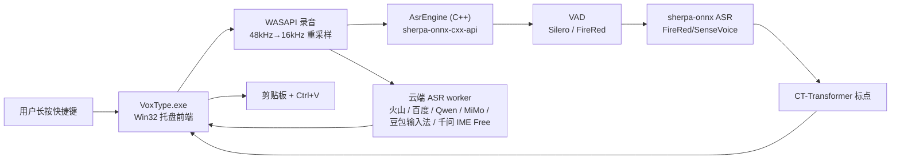
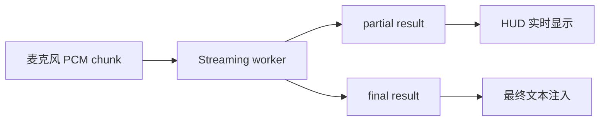

# 架构说明

> 🇬🇧 [English](../ARCHITECTURE.md)

本文描述当前实现，而不是最终理想设计。更长期的研究计划见 `PLAN.md`。

## 总览



## 进程

### `VoxType.exe`

单进程。职责：

- 单实例运行。
- 注册托盘图标。
- 显示 Settings。
- 监听全局快捷键。
- 采集麦克风音频。
- 通过 `AsrEngine` 直接调用 sherpa-onnx C++ API 完成本地 VAD、ASR、标点。
- 可选将音频发送到云端 ASR 后端：百度、火山引擎、Qwen ASR、MiMo ASR、实验性豆包输入法 ASR 或逆向还原的千问 IME Free。
- 将最终文本注入当前应用。

`AsrEngine` 内部缓存 `OfflineRecognizer`、`VoiceActivityDetector`、`OfflinePunctuation`，同一模型不会重复加载。

## 源码结构

自 v0.6.0 起，源码组织为多个模块。当前源码按职责分组在 `src/` 下：

| 目录 | 职责 |
|------|------|
| `src/app/` | 程序入口、主窗口、录音编排、Win32 资源 |
| `src/asr/` | 本地 ASR 引擎、ASR Provider 客户端、批量/流式 session、指标统计、结果分发 |
| `src/audio/` | 音频采集（WASAPI / waveIn）、FireRed VAD、流式 VAD trim |
| `src/ui/` | HUD、HUD 分页、热键、Settings 窗口、UI 主题资源与控件 |
| `src/platform/` | 平台集成（文本注入器、剪贴板、Windows 消息模拟） |
| `src/core/` | 核心窗口消息与状态、路径服务、配置存取、LLM 纠错、输入框上下文读取 |

| 文件 | 职责 |
|------|------|
| `src/core/app_messages.h` | 应用程序窗口消息、热键命令 ID、定时器 ID、托盘通知常量 |
| `src/core/app_state.h` / `src/core/app_state.cpp` | 全局应用程序实例句柄、窗口句柄、图标、原子音频遥测状态 |
| `src/core/config_store.h` / `src/core/config_store.cpp` | 配置数据模型（`Config`）、schema 迁移、DPAPI 凭据加密与 JSON 读写 |
| `src/core/path_service.h` / `src/core/path_service.cpp` | 程序与模型运行目录路径解析、日志与配置文件路径查询 |
| `src/core/vocabulary_manager.h` / `src/core/vocabulary_manager.cpp` | 通用自定义词汇表管理器：多模式解析（JSON/行格式）、权重比例线性折算与跨 ASR 引擎转译 |
| `src/platform/text_injector.h` / `src/platform/text_injector.cpp` | 目标窗口直接文本注入（剪贴板粘贴与针对微信的 WM_CHAR 逐字流式投递） |
| `src/asr/engine_local.h` / `src/asr/engine_local.cpp` | 本地 sherpa-onnx 识别器、VAD 探测器、标点模型生命周期管理、预加载及 DLL 安全探测 |
| `src/asr/asr_metrics.h` / `src/asr/asr_metrics.cpp` | 线程安全的各阶段耗时指标度量（VAD、ASR、标点、云端 API、LLM） |
| `src/audio/audio_capture.h` / `src/audio/audio_capture.cpp` | 麦克风音频采集生命周期（WASAPI / waveIn）、缓冲区管理、RMS 音量计算 |
| `src/audio/audio_diagnostics.h` / `src/audio/audio_diagnostics.cpp` | provider 无关的采集/stage 诊断、PCM 指标、WAV/SHA-256/JSON 持久化、留存与受管目录操作 |
| `src/audio/streaming_vad_trimmer.h` / `src/audio/streaming_vad_trimmer.cpp` | 云端流式 ASR session 可复用的 provider-independent PCM VAD trim |
| `src/asr/asr_session.h` / `src/asr/asr_session.cpp` | Local、百度、MiMo、Qwen 和 Doubao IME recorded 路径的批量 ASR session 抽象 |
| `src/asr/asr_result.h` / `src/asr/asr_result.cpp` | ASR 文本归一化、结果/失败分类、稳定的后端/结果日志名，以及 `MakeAsrWatchdogTimeoutText()` —— 看门狗超时文案的唯一构造入口，前缀保证落在运维错误白名单内 |
| `src/asr/asr_dispatcher.h` / `src/asr/asr_dispatcher.cpp` | ASR final 结果分发、LLM 门控、raw ASR 记录 |
| `src/asr/asr_runtime_log.h` / `src/asr/asr_runtime_log.cpp` | 仅 Debug Mode 使用的隐私安全 ASR 生命周期日志，带时间/PID 和有界轮转 |
| `src/asr/cloud_asr_common.h` / `src/asr/cloud_asr_common.cpp` | 云端 replay buffer、自适应 finalize timeout、空 final retry 辅助、`ComputeCloudAsrPostStopWatchdogMs()`（共享的停录后看门狗预算：primary final 等待 + retry 预留，带上限），以及 replay 可行性算术 `EstimateCloudAsrReplaySendMs()` / `CloudAsrReplayFitsInBudget()` |
| `src/asr/asr_diagnostics.h` / `src/asr/asr_diagnostics.cpp` | 把公共 `Config` stage 路由和 provider 终态映射到 `audio_diagnostics`，provider 不直接写文件 |
| `src/ui/hud.h` / `src/ui/hud.cpp` | HUD 窗口、Direct2D/DirectWrite 渲染、托盘图标、UI 资源创建/销毁 |
| `src/ui/hud_pagination.h` / `src/ui/hud_pagination.cpp` | HUD 文本行换行、分页计算与可视范围裁剪 |
| `src/ui/ui_types.h` | UI 布局度量、颜色常量、控件 ID、DPI 辅助常量 |
| `src/ui/ui_theme.h` / `src/ui/ui_theme.cpp` | UI 字体与画刷等 GDI/DirectWrite 主题资源生命周期管理 |
| `src/ui/hotkey.h` / `src/ui/hotkey.cpp` | 热键配置、CapsLock 长按逻辑、`WH_KEYBOARD_LL` Hook、`HotkeyEdit` 自绘控件 |
| `src/ui/settings.h` / `src/ui/settings.cpp` | Settings 窗口外壳、Tab 切换器、顶层窗口布局与事件分发 |
| `src/ui/tabs/` | 模块化 Settings Tab 面板：`General`、`Recognition`、`Cloud ASR`、`Vocabulary`、`LLM` 和 `Prompt` |
| `src/ui/providers/` | 模块化云端 ASR Provider 子面板：`Baidu`、`Volcengine`、`Qwen`、`MiMo`、`Doubao IME`、`Qwen Free` 和 `MAI` |
| `src/ui/settings_controls.h` / `src/ui/settings_controls.cpp` | Settings 对话框控件句柄封装与按分类显隐控制 |
| `src/app/main.cpp` | 精简 Win32 程序入口（`wWinMain`）与消息主循环 |
| `src/app/main_window.h` / `src/app/main_window.cpp` | 隐藏主消息窗口、托盘消息调度、热键响应、定时器触发 |
| `src/app/recording_session_controller.h` / `src/app/recording_session_controller.cpp` | 编排录音生命周期、VAD 裁剪与 ASR 调度的核心状态机 |
| `src/app/asr_attempt_manager.h` / `src/app/asr_attempt_manager.cpp` | ASR 主备后端重试与分发尝试编排 |
| `src/app/debug_logger.h` / `src/app/debug_logger.cpp` | 调试信息输出与控制台附加管理 |
| `src/core/llm_refine.h` | LLM 纠错模块：供应商预设/迁移、请求 JSON、端点规范化、有界 WinHTTP 请求和 OpenAI 兼容响应解析（header-only，`llm::` 命名空间） |
| `src/asr/baidu_asr.h` | 百度智能云 ASR 模块（header-only） |
| `src/asr/volcengine_asr.h` | 火山引擎（豆包）ASR 模块（header-only，WebSocket） |
| `src/asr/qwen_asr.h` / `src/asr/qwen_asr.cpp` | Qwen ASR realtime WebSocket 客户端 |
| `src/asr/qwen_audio_http.*` | Qwen Audio 3 `qwen-audio-3.0-asr-flash` HTTP/WAV batch 客户端 |
| `src/asr/qwen_audio_streaming.*` / `src/asr/qwen_audio_streaming_session.*` | Qwen Audio 3 streaming `run-task`、二进制 PCM、partial/final 与任务生命周期 |
| `src/asr/qwen_free_streaming_session.h` / `src/asr/qwen_free_streaming_session.cpp` | 千问 IME Free 流式 session：本地 PCM、可重放 final、bundled LLM 后处理和（当前禁用的）选区改写实验安全校验 |
| `src/asr/qwen_free_proto_asr.h` / `src/asr/qwen_free_proto_asr.cpp` | 千问 IME Free ASR WebSocket 协议：UTDID/WSG query、长度前缀 PCM/JSON 帧、partial/final 解析和连接诊断 |
| `src/asr/qwen_free_proto_llm.h` / `src/asr/qwen_free_proto_llm.cpp` | 千问 IME Free `VoiceInputWrite` / `VoiceInputRewrite` HTTP 协议及响应校验 |
| `src/asr/qwen_free_proto_sign.*`、`qwen_free_proto_unet.*`、`qwen_free_proto_utdid.*` | 千问 IME Free WSG 签名、native `unet.dll` 尝试及 A1 回退、本机 UTDID 获取 |
| `src/asr/mimo_asr.h` / `src/asr/mimo_asr.cpp` | 小米 MiMo ASR 批量客户端（`mimo-v2.5-asr`，通过 `/chat/completions` 上传 WAV） |
| `src/asr/doubao_ime_asr.h` / `src/asr/doubao_ime_asr.cpp` | 实验性豆包输入法客户端：设备注册、token bootstrap、Opus 编码、手写 protobuf over WebSocket |
| `src/asr/doubao_ime_streaming_session.h` / `src/asr/doubao_ime_streaming_session.cpp` | 豆包输入法 `IStreamingAsrSession` 封装：pending PCM buffer、replay retry、partial HUD、凭据写回 |
| `tools/doubao_ime_probe.bat` / `tools/doubao_ime_probe.cpp` | 独立豆包输入法诊断 probe：复用保存凭据、执行 live protocol 检查，可选执行 16kHz mono WAV 识别检查，并支持按实时节奏发送/接收的 streaming probe |
| `tools/asr_audio_replay.bat` / `tools/asr_audio_replay.cpp` | 开发专用规范 WAV 校验与多后端 replay，复用生产 batch/streaming session |
| `src/audio/firered_vad.h` | FireRed VAD 模块（header-only） |
| `src/core/input_context.h` | 输入框上下文读取模块（header-only，UIA/MSAA/WM_GETTEXT 分层 Fallback） |
| `src/core/startup_registration.h` / `src/core/startup_registration.cpp` | 当前用户 Windows 开机自启注册表管理，支持旧版便携路径探测与修复 |
| `src/core/utils.h` | 共享工具函数（WideToUtf8、Utf8ToWide、EscapeJson、Trim） |

全局状态变量拆解封装在所属分层模块中（`app_state.*`、`config_store.*`、`audio_capture.*`、`engine_local.*`、`asr_metrics.*`、`ui_theme.*`），具有清晰的访问边界。

### 延迟加载 DLL

`onnxruntime.dll`、`sherpa-onnx-cxx-api.dll`、`kaldi-native-fbank-core.dll` 通过 MSVC `/DELAYLOAD` 链接选项延迟加载。只在本地 ASR 函数实际调用时才加载到内存。纯云端模式下这些 DLL 永远不会加载，空闲内存保持在 ~12 MB。

`engine_local.cpp` 中的 `TryLoadAsrDlls()` 安全检查 DLL 是否可用，缺失时优雅返回 false。

### 模型预加载

当 `asrBackend` 为 `local` 且模型目录存在时，启动时 `PreloadAsrEngine()` 在后台线程预加载当前模型（ASR + VAD + 标点），消除首次按热键的延迟。Settings Save 后如果后端为 `local`，会 Reload + 后台预加载新模型。预加载完成后发送 `kPreloadDoneMessage`，HUD 显示 "ASR ready: xxx"。

## 主要模块

### 托盘和主窗口

主窗口是隐藏 Win32 窗口，用来接收托盘消息、菜单命令和 worker 结果。

托盘菜单：

- `Settings...`
- `Reload ASR Worker`
- `Quit`

### Settings

Settings 是普通 Win32 窗口，目前分 5 个 tab：

- `General`: 录音快捷键、可选的当前用户 `HKCU\Software\Microsoft\Windows\CurrentVersion\Run\VoxType` 开机启动注册，以及共用录音诊断（`Off` / `Failures only` / `All recordings`）、打开目录和受管删除入口。
- `Recognition`: ASR Backend、可选 Fallback 后端、模型、模型目录、线程、VAD、VAD 模型、Punctuation（`Disabled` / `Auto punctuate`）。
- `Cloud ASR`: 云端供应商选择、百度/火山引擎/Qwen/MiMo/MAI/豆包输入法/千问 IME Free 专属字段。
- `Vocabulary`: 通用词汇表管理（%APPDATA%\VoxType\vocabulary.json），与千问及火山引擎共享。
- `LLM`: 总开关（`Enable LLM Refinement`）、供应商选择（Provider dropdown + [+] / [−]）、API Base URL、API Key、Model、Extra Params、提示词预设切换与二级弹窗管理（`Manage...` 对话框，内含超大 System Prompt 多行编辑、预设说明与重置按钮）、Test Connection 及调试日志开关。

打开 Settings 时：

1. 调用 `UninstallKeyboardHook()` 暂停全局快捷键监听。
2. 用户可以录入 `CapsLock` 或其他组合键。
3. 关闭窗口时调用 `InstallKeyboardHook()` 恢复监听。

底部 `Status / Save / Close` 由 `LayoutSettingsWindow()` 根据客户区高度动态定位，避免裁切。

### 快捷键监听

使用 `WH_KEYBOARD_LL`。

普通热键当前行为：

- `WM_KEYDOWN` / `WM_SYSKEYDOWN`: 开始录音。
- `WM_KEYUP` / `WM_SYSKEYUP`: 停止录音并提交 ASR。
- 匹配配置中的主键和修饰键。
- 录音期间保存 `g_activeHotkeyKey`，避免松开主键时因修饰键已释放导致无法停止。

`CapsLock` 是特殊默认热键：

- 物理 `CapsLock` 按下时先拦截，不立即触发系统大小写切换。
- 300ms 内松开视为短按，程序补发一次 `CapsLock`，让系统正常切换大小写。
- 按住超过 300ms 视为长按，开始录音；松开后停止录音并恢复按下前的 Caps Lock 状态。
- 补发的 `CapsLock` 注入事件会被 hook 放行，避免递归拦截。

### 录音

当前使用 WASAPI Shared Mode（v0.7.3 起），自动 fallback 到 `waveIn`：

- WASAPI：以系统混合格式（通常 48kHz/32bit float/立体声）捕获，通过线性插值重采样到 16kHz/16bit/单声道
- waveIn fallback：16kHz/16bit/单声道，4 个约 100ms buffer

普通录音不会写入磁盘。早期单一
`%APPDATA%\VoxType\last_recording.wav` 行为早已删除。新的
`audio_diagnostics` 服务由 Settings 显式控制，并覆盖全部 Local/云端
provider、内部 retry 和配置的 fallback。

- `Off` 为默认值，不持久化诊断音频。
- `Failures only` 保存有分析价值的 no-speech、采集、传输或 provider
  失败；短录音、用户取消、过期 attempt，以及无 PCM 的鉴权/配置错误不保存。
- `All recordings` 仅在用户明确接受隐私提示后保存所有非取消录音。
- 安装版目录为 `%LOCALAPPDATA%\VoxType\diagnostics\audio`，Portable
  版目录为 `<portable-root>\diagnostics\audio`。
- 一次物理录音只有一个 capture，可登记任意数量的
  primary/internal-retry/fallback stage；stage PCM 按 SHA-256 去重，相同
  retry 输入引用同一个 WAV。
- 采集指标包括原生设备格式、每声道/downmix RMS、输出
  RMS/peak/zero/silence/clipping、静音包、discontinuity、callback gap 和首个非静音延迟。
- WAV/JSON 写入与 retention 在采集结束后通过串行 worker I/O 执行；
  回调只累计 O(n) 计数和 PCM。临时文件原子 rename 避免半成品 manifest 成为有效文件组。
- 最多保留 20 个受管文件组、100 MiB、7 天；retention 和 Settings 删除
  都不会删除未知文件。
- manifest 不保存 transcript、上下文正文、key/token、原始稳定设备 ID
  或原始 provider JSON；诊断服务本身绝不上传音频。

短于约 8000 bytes 的录音会被判定为 `Too short`。

开发专用 `asr_audio_replay` CMake target 输出到
`build/artifacts/tools`，不进入规范运行载荷。它校验 16 kHz/单声道/PCM16
WAV，输出 PCM SHA-256 与信号指标，并可调用生产 Local、当前配置/fallback
或显式选择的云端 batch/streaming session。云端 replay 必须显式选择；
transcript 控制台输出也必须显式启用，工具不会持久化 transcript。BAT
wrapper 会显式传入规范 `build/run/x64-release` runtime，避免 bundled
DLL/模型和 Portable 配置错误地按工具 exe 所在目录解析。

### HUD

录音时显示底部居中的无边框胶囊 HUD。当前实现使用 Direct2D/DirectWrite：

- `WS_POPUP | WS_EX_TOOLWINDOW | WS_EX_TOPMOST | WS_EX_LAYERED` 创建悬浮窗。
- Direct2D 绘制胶囊背景、细边框和 5 根音量条。
- DirectWrite 绘制状态文本，并用 DIP 进行测量和布局。
- Win32 窗口尺寸使用当前窗口 DPI 将 DIP 转为物理像素，避免高 DPI 下文本裁切。
- 录音回调计算每个音频 buffer 的 PCM RMS，归一化后驱动音量条。
- 音量条使用 attack/release 平滑，录音期间通过约 33ms 定时器重绘。
- 显示 `Listening...`、`Recognizing...`、最终文本或错误状态。火山引擎、Qwen ASR 和豆包输入法可以从 receive/drain 线程向 HUD 投递 partial 文本。

### VAD

`Enable VAD` 开启时，ASR 前先做人声检测。Settings 中可选择 VAD 模型：

**Silero VAD**（默认）：sherpa-onnx 内置的 `VoiceActivityDetector`，保守裁剪头尾静音。

**FireRed VAD**：小红书团队开源的 DFSMN 流式 VAD，准确率更高（F1 97.57 vs 95.95，误报率 2.69% vs 9.41%）。

- `src/audio/firered_vad.h` header-only 模块，使用 `kaldi_native_fbank` 提取 80 维 fbank 特征 + `onnxruntime` 加载模型
- 模型：`models/fireredvad_stream_vad_with_cache.onnx`（2.2MB）
- CMVN 参数：`models/cmvn.ark`（硬编码进代码）
- 流式推理，每帧更新 DFSMN 缓存 `[8, 1, 128, 19]`
- **关键**：音频需要 int16 范围（-32768~32767），归一化 float 需先乘以 32768

当前策略（两种 VAD 共用）：

- 只处理 16kHz 音频。
- 没检测到语音时直接返回空文本，不加载 ASR 模型。

### ASR 引擎

`AsrEngine` 类（`src/audio/engine.h` / `src/audio/engine.cpp`）封装 sherpa-onnx C++ API：

- `OfflineRecognizer`：ASR 识别（FireRedASR2 CTC/AED、SenseVoice）
- `VoiceActivityDetector`：Silero VAD
- `firered_vad::FireRedVad`：FireRed VAD（`src/audio/firered_vad.h`）
- `OfflinePunctuation`：CT-Transformer 标点

模型加载后缓存，同一配置不会重复加载。切换模型或 Reload 时清除缓存，下次识别自动重新加载。

运行时 DLL 依赖：
- `sherpa-onnx-cxx-api.dll`
- `sherpa-onnx-c-api.dll`
- `onnxruntime.dll`
- `kaldi-native-fbank-core.dll`（FireRed VAD 使用）

### 云端 ASR

云端后端是可选能力，识别本身在远端完成，本地标点会被绕过：

- **百度智能云** 通过 `BaiduAsrSession` 走 batch-style REST 流程。
- **火山引擎** 保留已验证的 WebSocket 协议实现于 `src/asr/volcengine_asr.h`；`main.cpp` 只在外围编排 replay retry、watchdog 和 HUD 分发。
- **Qwen ASR** 按 Model profile 路由：旧 `qwen3-asr-flash-realtime` 继续通过 `src/asr/qwen_asr.h/.cpp` 使用原 Realtime WebSocket；`qwen-audio-3.0-asr-flash` 由 `qwen_audio_http.*` 走整段 WAV/Base64 HTTP batch；`qwen-audio-3.0-asr-flash-streaming` 由 `qwen_audio_streaming.*` 和 `qwen_audio_streaming_session.*` 使用北京 Workspace 的 `run-task`/二进制 PCM/`finish-task` WebSocket。三者共享 API Key、录音、VAD、session、fallback 和结果分发，但不混用协议消息。Audio 3 streaming 的接收线程累计 sentence final 与当前 partial，松开后只等待 `task-finished`，超时或协议错误进入统一 fallback。
- Audio 3 streaming 同时复用 `PendingPcmBuffer`、有界 `CloudAsrReplayBuffer`、自适应 final timeout、主 watchdog 和 stale-attempt guard。传输断开允许在松键后进行一次 replay；服务端 `task-failed` 视为请求拒绝，不盲目重放；replay 或 pending buffer 达到上限时保持录音边界并报告明确错误。
- 公共录音层会把运行中的 WASAPI 和 `waveIn` 设备/驱动错误通过带 generation 的主窗口消息上报。UI 线程会使当前 attempt 失效、停止并释放设备、终止活动 provider session、取消 watchdog，并显示设备错误；不完整 PCM 不会进入 fallback，也不会作为文本粘贴。上一段录音遗留的错误消息会被 generation guard 丢弃。
- **千问 IME Free** 通过 `src/asr/qwen_free_proto_*` 和 `src/asr/qwen_free_streaming_session.cpp` 接入本机千问 IME 的逆向协议。VoxType 自己采集 WASAPI PCM，获取本机 UTDID，并只对 SHA-256 指纹匹配的兼容 `unet.dll` 调用版本相关 WSG FFI；原生鉴权不可用时会在联网前失败并进入统一 fallback。连接成功后发送 `0xf00` PCM commit 和最终 stop 帧，并可选调用 `VoiceInputWrite` HTTP 后处理。该后端绕过本地 VAD，保留完整 PCM 交给服务端分段；`Punctuate` 与 `Correct` 是 bundled 响应的兼容开关，不是独立请求；`Rewrite selection` 目前仅保留为禁用的实验协议路径，配置加载/保存会强制关闭，待兼容字段与原版同场景请求/响应完成对照后再重新评审。
- **MiMo ASR** 通过 `src/asr/mimo_asr.h/.cpp` 接入小米 MiMo `mimo-v2.5-asr`。它是批量云端后端：16k/16-bit/mono PCM 可先经 VAD trim，再封装为 WAV，通过 `{baseUrl}/chat/completions` 上传。
- **豆包输入法** 通过 `src/asr/doubao_ime_asr.h/.cpp` 和 `src/asr/doubao_ime_streaming_session.cpp` 接入非官方输入法端点 `frontier-audio-ime-ws.doubao.com`，不是火山引擎官方 `openspeech.bytedance.com` 协议。客户端会注册输入法风格设备、获取 `asr_config.app_key`、使用 vendored static `libopus` 编码 20ms PCM，并通过 WinHTTP WebSocket 发送手写 protobuf 消息（`StartTask`、`StartSession`、`TaskRequest`、`FinishSession`）。凭据写回由主线程完成；auth/token 错误会清凭据重试，瞬态启动失败会在 PCM 继续缓冲时重试，abort 会关闭 bootstrap/WebSocket 活跃句柄以避免卡死。由于输入法服务可能在一次热键按住期间发出多个云端 VAD final segment，或因文本过长清空/重启 partial 窗口，streaming session 会维护“已提交前缀 + 当前 partial 窗口”、跨 WebSocket 事件累计 final 文本；`FinishSession` 之前的 final 不会结束松手后的 final 等待。HUD 展示是 Doubao 专属的 UI 层逻辑：三行文本区以内直接显示 live partial，超过后清空前文显示，只从当前最后一句重新开始；清屏后的新页会继续正常累积，直到再次超过三行正文才会再次清屏，最终上屏完整文本不受影响。

开启 `Enable VAD` 时，Qwen ASR 和火山引擎流式后端会先通过 `StreamingVadTrimmer` 做本地 VAD trim 再上传，批量云端后端使用 `BatchVadTrimmer` 后再上传。千问 IME Free 和 Doubao IME 刻意绕过本地 VAD：前者上传完整 PCM，后者将原始 PCM 编码为 Opus，均依赖服务端自身分段。参与 VAD 的路径会输出 provider-independent PCM bytes，各 provider session 再按自己的协议重新切 chunk。云端 replay buffer、自适应 finalize timeout、空 final retry 和结果分类等公共策略由 `cloud_asr_common.*` 和 `asr_result.*` 复用。

当前验证状态：跨事件云端 VAD 分段累计修复后，豆包输入法 live protocol probe、16kHz mono WAV 识别 probe、`--streaming` 发送/drain probe 已通过，`.\build.bat` 和 `git diff --check` 已通过；`git diff --check` 仅有既有 CRLF 提示。长录音热键实测复核、断网 watchdog 和额外 DPI 检查仍需人工桌面冒烟。

### ASR Fallback 编排与诊断

Fallback 采用串行策略：primary 先完成自己的 retry/replay，只有最终结果分类为 `OperationalError` 才会用同一段 16kHz/s16le/mono 原始 PCM 启动已配置的 fallback。`Too short`、`No speech detected`、主动取消、stale attempt、未启用/与 primary 相同的 fallback，以及 primary 可用文本都不会触发 fallback。火山引擎可作为 primary，但有意不作为 fallback target；Local、百度、Qwen、MiMo、Doubao IME recorded request 和千问 IME Free 可作为 fallback。

`main.cpp` 维护单调递增的 recognition-attempt context，保存 primary config、录音/final 状态、原始 PCM 和 fallback claim。Streaming callback 只向主窗口投递消息。如果 provider 在热键松开前已经耗尽重试并回报 final failure，该结果先保存在 attempt context；松手后先保存完整 PCM、执行 too-short/VAD no-speech 门控，再恢复同一 completion 路径。这样既不会拿不完整音频提前 fallback，也不会因当时尚无 PCM 而绕过 fallback。Watchdog 和 provider callback 通过同一个 final-claim guard 竞争，fallback worker 在 side effect 和 dispatch 前再次检查 attempt id。

启用 fallback 时，primary streaming 松手后的 final 预算仍为自适应 6–12 秒，且 session 自己的"等 final"只能吃这一段；主窗口 post-stop watchdog 是**总上限**，在此之上固定加 9000ms 供一次连接/replay 重试使用（上限 45000ms）。上述额度与预留统一由 `ComputeCloudAsrPostStopWatchdogMs()` 提供；`qwen_free`（ASR + bundled 后处理两段）与 `volcengine`（opening 守卫）保留各自的多相位预算。provider 内部 batch/recorded request 使用独立且更长的预算。

这笔预留**并不能**让长录音的 replay 真正跑完，代码也不再把这句话当成前提。replay 保持 primary 的实时节奏（burst 上传会触发服务端背压），所以重发一段 30 秒录音要约 30 秒，而预留只有 9000ms。因此 `StreamingAsrSessionBase::ShouldStartFailureReplay()`（底层是 `CloudAsrReplayFitsInBudget()`）会在**失败路径**的 replay 之前检查剩余停录预算，装不下就跳过，让已完成的主流程错误立即抵达 fallback handler，而不是让 attempt 一直挂到外层看门狗 Abort。9000ms 预留下的可达窗口约为**音频 1.5 秒以内**。空结果路径的 replay **有意不门控** —— 跳过它会把一次可疑的空 final 变成 `No speech detected` 且不给 fallback 机会。

结构化运行时日志与 provider 详细日志的开启条件不同。`voxtype_asr_runtime.log` 在 Debug Mode 打开、**或**诊断音频模式非 `off`、**或**千问 IME Free 调试开关打开时写入 —— 诊断音频刻意只打开这条有界的结构化日志，不暴露 provider 报文。而 provider 详细日志（`volc_asr_debug.log`、`mai_asr_debug.log`、`qwen_asr_debug.log`）仍需显式打开 Debug Mode。

Debug Mode 会在 `%TEMP%` 下写入两个有界日志：

- `voxtype_asr_runtime.log`：结构化 attempt/primary/fallback 生命周期事件，只记录后端 id、归一化结果/失败分类、来源、耗时、录音时长和 PCM 大小，不记录识别正文或 provider 原始错误。
- `volc_asr_debug.log`：隐私脱敏的火山传输/retry 诊断，不持久化 request JSON、response payload、识别正文、provider 原始错误和代理地址字符串。

两个日志都包含完整本地日期/时间、毫秒和 PID；单文件达到 5 MiB 后轮转，保留 `.1`、`.2` 两个归档。provider 详细日志在 Debug Mode 关闭时不写文件（结构化运行时日志有上面单独说明的更宽开启条件）。轮转不会主动删除用户已有的 v0.9.7 之前日志；新版本停止追加敏感内容，并在达到大小阈值后按正常规则归档/替换。

### 模型适配

`AsrEngine` 根据 `model_id` 创建不同 recognizer：

| model_id | 模型 | 文件 |
| --- | --- | --- |
| `firered_ctc` | FireRedASR2 CTC int8 | `model.int8.onnx`, `tokens.txt` |
| `firered_aed` | FireRedASR2 AED int8 | `encoder.int8.onnx`, `decoder.int8.onnx`, `tokens.txt` |
| `sensevoice` | SenseVoiceSmall int8 | `model.int8.onnx`, `tokens.txt` |

当前只缓存一个 ASR recognizer。切换模型后会加载新模型。

### 标点后处理

FireRedASR2 AED/CTC 输出常常没有标点，因此 worker 增加本地标点模型：

```text
models/sherpa-onnx-punct-ct-transformer-zh-en-vocab272727-2024-04-12-int8/model.int8.onnx
```

当 Settings 中 `Punctuation` 设为 `Auto punctuate` 或 `Auto punctuate + LLM` 时启用。`LLM` 选项会调用云端 LLM API 进行文本纠错（见 LLM 纠错模块）。

### 文本注入

当前实现（`PasteTextImeAware`）：

1. **微信**（`Weixin.exe`）：`WM_CHAR` 逐字符发送（微信自定义 Qt 控件拦截 Ctrl+V）
2. **其他应用**：剪贴板 + `Ctrl+V` + IMM32 临时切换英文模式
3. **Force Unicode Input**（可选）：`SendInput` + `KEYEVENTF_UNICODE` 逐字符发送
4. 所有路径使用 `SendMessageTimeoutW` + `SMTO_ABORTIFHUNG` + 2 秒超时，防止目标窗口挂起阻塞 UI

## 配置

安装版配置保存到：

```text
%LOCALAPPDATA%\VoxType\config.json
```

下载的 ASR/标点模型和日志分别位于同一数据根目录的 `models`、`log`。
Portable 包通过 `<app-root>\portable.flag` 识别，并继续使用解压目录旁的
`config.json`、`models`、`log`。

当前结构是扁平 JSON：

```json
{
  "model_id": "firered_aed",
  "model_dir": "D:\\...\\models\\sherpa-onnx-fire-red-asr2-zh_en-int8-2026-02-26",
  "threads": "4",
  "enable_vad": true,
  "vad_model": "silero",
  "enable_partial": true,
  "postprocess": "itn",
  "hotkey": "CapsLock",
  "diagnostic_audio_mode": "off",
  "llm_provider": "DeepSeek",
  "llm_providers_json": "{\"DeepSeek\":{\"endpoint\":\"https://api.deepseek.com\",\"api_key\":\"<encrypted>\",\"model\":\"deepseek-v4-flash\",\"extra_params\":\"\\\"thinking\\\":{\\\"type\\\":\\\"disabled\\\"}\"}}",
  "llm_prompt": "",
  "enable_llm_debug": false,
  "asr_backend": "doubao_ime",
  "fallback_asr_backend": "local",
  "cloud_provider": "doubao_ime",
  "qwen_base_url": "wss://dashscope.aliyuncs.com/api-ws/v1/realtime",
  "qwen_http_base_url": "https://llm-c6rtn7zy4nw0u39k.cn-beijing.maas.aliyuncs.com/api/v1/services/aigc/multimodal-generation/generation",
  "qwen_audio_streaming_base_url": "wss://llm-c6rtn7zy4nw0u39k.cn-beijing.maas.aliyuncs.com/api-ws/v1/inference",
  "qwen_model": "qwen-audio-3.0-asr-flash-streaming",
  "qwen_transport": "audio_streaming",
  "qwen_language": "",
  "qwen_chunk_ms": 100,
  "qwen_language_hints": "",
  "qwen_vocabulary_id": "",
  "qwen_vocabulary": "",
  "qwen_semantic_punctuation": false,
  "qwen_max_sentence_silence": 1300,
  "qwen_multi_threshold": false,
  "qwen_heartbeat": false,
  "qwen_speech_noise_threshold_enabled": false,
  "qwen_speech_noise_threshold": 0.0,
  "qwen_free_polish": false,
  "qwen_free_punct": false,
  "qwen_free_correct": false,
  "qwen_free_rewrite": false,
  "qwen_free_debug_log": false,
  "qwen_free_shell_path": "",
  "mimo_base_url": "https://token-plan-ams.xiaomimimo.com/v1",
  "mimo_model": "mimo-v2.5-asr",
  "mimo_language": "auto",
  "doubao_ime_device_id": "<device_id>",
  "doubao_ime_cdid": "<cdid>",
  "doubao_ime_token": "<encrypted>"
}
```

对于 Qwen IME Free，`qwen_free_polish` 是 bundled `VoiceInputWrite` 后处理的
唯一主开关。旧版本的 `qwen_free_punct` 和 `qwen_free_correct` 仅为配置文件
兼容键，加载和保存时会统一归一化为相同值。

- `llm_provider`：当前选中的供应商名称。
- `llm_providers_json`：JSON 字符串，分别存储每个供应商的 endpoint、api_key（DPAPI 加密）、model 和 Extra Params。
- `llm_prompt`：自定义 System Prompt（留空使用内置默认）。
- `enable_llm_debug`：开启后记录 ASR 前后对比到 `log/llm_refine_YYYYMMDD.log`。
- `asr_backend`：当前 ASR 后端（`local`、`baidu`、`volcengine`、`qwen`、`mimo`、`doubao_ime` 或 `qwen_free`）。
- `fallback_asr_backend`：可选串行 fallback（`none`、`local`、`baidu`、`qwen`、`mimo`、`doubao_ime` 或 `qwen_free`），必须与 `asr_backend` 不同；火山引擎不是 fallback target。
- `diagnostic_audio_mode`：全部 ASR provider/stage 共用的录音诊断策略（`off`、`failures` 或 `all`），默认 `off`。
- `qwen_*`：Qwen ASR 的三种 profile、北京 Audio 3 HTTP/WSS 地址、语言提示、词汇 JSON、语义标点、句间静音、多阈值、heartbeat、噪声阈值和 chunk 配置。旧 realtime 的 turn detection 仍固定 Manual，不再持久化。
- `qwen_free_*`：千问 IME Free 启用状态、bundled `VoiceInputWrite` 后处理开关、实验性选区改写、本地协议诊断和可选 shell 目录覆盖。UTDID 通常自动获取，不放入普通示例配置。
- `mimo_*`：MiMo ASR API key、OpenAI-compatible Base URL、模型和语言（`auto`、`zh`、`en`）；`mimo_api_key` 使用 DPAPI 加密。
- `doubao_ime_*`：实验性 Doubao IME device id、cdid 和 DPAPI 加密 token；程序可自动注册，也可从 Settings 重置。

## 后续架构演进

### 流式演进

Qwen、千问 IME Free、火山引擎和豆包输入法已经支持录音期间的云端 partial HUD。本地 ASR、百度和 MiMo 仍是录完后 finalize。后续方向是把 streaming 能力变成明确的 session trait，减少 `main.cpp` 中的 provider-specific orchestration：



可能路线：

- 继续用 offline 模型做本地模拟 partial。
- 更换/新增 streaming 本地 ASR 模型。
- 引入 `StreamingAsrSession` 接口，把 Qwen/火山的编排逻辑继续从 `main.cpp` 往外迁移。

### 保守纠错

v0.2.0 起已接入云端 LLM 纠错（`src/core/llm_refine.h`）。默认关闭，需在 Settings 中将 Punctuation 设为 `Auto punctuate + LLM` 并配置供应商 API Key。

内置供应商统一使用 OpenAI 兼容 Chat Completions 请求。端点规范化支持纯主机、带版本的 Base URL 或完整 `/chat/completions` URL，并保证只生成一个请求路径。`Test Connection` 与真实纠错共用 Extra Params 合并和响应校验。解析/连接/发送超时为 5 秒，接收超时为 15 秒，响应体限制 1 MiB；网络、HTTP、JSON 或内容校验失败时均回退到 ASR 原文。

供应商状态隔离存储在 `llm_providers_json` 中，切换供应商不会复用上一家的 API Key 或请求参数。保存、加载、枚举与删除会解析 JSON 顶层成员，而不是直接扫描大括号，因此字符串内容不会跨供应商串读。仅当端点仍匹配对应官方预设 URL 时，才迁移精确的旧别名或过时参数结构，从而保留自定义网关和自定义模型选择。

建议后续补充：

- 用户词库/术语替换。
- 中文拼写纠错模型。

LLM 必须默认关闭，并加入：

- 超时。
- 改动比例限制。
- JSON 输出校验。
- 数字、路径、URL、代码保护。
- 失败直接使用 ASR 原文。

### 架构演进

当前已是纯 C++ 单进程架构。后续可考虑：

- 流式 ASR：更换支持 `OnlineRecognizer` 的模型（如 Paraformer 流式版、Zipformer2 CTC）。
- WebSocket 或长连接协议，支持音频流式传输。
- Rust/C++ 独立服务，前端保持薄 UI。

## 风险点

- Win32 UI 在高 DPI 下容易裁切文字；HUD 使用 DIP 测量并转物理像素，Settings 控件仍要留足高度。
- 模型加载必须永远在 worker 里，不能阻塞 UI 线程。
- 模型大，内存占用需要实测。
- 全局快捷键不能在 Settings 打开时拦截用户录入。
- 剪贴板注入对部分高权限窗口可能失败。
- 标点模型会改断句，但不能修正 ASR 错字。
